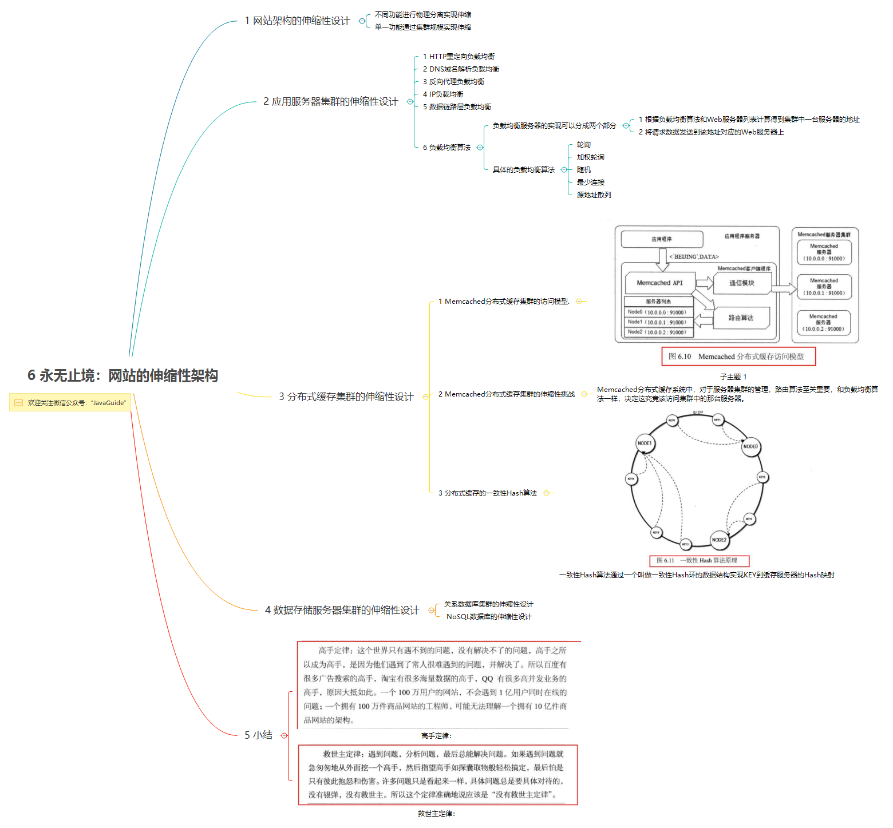

### 架构基础
随着软件系统规模的增加，计算相关的算法和数据结构不再构成主要的设计问题；当系统由许多部分组成时，整个系统的组织，也就是所说的“软件架构”，导致了一系列新的设计问题。  

软件架构的出现有其历史必然性。  
20 世纪 60 年代第一次软件危机引出了“结构化编程”，创造了“模块”概念；20 世纪 80 年代第二次软件危机引出了“面向对象编程”，创造了“对象”概念；到了 20 世纪 90 年代“软件架构”开始流行，创造了“组件”概念。我们可以看到，“模块”“对象”“组件”本质上都是对达到一定规模的软件进行拆分，差别只是在于随着软件的复杂度不断增加，拆分的粒度越来越粗，拆分的层次越来越高。

**架构设计相关的几个特性**  

- 架构设计的思维和程序设计的思维差异很大  
架构设计的关键思维是判断和取舍，程序设计的关键思维是逻辑和实现。很多程序员在转换为架构师后，很难一开始就意识到这个差异，还是按照写代码的方式去思考架构，会导致很多 困惑。
- 架构设计没有体系化的培训和训练机制
大学的课程几乎没有架构设计相关的课程，架构设计的书籍更多的也只是关注某个架构设计点，没有体系化的架构设计书籍，导致程序员在学习上没有明确指导，只能自己慢慢摸 索，效率低，容易踩坑。
- 程序员对架构设计的理解存在很多误区。
例如：要成为架构师必须要有很强的技术天分；架构师必须有很强的创造力；架构设计必须要高大上才能体现架构师能力；架构一定要具备高可用、高性能……这些似是而非的误区 让很多技术人员望而生畏，还没尝试就已经放弃了。

**架构到底是什么**  
软件架构指软件系统的顶层结构，它基本上把系统、子系统、模块、组件、架构等概念都串起来了：  
首先，“系统是一群关联个体组成”，这些“个体”可以是“子系统”“模块”“组件”等；架构需要明确系统包含哪些“个体”。  
其次，系统中的个体需要“根据某种规则”运作，架构需要明确个体运作和协作的规则。  
最后，维基百科定义的架构用到了“基础结构”这个说法，这里改为“顶层结构”，可以更好地区分系统和子系统，避免将系统架构和子系统架构混淆在一起导致架构层次混乱。  

- 系统泛指由一群有关联的个体组成，根据某种规则运作，能完成个别元件不能单独完成的工作的群体。它的意思是“总体”“整体”或“联盟”。  
1. 关联：系统是由一群有关联的个体组成的，没有关联的个体堆在一起不能成为一个系统。例如，把一个发动机和一台PC放在一起不能称之为一个系统，把发动机、底盘、轮胎、车架组合起来才能成为一台汽车。  
2. 规则：系统内的个体需要按照指定的规则运作，而不是单个个体各自为政。规则规定了系统内个体分工和协作的方式。例如，汽车发动机负责产生动力，然后通过变速器和传动轴，将动力输出到车轮上，从而驱动汽车前进。  
3. 能力：系统能力与个体能力有本质的差别，系统能力不是个体能力之和，而是产生了新的能力。例如，汽车能够载重前进，而发动机、变速器、传动轴、车轮本身都不具备这样的能力。   
- 子系统也是由一群有关联的个体所组成的系统，多半会是更大系统中的一部分。  
其实子系统的定义和系统定义是一样的，只是观察的角度有差异，一个系统可能是另外一个更大系统的子系统。  
以微信为例来做一个分析：  
1. 微信本身是一个系统，包含聊天、登录、支付、朋友圈等子系统。  
2. 朋友圈这个系统又包括动态、评论、点赞等子系统。  
3. 评论这个系统可能又包括防刷子系统、审核子系统、发布子系统、存储子系统。  
4. 评论审核子系统不再包含业务意义上的子系统，而是包括各个模块或者组件，这些模块或者组件本身也是另外一个维度上的系统。例如，MySQL、Redis 等是存储系统，但不是业务子系统。  
- 软件模块（Module）是一套一致而互相有紧密关连的软件组织。它分别包含了程序和数据结构两部分。现代软件开发往往利用模块作为合成的单位。模块的接口表达 了由该模块提供的功能和调用它时所需的元素。模块是可能分开被编写的单位。这使它们可再用和允许人员同时协作、编写及研究不同的模块。
- 软件组件定义为自包含的、可编程的、可重用的、与语言无关的软件单元，软件组件可以很容易被用于组装应用程序中。
模块和组件都是系统的组成部分，只是从不同的角度拆分系统而已。  
从逻辑的角度来拆分系统后，得到的单元就是“模块”；从物理的角度来拆分系统后，得到的单元就是“组件”。划分模块的主要目的是职责分离；划分组件的主要目的是单元复用。其实，“组件”的英文component也可翻译成中文的“零件”一词，“零件”更容易理解一些，“零件”是一个物理的概念，并且具备“独立且可替换”的特点。  
以一个最简单的网站系统来为例，假设我们要做一个学生信息管理系统，这个系统从逻辑的角度来拆分，可以分为“登录注册模块”“个人信息模块”“个人成绩模块”；从物理的角度 来拆分，可以拆分为 Nginx、Web 服务器、MySQL。  
- 软件框架（Software framework）通常指的是为了实现某个业界标准或完成特定基本任务的软件组件规范，也指为了实现某个软件组件规范时，提供规范所要求之基 础功能的软件产品。  
1. 框架是组件规范：例如，MVC就是一种最常见的开发规范，类似的还有MVP、MVVM、J2EE等框架。  
2. 框架提供基础功能的产品：例如，Spring MVC 是 MVC 的开发框架，除了满足 MVC 的规范，Spring 提供了很多基础功能来帮助我们实现功能，包括注解 （@Controller 等）、Spring Security、Spring JPA 等很多基础功能。  
- 软件架构指软件系统的“基础结构”，创造这些基础结构的准则，以及对这些结构的描述。  
单纯从定义的角度来看，框架和架构的区别还是比较明显的，框架关注的是“规范”，架构关注的是“结构”。框架的英文是 Framework，架构的英文是 Architecture。

**架构的目的是什么**  
首先，架构设计存在一些误区。
> 不做架构设计系统就跑不起来么？其实不然，很多朋友尤其是经历了创业公司的朋友可能会发现，公司的初始产品可能没有架构设计，大伙撸起袖子简单讨论一下就开始编码了，根本没有正规的架构设计过程，而且也许产品开发速度还更快，上线后运行也还不错。  
> 
> 做了架构设计就能提升开发效率么？也不尽然，实际上有时候最简单的设计开发效率反而是最高的，架构设计毕竟需要投入时间和人力，这部分投入如果用来尽早编码，项目也许会更快。  
> 
> 设计良好的架构能促进业务发展么？好像有一定的道理，例如设计高性能的架构能够让用户体验更好，但反过来想，我们照抄微信的架构，业务就能达到微信的量级么？肯定不可能，不要说达到微信的量级，达到微信的 1/10 做梦都要笑醒了。  
> 
> 不是每个系统都要做架构设计吗？这其实是知其然不知其所以然，系统确实要做架构设计，但还是不知道为何要做架构设计，反正大家都要做架构设计，所以做架构设计肯定没错。这样的架构师或者设计师很容易走入生搬硬套业界其他公司已有架构的歧路，美其名曰“参考”“微改进”。一旦强行引入其他公司架构后，很可能会发现架构水土不服，或者运行起来很别扭等各种情况，最后往往不得不削足适履，或者不断重构，甚至无奈推倒重来。  
> 
> 公司流程要求系统开发过程中必须有架构设计？与此答案类似还有因为“架构师总要做点事情”，所以要做架构设计，其实都是舍本逐末。因为流程有规定，所以要做架构设计；因为架构师要做事，所以要做架构设计，这都是很表面地看问题，并没有真正理解为何要做架构设计，而且很多需求并不一定要进行架构设计。如果认为架构师一定要找点事做，流程一定要进行架构设计，就会出现事实上不需要架构设计但形式上却继续去做架构设计，不但浪费时间和人力，还会拖慢整体的开发进度。  
> 
> 为了高性能、高可用、可扩展，所以要做架构设计？能够给出这个答案，说明已经有了一定的架构经历或者基础，毕竟确实很多架构设计都是冲着高性能、高可用……等“高 XX”的目标去的。但往往持有这类观点的架构师和设计师会给项目带来巨大的灾难，这绝不是危言耸听，而是很多实际发生的事情，为什么会这样呢？因为这类架构师或者设计师不管三七二十一，不管什么系统，也不管什么业务，上来就要求“高性能、高可用、高扩展”，结果就会出现架构设计复杂无比，项目落地遥遥无期，团队天天吵翻天……等各种让人抓狂的现象，费尽九牛二虎之力将系统整上线，却发现运行不够稳定，经常出问题，出了问题很难解决，加个功能要改 1 个月……等各种继续让人抓狂的事件。

架构即(重要)决策，是在一个有约束的盒子里去求解或接近最合适的解。这个有约束的盒子是团队经验、成本、资源、进度、业务所处阶段等所编织、掺杂在一起的综合体(人，财，物，时间，事情等)。架构无优劣，但是存在恰当的架构用在合适的软件系统中，而这些就是决策的结果。  
需求驱动架构。在分析设计阶段，需要考虑一定的人力与时间去"跳出代码，总揽全局"，为业务和 IT 技术之间搭建一座"桥梁"。  
架构设计处于软件研制的前期，一方面，越是前期，如有问题，就能够越早发现，修改的代价也就越低；另外一方面，也意味着，软件实施后期若有架构上的修改，也需要付出更多的代价。  

通过回顾架构产生的历史背景和原因，我们可以基本推导出答案：架构设计的主要目的是为了解决软件系统复杂度带来的问题。  
首先，遵循这条准则能够让“新手”架构师心中有数，而不是一头雾水。  
其次，遵循这条准则能够让“老鸟”架构师有的放矢，而不是贪大求全。  

我来分析一个简单的案例，一起来看看如何将“架构设计的真正目的是为了解决软件系统复杂度带来的问题”这个指导思想应用到实践中。  
假设我们需要设计一个大学的学生管理系统，其基本功能包括登录、注册、成绩管理、课程管理等。当我们对这样一个系统进行架构设计的时候，首先应识别其复杂度到底体现在哪里。  
> 性能：一个学校的学生大约 1 ~ 2 万人，学生管理系统的访问频率并不高，平均每天单个学生的访问次数平均不到 1 次，因此性能这部分并不复杂，存储用 MySQL 完全能够胜任，缓存都可以不用，Web 服务器用 Nginx 绰绰有余。  
> 可扩展性：学生管理系统的功能比较稳定，可扩展的空间并不大，因此可扩展性也不复杂。  
> 高可用：学生管理系统即使宕机 2 小时，对学生管理工作影响并不大，因此可以不做负载均衡，更不用考虑异地多活这类复杂的方案了。但是，如果学生的数据全部丢失，修复是非常麻烦的，只能靠人工逐条修复，这个很难接受，因此需要考虑存储高可靠，这里就有点复杂了。我们需要考虑多种异常情况：机器故障、机房故障，针对机器故障，我们需要设计 MySQL 同机房主备方案；针对机房故障，我们需要设计 MySQL 跨机房同步方案。  
> 安全性：学生管理系统存储的信息有一定的隐私性，例如学生的家庭情况，但并不是和金融相关的，也不包含强隐私（例如玉照、情感）的信息，因此安全性方面只要做 3 个事情就基本满足要求了：Nginx 提供 ACL 控制、用户账号密码管理、数据库访问权限控制。  
> 成本：由于系统很简单，基本上几台服务器就能够搞定，对于一所大学来说完全不是问题，可以无需太多关注。  

还有其他方面，如果有兴趣，你可以自行尝试去分析。通过上面的分析，可以看到这个方案的主要复杂性体现在存储可靠性上，需要保证异常的时候，不要丢失所有数据即可（丢失几个或者几十个学生的信息问题不大）。  

**复杂度来源**  
复杂度来源之高性能。  
软件系统中高性能带来的复杂度主要体现的两方面，一是单台计算机内部为了高性能带来的复杂度；二是是多台计算机集群为了高性能带来的复杂度。  
> 单机复杂度。  
> 计算机内部复杂度最关键的地方就是操作系统；计算机性能的发展本质上是由硬件发展驱动的，尤其是 CPU 的性能发展。操作系统本身其实也是跟随硬件的发展而发展的，操作系统是软件系统的运行环境，操作系统的复杂度直接决定了软件系统的复杂度。  
> 操作系统和性能最相关的就是进程和线程。操作系统调度的最小单位就变成了线程，而进程变成了操作系统分配资源的最小单位。  
> 操作系统发展到现在，如果我们要完成一个高性能的软件系统，需要考虑如多进程、多线程、进程间通信、多线程并发等技术点，而且这些技术并不是最新的就是最好的，也不是非此即彼的选择。  
> 
> 集群复杂度。  
> 通过大量机器来提升性能，并不仅仅是增加机器这么简单，让多台机器配合起来达到高性能的目的，是一个复杂的任务。  
> 常见的方式之一 —— 任务分配，任务分配的意思是指每台机器都可以处理完整的业务任务，不同的任务分配到不同的机器上执行。  
> 常见的方式之一 —— 任务分解，通过任务分配的方式，我们能够突破单台机器处理性能的瓶颈，通过增加更多的机器来满足业务的性能需求，但如果业务本身也越来越复杂，单纯只通过任务分配的方式来扩展性能，收益会越来越低。

复杂度来源之高可用。  
高可用的定义：是系统无中断地执行其功能的能力，代表系统的可用性程度，是进行系统设计时的准则之一。这个定义的关键在于“无中断”，但恰好难点也在“无中断”上面，因为无论是单个硬件还是单个软件，都不可能做到无中断，硬件会出故障，软件会有 bug；硬件会逐渐老化，软件会越来越复杂和庞大 … 除了硬件和软件本质上无法做到“无中断”，外部环境导致的不可用更加不可避免、不受控制。例如，断电、水灾、地震，这些事故或者灾难也会导致系统不可用，而且影响程度更加严重，更加难以预测和规避。所以，系统的高可用方案五花八门，但万变不离其宗，本质上都是通过“冗余”来实现高可用。  
通俗点来讲，就是一台机器不够就两台，两台不够就四台；一个机房可能断电，那就部署两个机房；一条通道可能故障，那就用两条，两条不够那就用三条（移动、电信、联通一起上）。高可用的“冗余”解决方案，单纯从形式上来看，和之前讲的高性能是一样的，都是通过增加更多机器来达到目的，但其实本质上是有根本区别的：高性能增加机器目的在于“扩展”处理性能；高可用增加机器目的在于“冗余”处理单元。  
通过冗余增强了可用性，但同时也带来了复杂性。比如计算高可用，这里的“计算”指的是业务的逻辑处理，计算有一个特点就是无论在哪台机器上进行计算，同样的算法和输入数据，产出的结果都是一样的，所以将计算从一台机器迁移到另外一台机器，对业务并没有什么影响，分配算法可以是 1 主 3 备、2 主 2 备、3 主 1 备、4 主 0 备，具体应该采用哪种方式，需要结合实际业务需求来分析和判断，并不存在某种算法就一定优于另外的算法。又比如存储高可用，存储与计算相比有一个本质上的区别：将数据从一台机器搬到到另一台机器，需要经过线路进行传输；而线路传输的速度是毫秒级别，同一机房内部能够做到几毫秒；分布在不同地方的机房，传输耗时需要几十甚至上百毫秒，对于高可用系统来说，就是本质上的不同，这意味着整个系统在某个时间点上，数据肯定是不一致的。  
无论是计算高可用还是存储高可用，其基础都是“状态决策”，即系统需要能够判断当前的状态是正常还是异常，如果出现了异常就要采取行动来保证高可用。如果状态决策本身都是有错误或者有偏差的，那么后续的任何行动和处理无论多么完美也都没有意义和价值。但在具体实践的过程中，恰好存在一个本质的矛盾：通过冗余来实现的高可用系统，状态决策本质上就不可能做到完全正确。  
> 独裁式决策指的是存在一个独立的决策主体，我们姑且称它为“决策者”，负责收集信息然后进行决策；所有冗余的个体，我们姑且称它为“上报者”，都将状态信息发送给决策者。独裁式的决策方式不会出现决策混乱的问题，因为只有一个决策者，但问题也正是在于只有一个决策者。当决策者本身故障时，整个系统就无法实现准确的状态决策。如果决策者本身又做一套状态决策，那就陷入一个递归的死循环了。  
> 协商式决策指的是两个独立的个体通过交流信息，然后根据规则进行决策，最常用的协商式决策就是主备决策。协商式决策的架构不复杂，规则也不复杂，其难点在于，如果两者的信息交换出现问题（比如主备连接中断），此时状态决策应该怎么做。  
> 民主式决策指的是多个独立的个体通过投票的方式来进行状态决策。例如，ZooKeeper 集群在选举 leader 时就是采用这种方式。  

无论采取什么样的方案，状态决策都不可能做到任何场景下都没有问题，但完全不做高可用方案又会产生更大的问题，如何选取适合系统的高可用方案，也是一个复杂的分析、判断和选择的过程。  

复杂度来源之可扩展性。  
可扩展性指系统为了应对将来需求变化而提供的一种扩展能力，当有新的需求出现时，系统不需要或者仅需要少量修改就可以支持，无须整个系统重构或者重建。设计具备良好可扩展性的系统，有两个基本条件：正确预测变化、完美封装变化。但要达成这两个条件，本身也是一件复杂的事情。  
> 预测变化：唯一不变的是变化，架构师每个设计方案都要考虑可扩展性，如果每个点都考虑可扩展性，架构师会不堪重负，架构设计也会异常庞大且最终无法落地；但架构师也不能完全不做预测，否则可能系统刚上线，马上来新的需求就需要重构，这同样意味着前期很多投入的工作量也白费了。同时，“预测”这个词，本身就暗示了不可能每次预测都是准确的，如果预测的事情出错，我们期望中的需求迟迟不来，甚至被明确否定，那么基于预测做的架构设计就没什么作用，投入的工作量也就白费了。  
> 预测变化的复杂性在于：不能每个设计点都考虑可扩展性，不能完全不考虑可扩展性，所有的预测都存在出错的可能性。对于架构师来说，如何把握预测的程度和提升预测结果的准确性，是一件很复杂的事情，而且没有通用的标准可以简单套上去，更多是靠自己的经验、直觉，所以架构设计评审的时候经常会出现两个设计师对某个判断争得面红耳赤的情况，原因就在于没有明确标准，不同的人理解和判断有偏差，而最终又只能选择一个判断。  
> 
> 应对变化：第一种应对变化的常见方案是将“变化”封装在一个“变化层”，将不变的部分封装在一个独立的“稳定层”，无论是变化层依赖稳定层，还是稳定层依赖变化层都是可以的，需要根据具体业务情况来设计；第二种常见的应对变化的方案是提炼出一个“抽象层”和一个“实现层”，抽象层是稳定的，实现层可以根据具体业务需要定制开发，当加入新的功能时，只需要增加新的实现，无须修改抽象层。这种方案典型的实践就是设计模式和规则引擎。  
> 例如，《设计模式》中装饰者模式的样例“TextView”类的实现，用了装饰者之后，能够灵活地给 TextView 增加额外更多功能，比如可以增加边框、滚动条、背景图片等，这些功能上的组合不影响规则，只需要按照规则实现即可。但装饰者模式相对普通的类实现模式，明显要复杂多了。本来一个函数或者一个类就能搞定的事情，现在要拆分成多个类，而且多个类之间必须按照装饰者模式来设计和调用。

复杂度来源之低成本、安全、规模。  
当我们的架构方案只涉及几台或者十几台服务器时，一般情况下成本并不是我们重点关注的目标，但如果架构方案涉及几百上千甚至上万台服务器，成本就会变成一个非常重要的架构设计考虑点。当我们设计“高性能”“高可用”的架构时，通用的手段都是增加更多服务器来满足“高性能”和“高可用”的要求；而低成本正好与此相反，我们需要减少服务器的数量才能达成低成本的目标。因此，低成本本质上是与高性能和高可用冲突的，所以低成本很多时候不会是架构设计的首要目标，而是架构设计的附加约束。低成本给架构设计带来的主要复杂度体现在，往往只有“创新”才能达到低成本目标。这里的“创新”既包括开创一个全新的技术领域（这个要求对绝大部分公司太高），也包括引入新技术，如果没有找到能够解决自己问题的新技术，那么就真的需要自己创造新技术了。无论是引入新技术，还是自己创造新技术，都是一件复杂的事情。  
安全本身是一个庞大而又复杂的技术领域，并且一旦出问题，对业务和企业形象影响非常大。从技术的角度来讲，安全可以分为两类：一类是功能上的安全，一类是架构上的安全。常见的功能安全比如 XSS 攻击、CSRF 攻击、SQL 注入、Windows 漏洞、密码破解等，形象地说，功能安全其实就是“防小偷”。从实现的角度来看，功能安全更多地是和具体的编码相关（所以说功能安全是一个逐步完善的过程），与架构关系不大。架构安全是“防强盗”（故意搞破坏），传统的架构安全主要依靠防火墙，防火墙最基本的功能就是隔离网络（性能一般）。一般不会堆防火墙来防 DDoS 攻击，因为 DDoS 攻击最大的影响是大量消耗机房的出口总带宽。互联网系统的架构安全目前并没有太好的设计手段来实现，更多地是依靠运营商或者云服务商强大的带宽和流量清洗的能力，较少自己来设计和实现。  
规模带来复杂度的主要原因就是“量变引起质变”，当数量超过一定的阈值后，复杂度会发生质的变化。常见的规模带来的复杂度有：功能越来越多，导致系统复杂度指数级上升；数据越来越多，系统复杂度发生质变。

**架构设计三原则**  
架构设计时遵循"合适原则、简单原则、演化原则"原则，有助于你做出最好的选择。  
合适原则宣言：“合适优于业界领先”。优秀的技术人员都有很强的技术情结，当他们做方案或者架构时，总想不断地挑战自己，想达到甚至优于业界领先水平是其中一个典型表现，但现实是，大部分这样想和这样做的架构，最后可能都以失败告终！  
简单原则宣言：“简单优于复杂”。软件架构设计是一门技术活。当我们进行架构设计时，会自然而然地想把架构做精美、做复杂，这样才能体现我们的技术实力，也才能够将架构做成一件艺术品。  
演化原则宣言：“演化优于一步到位”。架构师在进行架构设计时需要牢记这个原则，时刻提醒自己不要贪大求全，或者盲目照搬大公司的做法。应该认真分析当前业务的特点，明确业务面临的主要问题，设计合理的架构，快速落地以满足业务需要，然后在运行过程中不断完善架构，不断随着业务演化架构。即使是大公司的团队，在设计一个新系统的架构时，也需要遵循演化的原则，而不应该认为团队人员多、资源多，不管什么系统上来就要一步到位，因为业务的发展和变化是很快的，不管多牛的团队，也不可能完美预测所有的业务发展和变化路径。  
> 淘宝技术发展主要经历了“个人网站”→“Oracle/ 支付宝 / 旺旺”→“Java 时代 1.0”→“Java 时代 2.0”→“Java 时代 3.0”→“分布式时代”。  
> 第一阶段：淘宝最开始的时候业务要求就是“快”，因此反过来要求技术同样要“快”，业务决定技术，这里架构设计和选择主要遵循的是“合适原则”和“简单原则”。  
> 第二阶段：淘宝的策略主要还是“买”，买更高配置的 Oracle，如果说第一阶段买的是“方案”，这个阶段买的就是“性能”，这里架构设计和选择主要遵循的还是“合适原则”和“简单原则”。  
> 第三阶段：淘宝切换到 Java 的原因很有趣，主要因为找了一个 PHP 的开源连接池 SQL Relay 连接到 Oracle，而这个代理经常死锁，死锁了就必须重启，而数据库又必须用 Oracle，于是决定换个开发语言。这次架构的变化没有再简单通过“买”来解决，而是通过重构来解决，架构设计和选择遵循了“演化原则”。  
> 第四阶段：Java 时代 2.0，淘宝做了很多优化工作：数据分库、放弃 EJB、引入 Spring、加入缓存、加入 CDN、采用开源的 JBoss。原有的方案存在固有缺陷，随着业务的发展，已经不是靠“买”就能够解决问题了，此时必须从整个架构上去进行调整和优化。  
> 第五阶段：淘宝技术飞跃的开始，简单来说就是淘宝技术从商用转为“自研”，典型的就是去 IOE 化。业务规模急剧上升后，原来并不是主要复杂度的 IOE 成本开始成为了主要的问题，因此通过自研系统来降低 IOE 的成本，去 IOE 也是系统架构的再一次演化。  

**架构设计流程**  
架构设计第 1 步：识别复杂度  
架构设计的本质目的是为了解决软件系统的复杂性，所以在我们设计架构时，首先就要分析系统的复杂性。识别复杂度对架构师来说是一项挑战，因为原始的需求中并没有哪个地方会明确地说明复杂度在哪里，需要架构师在理解需求的基础上进行分析。有经验的架构师可能一看需求就知道复杂度大概在哪里；如果经验不足，那只能采取“排查法”，从不同的角度逐一进行分析。  

架构设计第 2 步：设计备选方案  
虽说基于已有的技术或者架构模式进行组合，然后调整，大部分情况下就能够得到我们需要的方案，但并不意味着架构设计是一件很简单的事情。因为可选的模式有很多，组合的方案更多，往往一个问题的解决方案有很多个；如果再在组合的方案上进行一些创新，解决方案会更多。  
第一种常见的错误：设计最优秀的方案。很多架构师在设计架构方案时，心里会默认有一种技术情结：我要设计一个优秀的架构，才能体现我的技术能力！例如，高可用的方案中，集群方案明显比主备方案要优秀和强大；高性能的方案中，淘宝的 XX 方案是业界领先的方案……根据架构设计原则中“合适原则”和“简单原则“的要求，挑选合适自己业务、团队、技术能力的方案才是好方案；否则要么浪费大量资源开发了无用的系统。  
第二种常见的错误：只做一个方案。很多架构师在做方案设计时，可能心里会简单地对几个方案进行初步的设想，再简单地判断哪个最好，然后就基于这个判断开始进行详细的架构设计了。这样做有很多弊端，比如心里评估过于简单，可能没有想得全面，只是因为某一个缺点就把某个方案给否决了，而实际上没有哪个方案是完美的，某个地方有缺点的方案可能是综合来看最好的方案。  
第三种常见的错误：备选方案过于详细。有的架构师或者设计师在写备选方案时，错误地将备选方案等同于最终的方案，每个备选方案都写得很细。这样做的弊端显而易见，耗费了大量的时间和精力，将注意力集中到细节中，忽略了整体的技术设计，导致备选方案数量不够或者差异不大，评审的时候其他人会被很多细节给绕进去，评审效果很差。  
正确的做法是备选阶段关注的是技术选型，而不是技术细节，技术选型的差异要比较明显；备选方案的数量以 3 ~ 5 个为最佳；备选方案的技术不要只局限于已经熟悉的技术。  

架构设计第三步：评估和选择备选方案  
真正应该选择“360 度环评”来评估和选择备选方案，具体的操作方式为：列出我们需要关注的质量属性点，然后分别从这些质量属性的维度去评估每个方案，再综合挑选适合当时情况的最优方案。  
常见的方案质量属性点有：性能、可用性、硬件成本、项目投入、复杂度、安全性、可扩展性等。在评估这些质量属性时，需要遵循架构设计原则 1 “合适原则”和原则 2 “简单原则”，避免贪大求全，基本上某个质量属性能够满足一定时期内业务发展就可以了。  

架构设计第 4 步：详细方案设计  
详细方案设计就是将方案涉及的关键技术细节给确定下来。  
> 假如我们确定使用 Elasticsearch 来做全文搜索，那么就需要确定 Elasticsearch 的索引是按照业务划分，还是一个大索引就可以了；副本数量是 2 个、3 个还是 4 个，集群节点数量是 3 个还是 6 个等。  
> 假如我们确定使用 MySQL 分库分表，那么就需要确定哪些表要分库分表，按照什么维度来分库分表，分库分表后联合查询怎么处理等。  
> 假如我们确定引入 Nginx 来做负载均衡，那么 Nginx 的主备怎么做，Nginx 的负载均衡策略用哪个（权重分配？轮询？ip_hash？）等。  
> 详细设计方案里面其实也有一些技术点和备选方案类似。例如，Nginx 的负载均衡策略，备选有轮询、权重分配、ip_hash、fair、url_hash 五个，具体选哪个呢？看起来和备选方案阶段面临的问题类似，但实际上这里的技术方案选择是很轻量级的，我们无须像备选方案阶段那样操作，而只需要简单根据这些技术的适用场景选择就可以了。  

详细设计方案阶段可能遇到的一种极端情况就是在详细设计阶段发现备选方案不可行，一般情况下主要的原因是备选方案设计时遗漏了某个关键技术点或者关键的质量属性。  

### 设计模式之基础架构思想
**MVC**  
MVC 模式代表 Model-View-Controller（模型 - 视图 - 控制器） 模式，常用于应用程序的分层开发。  
优点：View、Model 都是可以重复利用的，可以独立使用。  
缺点：Controller 的代码过于臃肿；没有明确的定义，会存在不同的实现细节。  

MVC 的一般流程是这样的：  
> 1、View（界面）触发事件   
> 2、Controller（业务）处理了业务，然后触发了数据更新   
> 3、不知道谁更新了 Model 的数据   
> 4、Model（带着数据）回到了 View  
> 5、View 更新数据  

MVC 的应用还是相当广泛的，也常常会在项目达到一定规模后进行重构，这时候可能考虑的方向：  
> 1、增加 Service 层  
> 2、使用 DDD   
> 3、模块化  
> 4、微服务  

**MVP**  
优化 MVC 模，其中之一就是 Model-View-Presenter（MVP）模式。  
MVP 切断 View 和 Model 的联系，让 View 只和 Presenter（原 Controller）交互，减少在需求变化中需要维护的对象的数量。MVP 定义了 Presenter 和 View 之间的接口，让一些可以根据已有的接口协议去各自分别独立开发，以此去解决界面需求变化频繁的问题。

**MVVM**  
MVVM（Model-View-ViewModel）是一种 “更好的” UI 模式解决方案。  
ViewModel 大致上就是 MVP 的 Presenter 和 MVC 的 Controller 了，而 View 和 ViewModel 间没有了 MVP 的界面接口，而是直接交互，用数据 “绑定” 的形式让数据更新的事件不需要开发人员手动去编写特殊用例，而是自动地双向同步。  
> 数据绑定可以认为是观察者（Observer）模式或者是发布订阅（Publish/Subscribe）模式。  
> 数据绑定的原理都是为了用一种统一的集中的方式实现频繁需要被实现的数据更新问题。  

比起 MVP，MVVM 不仅简化了业务与界面的依赖关系，还优化了数据频繁更新的解决方案，甚至可以说提供了一种有效的解决模式。

### 大型网站技术架构
`图片来源公众号 (JavaGuide) `

**1.大型网站架构演化**  
  

**2.大型架构模式**  
  

**3.大型网站核心架构要素**  
  

**4.瞬时响应：网站的高性能架构**  
  

**5.万无一失：网站的高可用架构**  
  

**6.永无止境：网站的伸缩性架构**  
  

**7.随机应变：网站的可扩展性架构**  
  

**8.固若金汤：网站的安全机构**  
  

