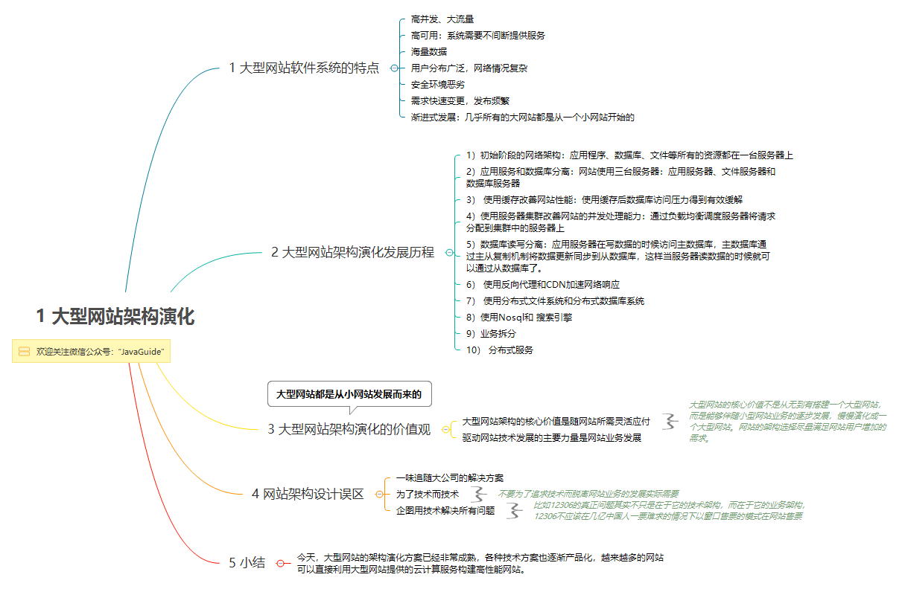
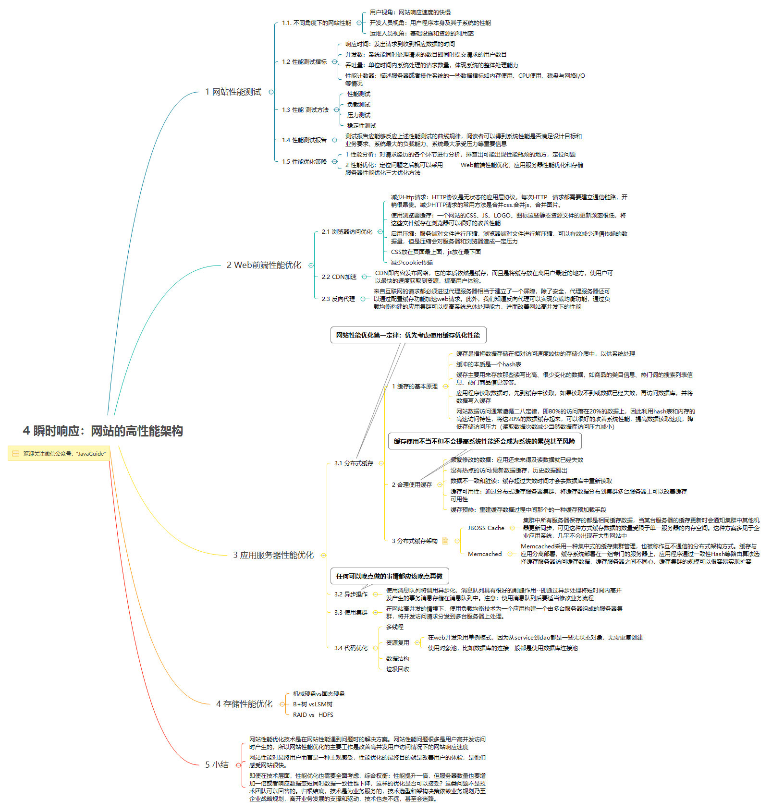
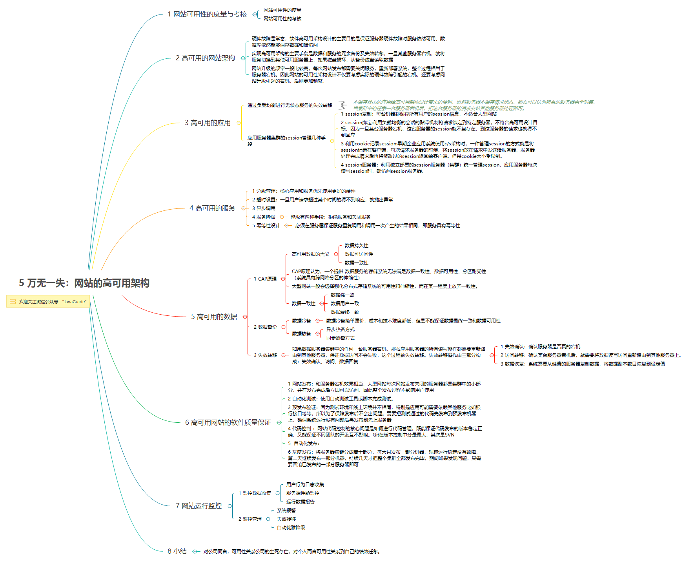
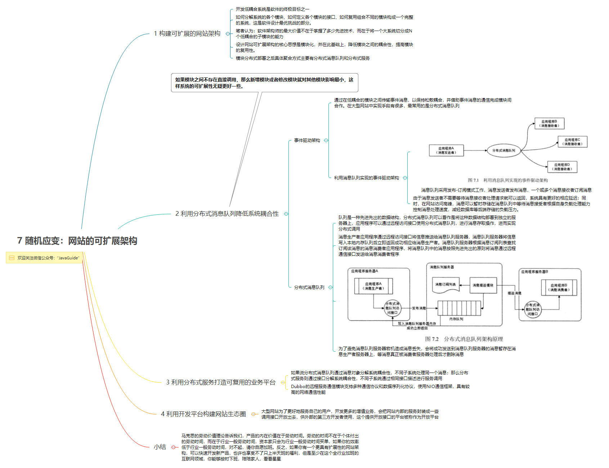

### 架构基础

**架构设计相关的几个特性**  

- 架构设计的思维和程序设计的思维差异很大  
架构设计的关键思维是判断和取舍，程序设计的关键思维是逻辑和实现。很多程序员在转换为架构师后，很难一开始就意识到这个差异，还是按照写代码的方式去思考架构，会导致很多 困惑。
- 架构设计没有体系化的培训和训练机制
大学的课程几乎没有架构设计相关的课程，架构设计的书籍更多的也只是关注某个架构设计点，没有体系化的架构设计书籍，导致程序员在学习上没有明确指导，只能自己慢慢摸 索，效率低，容易踩坑。
- 程序员对架构设计的理解存在很多误区。
例如：要成为架构师必须要有很强的技术天分；架构师必须有很强的创造力；架构设计必须要高大上才能体现架构师能力；架构一定要具备高可用、高性能……这些似是而非的误区 让很多技术人员望而生畏，还没尝试就已经放弃了。

**架构到底是什么**  
软件架构指软件系统的顶层结构，它基本上把系统、子系统、模块、组件、架构等概念都串起来了：  
首先，“系统是一群关联个体组成”，这些“个体”可以是“子系统”“模块”“组件”等；架构需要明确系统包含哪些“个体”。  
其次，系统中的个体需要“根据某种规则”运作，架构需要明确个体运作和协作的规则。  
最后，维基百科定义的架构用到了“基础结构”这个说法，这里改为“顶层结构”，可以更好地区分系统和子系统，避免将系统架构和子系统架构混淆在一起导致架构层次混乱。  

- 系统泛指由一群有关联的个体组成，根据某种规则运作，能完成个别元件不能单独完成的工作的群体。它的意思是“总体”“整体”或“联盟”。  
1. 关联：系统是由一群有关联的个体组成的，没有关联的个体堆在一起不能成为一个系统。例如，把一个发动机和一台PC放在一起不能称之为一个系统，把发动机、底盘、轮胎、车架组合起来才能成为一台汽车。  
2. 规则：系统内的个体需要按照指定的规则运作，而不是单个个体各自为政。规则规定了系统内个体分工和协作的方式。例如，汽车发动机负责产生动力，然后通过变速器和传动轴，将动力输出到车轮上，从而驱动汽车前进。  
3. 能力：系统能力与个体能力有本质的差别，系统能力不是个体能力之和，而是产生了新的能力。例如，汽车能够载重前进，而发动机、变速器、传动轴、车轮本身都不具备这样的能力。   
- 子系统也是由一群有关联的个体所组成的系统，多半会是更大系统中的一部分。  
其实子系统的定义和系统定义是一样的，只是观察的角度有差异，一个系统可能是另外一个更大系统的子系统。  
以微信为例来做一个分析：  
1. 微信本身是一个系统，包含聊天、登录、支付、朋友圈等子系统。  
2. 朋友圈这个系统又包括动态、评论、点赞等子系统。  
3. 评论这个系统可能又包括防刷子系统、审核子系统、发布子系统、存储子系统。  
4. 评论审核子系统不再包含业务意义上的子系统，而是包括各个模块或者组件，这些模块或者组件本身也是另外一个维度上的系统。例如，MySQL、Redis 等是存储系统，但不是业务子系统。  
- 软件模块（Module）是一套一致而互相有紧密关连的软件组织。它分别包含了程序和数据结构两部分。现代软件开发往往利用模块作为合成的单位。模块的接口表达 了由该模块提供的功能和调用它时所需的元素。模块是可能分开被编写的单位。这使它们可再用和允许人员同时协作、编写及研究不同的模块。
- 软件组件定义为自包含的、可编程的、可重用的、与语言无关的软件单元，软件组件可以很容易被用于组装应用程序中。
模块和组件都是系统的组成部分，只是从不同的角度拆分系统而已。  
从逻辑的角度来拆分系统后，得到的单元就是“模块”；从物理的角度来拆分系统后，得到的单元就是“组件”。划分模块的主要目的是职责分离；划分组件的主要目的是单元复用。其实，“组件”的英文component也可翻译成中文的“零件”一词，“零件”更容易理解一些，“零件”是一个物理的概念，并且具备“独立且可替换”的特点。  
以一个最简单的网站系统来为例，假设我们要做一个学生信息管理系统，这个系统从逻辑的角度来拆分，可以分为“登录注册模块”“个人信息模块”“个人成绩模块”；从物理的角度 来拆分，可以拆分为 Nginx、Web 服务器、MySQL。  
- 软件框架（Software framework）通常指的是为了实现某个业界标准或完成特定基本任务的软件组件规范，也指为了实现某个软件组件规范时，提供规范所要求之基 础功能的软件产品。  
1. 框架是组件规范：例如，MVC就是一种最常见的开发规范，类似的还有MVP、MVVM、J2EE等框架。  
2. 框架提供基础功能的产品：例如，Spring MVC 是 MVC 的开发框架，除了满足 MVC 的规范，Spring 提供了很多基础功能来帮助我们实现功能，包括注解 （@Controller 等）、Spring Security、Spring JPA 等很多基础功能。  
- 软件架构指软件系统的“基础结构”，创造这些基础结构的准则，以及对这些结构的描述。  
单纯从定义的角度来看，框架和架构的区别还是比较明显的，框架关注的是“规范”，架构关注的是“结构”。框架的英文是 Framework，架构的英文是 Architecture。

### 设计模式之基础架构思想
**MVC**  
MVC 模式代表 Model-View-Controller（模型 - 视图 - 控制器） 模式，常用于应用程序的分层开发。  
优点：View、Model 都是可以重复利用的，可以独立使用。  
缺点：Controller 的代码过于臃肿；没有明确的定义，会存在不同的实现细节。  

MVC 的一般流程是这样的：  
> 1、View（界面）触发事件   
> 2、Controller（业务）处理了业务，然后触发了数据更新   
> 3、不知道谁更新了 Model 的数据   
> 4、Model（带着数据）回到了 View  
> 5、View 更新数据  

MVC 的应用还是相当广泛的，也常常会在项目达到一定规模后进行重构，这时候可能考虑的方向：  
> 1、增加 Service 层  
> 2、使用 DDD   
> 3、模块化  
> 4、微服务  

**MVP**  
优化 MVC 模，其中之一就是 Model-View-Presenter（MVP）模式。  
MVP 切断 View 和 Model 的联系，让 View 只和 Presenter（原 Controller）交互，减少在需求变化中需要维护的对象的数量。MVP 定义了 Presenter 和 View 之间的接口，让一些可以根据已有的接口协议去各自分别独立开发，以此去解决界面需求变化频繁的问题。

**MVVM**  
MVVM（Model-View-ViewModel）是一种 “更好的” UI 模式解决方案。  
ViewModel 大致上就是 MVP 的 Presenter 和 MVC 的 Controller 了，而 View 和 ViewModel 间没有了 MVP 的界面接口，而是直接交互，用数据 “绑定” 的形式让数据更新的事件不需要开发人员手动去编写特殊用例，而是自动地双向同步。  
> 数据绑定可以认为是观察者（Observer）模式或者是发布订阅（Publish/Subscribe）模式。  
> 数据绑定的原理都是为了用一种统一的集中的方式实现频繁需要被实现的数据更新问题。  

比起 MVP，MVVM 不仅简化了业务与界面的依赖关系，还优化了数据频繁更新的解决方案，甚至可以说提供了一种有效的解决模式。

### 大型网站技术架构
`图片来源公众号 (JavaGuide) `

**1.大型网站架构演化**  
  

**2.大型架构模式**  
  

**3.大型网站核心架构要素**  
  

**4.瞬时响应：网站的高性能架构**  
  

**5.万无一失：网站的高可用架构**  
  

**6.永无止境：网站的伸缩性架构**  
  

**7.随机应变：网站的可扩展性架构**  
  

**8.固若金汤：网站的安全机构**  
  

