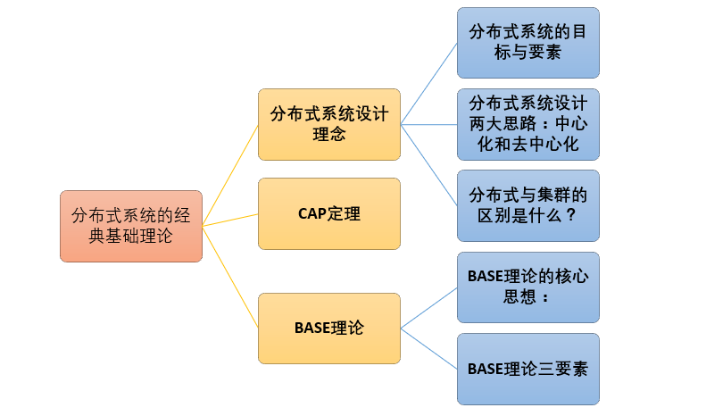

### 分布式

### 分布式理论
分布式三个常见的概念： 分布式系统设计理念、 CAP 定理、 BASE 理论。  
  

**分布式系统设计理念**  
  

**CAP 定理**  
在理论计算机科学中，CAP 定理（CAP theorem），又被称作布鲁尔定理（Brewer's theorem），它指出对于一个分布式计算系统来说，不可能同时满足以下三点：  

- 一致性（Consistence） : 所有节点访问同一份最新的数据副本  
- 可用性（Availability）: 每次请求都能获取到非错的响应 —— 但是不保证获取的数据为最新数据  
- 分区容错性（Partition tolerance）：分布式系统在遇到某节点或网络分区故障的时候，仍然能够对外提供满足一致性和可用性的服务  

  
CAP 仅适用于原子读写的 NOSQL 场景中，并不适合数据库系统。现在的分布式系统具有更多特性比如扩展性、可用性等等，在进行系统设计和开发时，我们不应该仅仅局限在 CAP 问题上。  
`注意：不是所谓的 3 选 2。大部分人解释这一定律时，常常简单的表述为：“一致性、可用性、分区容忍性三者你只能同时达到其中两个，不可能同时达到”。实际上这是一个非常具有误导性质的说法，而且在 CAP 理论诞生 12 年之后，CAP 之父也在 2012 年重写了之前的论文。`  

当发生网络分区的时候，如果我们要继续服务，那么强一致性和可用性只能 2 选 1。也就是说当网络分区之后 P 是前提，决定了 P 之后才有 C 和 A 的选择。也就是说分区容错性（Partition tolerance）我们是必须要实现的。  
[《分布式系统之 CAP 理论》参考](http://www.cnblogs.com/hxsyl/p/4381980.html)  

**BASE 理论**  
BASE 是 Basically Available（基本可用） 、Soft-state（软状态） 和 Eventually Consistent（最终一致性） 三个短语的缩写。BASE 理论是对 CAP 中一致性和可用性权衡的结果，其来源于对大规模互联网系统分布式实践的总结，是基于 CAP 定理逐步演化而来的，它大大降低了我们对系统的要求。  

- 基本可用： 基本可用是指分布式系统在出现不可预知故障的时候，允许损失部分可用性。但是，这绝不等价于系统不可用。 比如：  
①响应时间上的损失: 正常情况下，一个在线搜索引擎需要在 0.5 秒之内返回给用户相应的查询结果，但由于出现故障，查询结果的响应时间增加了 1~2 秒；  
②系统功能上的损失：正常情况下，在一个电子商务网站上进行购物的时候，消费者几乎能够顺利完成每一笔订单，但是在一些节日大促购物高峰的时候，由于消费者的购物行为激增，为了保护购物系统的稳定性，部分消费者可能会被引导到一个降级页面；
- 软状态： 软状态指允许系统中的数据存在中间状态，并认为该中间状态的存在不会影响系统的整体可用性，即允许系统在不同节点的数据副本之间进行数据同步的过程存在延时；
- 最终一致性： 最终一致性强调的是系统中所有的数据副本，在经过一段时间的同步后，最终能够达到一个一致的状态。因此，最终一致性的本质是需要系统保证最终数据能够达到一致，而不需要实时保证系统数据的强一致性。

  
BASE 理论的核心思想：即使无法做到强一致性，但每个应用都可以根据自身业务特点，采用适当的方式来使系统达到最终一致性。也就是牺牲数据的一致性来满足系统的高可用性，系统中一部分数据不可用或者不一致时，仍需要保持系统整体 “主要可用”。  