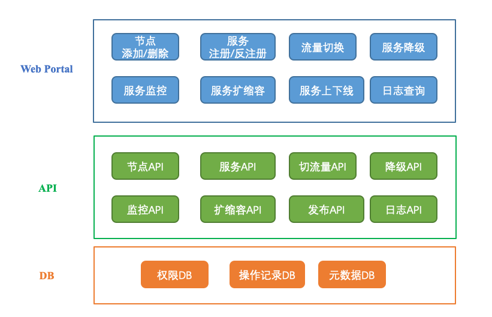

### 服务治理之识别服务节点是否存活
ZooKeeper 判断注册中心节点存活的机制其实就是注册中心摘除机制，服务消费者以注册中心中的数据为准，当服务端节点有变更时，注册中心就会把变更通知给服务消费者，服务消费者就会调用注册中心来拉取最新的节点信息。  

这种机制在大部分情况下都可以工作得很好，但是在网络频繁抖动时，服务提供者向注册中心汇报心跳信息可能会失败，如果在规定的时间内，注册中心都没有收到服务提供者的心跳信息，就会把这个节点从可用节点列表中移除。更糟糕的是，在服务池拥有上百个节点的的时候，每个节点都可能会被移除，导致注册中心可用节点的状态一直在变化，又该如何处理呢？  
1、心跳开关保护机制  
在网络频繁抖动的情况下，注册中心中可用的节点会不断变化，这时候服务消费者会频繁收到服务提供者节点变更的信息，于是就不断地请求注册中心来拉取最新的可用服务节点信息。当有成百上千个服务消费者，同时请求注册中心获取最新的服务提供者的节点信息时，可能会把注册中心的带宽给占满，尤其是注册中心是百兆网卡的情况下。  
针对这种情况，需要一种保护机制，即使在网络频繁抖动的时候，服务消费者也不至于同时去请求注册中心获取最新的服务节点信息。  
一个可行的解决方案就是给注册中心设置一个开关，当开关打开时，即使网络频繁抖动，注册中心也不会通知所有的服务消费者有服务节点信息变更，比如只给 10% 的服务消费者返回变更，这样的话就能将注册中心的请求量减少到原来的 1/10。  
当然，打开这个开关也是有一定代价的，它会导致服务消费者感知最新的服务节点信息延迟，原先可能在 10s 内就能感知到服务提供者节点信息的变更，现在可能会延迟到几分钟，所以在网络正常的情况下，开关并不适合打开；可以作为一个紧急措施，在网络频繁抖动的时候，才打开这个开关。  
2、服务节点摘除保护机制  
服务提供者在进程启动时，会注册服务到注册中心，并每隔一段时间，汇报心跳给注册中心，以标识自己的存活状态。如果隔了一段固定时间后，服务提供者仍然没有汇报心跳给注册中心，注册中心就会认为该节点已经处于“dead”状态，于是从服务的可用节点信息中移除出去。  
如果遇到网络问题，大批服务提供者节点汇报给注册中心的心跳信息都可能会传达失败，注册中心就会把它们都从可用节点列表中移除出去，造成剩下的可用节点难以承受所有的调用，引起“雪崩”。但是这种情况下，可能大部分服务提供者节点是可用的，仅仅因为网络原因无法汇报心跳给注册中心就被“无情”的摘除了。  
这个时候就需要根据实际业务的情况，设定一个阈值比例，即使遇到刚才说的这种情况，注册中心也不能摘除超过这个阈值比例的节点。这个阈值比例可以根据实际业务的冗余度来确定，通常会把这个比例设定在 20%，就是说注册中心不能摘除超过 20% 的节点。因为大部分情况下，节点的变化不会这么频繁，只有在网络抖动或者业务明确要下线大批量节点的情况下才有可能发生。而业务明确要下线大批量节点的情况是可以预知的，这种情况下可以关闭阈值保护；而正常情况下，应该打开阈值保护，以防止网络抖动时，大批量可用的服务节点被摘除。

心跳开关保护机制，是为了防止服务提供者节点频繁变更导致的服务消费者同时去注册中心获取最新服务节点信息；服务节点摘除保护机制，是为了防止服务提供者节点被大量摘除引起服务消费者可以调用的节点不足。  
无论是心跳开关保护机制还是服务节点摘除保护机制，都是因为注册中心里的节点信息是随时可能发生变化的，所以也可以把注册中心叫作动态注册中心。  

服务消费者并不严格以注册中心中的服务节点信息为准，而是更多的以服务消费者实际调用信息来判断服务提供者节点是否可用。  
因为服务提供者是向服务消费者提供服务的，是否可用服务消费者应该比注册中心更清楚，因此可以直接在服务消费者端根据调用服务提供者是否成功来判定服务提供者是否可用。如果服务消费者调用某一个服务提供者节点连续失败超过一定次数，可以在本地内存中将这个节点标记为不可用。并且每隔一段固定时间，服务消费者都要向标记为不可用的节点发起保活探测，如果探测成功了，就将标记为不可用的节点再恢复为可用状态，重新发起调用。  
这样的话，服务提供者节点就不需要向注册中心汇报心跳信息，注册中心中的服务节点信息也不会动态变化，也可以称之为静态注册中心。  

一开始采用了动态注册中心，后来考虑到网络的复杂性，心跳机制不一定是可靠的，而后开始改为采用服务消费者端的保活机制，事实证明这种机制足以应对网络频繁抖动等复杂的场景。  
静态注册中心中的服务节点信息并不是一直不变，当在业务上线或者运维人工增加或者删除服务节点这种预先感知的情况下，还是有必要去修改注册中心中的服务节点信息。  
比如在业务上线过程中，需要把正在部署的服务节点从注册中心中移除，等到服务部署完毕，完全可用的时候，再加入到注册中心。还有就是在业务新增或者下线服务节点的时候，需要调用注册中心提供的接口，添加节点信息或者删除节点。这个时候静态注册中心有点退化到配置中心的意思，只不过这个时候配置中心里存储的不是某一项配置，而是某个服务的可用节点信息。  

### 服务治理之负载均衡
RPC 调用中引入负载均衡算法，主要有两个原因：一个是要考虑调用的均匀性，也就是要让每个节点都接收到调用，发挥所有节点的作用；另一个是要考虑调用的性能，也就是哪个节点响应最快，优先调用哪个节点。  

常见的负载均衡算法有：随机算法、轮询算法、加权轮询算法、最少活跃连接算法和一致性 hash 算法。更有针对性的负载均衡算法，比如自适应最优选择算法。  
1、随机算法  
随机算法，顾名思义就是从可用的服务节点中，随机挑选一个节点来访问。在实现时，随机算法通常是通过生成一个随机数来实现，比如服务有 10 个节点，那么就每一次生成一个 1～10 之间的随机数，假设生成的是 2，那么就访问编号为 2 的节点。采用随机算法，在节点数量足够多，并且访问量比较大的情况下，各个节点被访问的概率是基本相同的。  
在请求量远超可用服务节点数量的情况下，各个服务节点被访问的概率基本相同，主要应用在各个服务节点的性能差异不大的情况下。  
```java
import java.util.List;
import java.util.concurrent.ThreadLocalRandom;

import com.weibo.api.motan.core.extension.SpiMeta;
import com.weibo.api.motan.rpc.Referer;
import com.weibo.api.motan.rpc.Request;

/**
 * 
 * random load balance.
 *
 * @author fishermen
 * @version V1.0 created at: 2013-5-21
 */
@SpiMeta(name = "random")
public class RandomLoadBalance<T> extends AbstractLoadBalance<T> {

    @Override
    protected Referer<T> doSelect(Request request) {
        List<Referer<T>> referers = getReferers();

        int idx = (int) (ThreadLocalRandom.current().nextDouble() * referers.size());
        for (int i = 0; i < referers.size(); i++) {
            Referer<T> ref = referers.get((i + idx) % referers.size());
            if (ref.isAvailable()) {
                return ref;
            }
        }
        return null;
    }

    @Override
    protected void doSelectToHolder(Request request, List<Referer<T>> refersHolder) {
        List<Referer<T>> referers = getReferers();

        int idx = (int) (ThreadLocalRandom.current().nextDouble() * referers.size());
        for (int i = 0; i < referers.size(); i++) {
            Referer<T> referer = referers.get((i + idx) % referers.size());
            if (referer.isAvailable()) {
                refersHolder.add(referer);
            }
        }
    }
}
```

2、轮询算法  
轮询算法，顾名思义就是按照固定的顺序，把可用的服务节点，挨个访问一次。在实现时，轮询算法通常是把所有可用节点放到一个数组里，然后按照数组编号，挨个访问。比如服务有 10 个节点，放到数组里就是一个大小为 10 的数组，这样的话就可以从序号为 0 的节点开始访问，访问后序号自动加 1，下一次就会访问序号为 1 的节点，以此类推。轮询算法能够保证所有节点被访问到的概率是相同的。  
跟随机算法类似，各个服务节点被访问的概率也基本相同，也主要应用在各个服务节点性能差异不大的情况下。  
```java
import java.util.List;
import java.util.concurrent.atomic.AtomicInteger;

import com.weibo.api.motan.core.extension.SpiMeta;
import com.weibo.api.motan.rpc.Referer;
import com.weibo.api.motan.rpc.Request;
import com.weibo.api.motan.util.MathUtil;

/**
 * 
 * Round robin loadbalance.
 * 
 * @author fishermen
 * @version V1.0 created at: 2013-6-13
 */
@SpiMeta(name = "roundrobin")
public class RoundRobinLoadBalance<T> extends AbstractLoadBalance<T> {

    private AtomicInteger idx = new AtomicInteger(0);

    @Override
    protected Referer<T> doSelect(Request request) {
        List<Referer<T>> referers = getReferers();

        int index = getNextNonNegative();
        for (int i = 0; i < referers.size(); i++) {
            Referer<T> ref = referers.get((i + index) % referers.size());
            if (ref.isAvailable()) {
                return ref;
            }
        }
        return null;
    }

    @Override
    protected void doSelectToHolder(Request request, List<Referer<T>> refersHolder) {
        List<Referer<T>> referers = getReferers();

        int index = getNextNonNegative();
        for (int i = 0, count = 0; i < referers.size() && count < MAX_REFERER_COUNT; i++) {
            Referer<T> referer = referers.get((i + index) % referers.size());
            if (referer.isAvailable()) {
                refersHolder.add(referer);
                count++;
            }
        }
    }

    // get non-negative int
    private int getNextNonNegative() {
        return MathUtil.getNonNegative(idx.incrementAndGet());
    }
}
```

3、加权轮询算法  
轮询算法能够保证所有节点被访问的概率相同，而加权轮询算法是在此基础上，给每个节点赋予一个权重，从而使每个节点被访问到的概率不同，权重大的节点被访问的概率就高，权重小的节点被访问的概率就小。在实现时，加权轮询算法是生成一个节点序列，该序列里有 n 个节点，n 是所有节点的权重之和。在这个序列中，每个节点出现的次数，就是它的权重值。比如有三个节点：a、b、c，权重分别是 3、2、1，那么生成的序列就是{a、a、b、c、b、a}，这样的话按照这个序列访问，前 6 次请求就会分别访问节点 a 三次，节点 b 两次，节点 c 一次。从第 7 个请求开始，又重新按照这个序列的顺序来访问节点。  
在应用加权轮询算法的时候，要尽可能保证生产的序列的均匀，如果生成的不均匀会造成节点访问失衡，比如刚才的例子，如果生成的序列是{a、a、a、b、b、c}，就会导致前 3 次访问的节点都是 a。  
比如经常会出现一种情况，因为采购时间的不同，新的服务节点的性能往往要高于旧的节点，这个时候可以给新的节点设置更高的权重，让它承担更多的请求，充分发挥新节点的性能优势。  

4、最少活跃连接算法  
最少活跃连接算法，顾名思义就是每一次访问都选择连接数最少的节点。因为不同节点处理请求的速度不同，使得同一个服务消费者同每一个节点的连接数都不相同。连接数大的节点，可以认为是处理请求慢，而连接数小的节点，可以认为是处理请求快。所以在挑选节点时，可以以连接数为依据，选择连接数最少的节点访问。在实现时，需要记录跟每一个节点的连接数，这样在选择节点时，才能比较出连接数最小的节点。  
尤其在服务端节点性能差异较大，而又不好做到预先定义权重时，采用最少活跃连接算法是比较好的选择。  

5、一致性 hash 算法  
一致性 hash 算法，是通过某个 hash 函数，把同一个来源的请求都映射到同一个节点上。一致性 hash 算法最大的特点就是同一个来源的请求，只会映射到同一个节点上，可以说是具有记忆功能。只有当这个节点不可用时，请求才会被分配到相邻的可用节点上。  
因为它能够保证同一个客户端的请求始终访问同一个服务节点，所以适合服务端节点处理不同客户端请求差异较大的场景。比如服务端缓存里保存着客户端的请求结果，如果同一客户端一直访问一个服务节点，那么就可以一直从缓存中获取数据。  

6、自适应最优选择算法  
自适应最优选择算法的主要思路是在客户端本地维护一份同每一个服务节点的性能统计快照，并且每隔一段时间去更新这个快照。在发起请求时，根据“二八原则”，把服务节点分成两部分，找出 20% 的那部分响应最慢的节点，然后降低权重。这样的话，客户端就能够实时的根据自身访问每个节点性能的快慢，动态调整访问最慢的那些节点的权重，来减少访问量，从而可以优化长尾请求。  
自适应最优选择算法是对加权轮询算法的改良，可以看作是一种动态加权轮询算法。它的实现关键之处就在于两点：第一点是每隔一段时间获取客户端同每个服务节点之间调用的平均性能统计；第二点是按照这个性能统计对服务节点进行排序，对排在性能倒数 20% 的那部分节点赋予一个较低的权重，其余的节点赋予正常的权重。  
在具体实现时，针对第一点，需要在内存中开辟一块空间记录客户端同每一个服务节点之间调用的平均性能，并每隔一段固定时间去更新。这个更新的时间间隔不能太短，太短的话很容易受瞬时的性能抖动影响，导致统计变化太快，没有参考性；同时也不能太长，太长的话时效性就会大打折扣，效果不佳。根据经验，1 分钟的更新时间间隔是个比较合适的值。针对第二点，关键点是权重值的设定，即使服务节点之间的性能差异较大，也不适合把权重设置得差异太大，这样会导致性能较好的节点与性能较差的节点之间调用量相差太大，这样也不是一种合理的状态。在实际设定时，可以设置 20% 性能较差的节点权重为 3，其余节点权重为 5。  

### 服务治理之服务路由
服务路由就是服务消费者在发起服务调用时，必须根据特定的规则来选择服务节点，从而满足某些特定的需求。  
服务路由主要有以下几种应用场景：  

- 分组调用。一般来讲，为了保证服务的高可用性，实现异地多活的需求，一个服务往往不止部署在一个数据中心，而且出于节省成本等考虑，有些业务可能不仅在私有机房部署，还会采用公有云部署，甚至采用多家公有云部署。服务节点也会按照不同的数据中心分成不同的分组，这时对于服务消费者来说，选择哪一个分组调用，就必须有相应的路由规则。  
- 灰度发布。在服务上线发布的过程中，一般需要先在一小部分规模的服务节点上先发布服务，然后验证功能是否正常。如果正常的话就继续扩大发布范围；如果不正常的话，就需要排查问题，解决问题后继续发布。这个过程就叫作灰度发布，也叫金丝雀部署。  
- 流量切换。在业务线上运行过程中，经常会遇到一些不可抗力因素导致业务故障，比如某个机房的光缆被挖断，或者发生着火等事故导致整个机房的服务都不可用。这个时候就需要按照某个指令，能够把原来调用这个机房服务的流量切换到其他正常的机房。  
- 读写分离。对于大多数互联网业务来说都是读多写少，所以在进行服务部署的时候，可以把读写分开部署，所有写接口可以部署在一起，而读接口部署在另外的节点上。

服务路由可以通过各种规则来实现。服务路由主要有两种规则：一种是条件路由，一种是脚本路由。
**条件路由**  
条件路由是基于条件表达式的路由规则。  
以 Dubbo 框架为例，条件路由的应用场景是排除某个服务节点、白名单和黑名单功能、机房隔离、读写隔离等。  

**脚本路由**  
脚本路由是基于脚本语言的路由规则，常用的脚本语言比如 JavaScript、Groovy、JRuby 等。  

服务路由是通过路由规则来实现的，最终由服务消费者获取路由规则。  
服务路由的获取方式主要有三种：  
> 1、本地配置  
> 路由规则存储在服务消费者本地上。服务消费者发起调用时，从本地固定位置读取路由规则，然后按照路由规则选取一个服务节点发起调用。  
> 2、配置中心管理  
> 所有的服务消费者都从配置中心获取路由规则，由配置中心来统一管理。  
> 3、动态下发  
> 一般是运维人员或者开发人员，通过服务治理平台修改路由规则，服务治理平台调用配置中心接口，把修改后的路由规则持久化到配置中心。因为服务消费者订阅了路由规则的变更，于是就会从配置中心获取最新的路由规则，按照最新的路由规则来执行。  

一般来讲，服务路由最好是存储在配置中心中，由配置中心来统一管理。这样的话，所有的服务消费者就不需要在本地管理服务路由，因为大部分的服务消费者并不关心服务路由的问题，或者说也不需要去了解其中的细节。通过配置中心，统一给各个服务消费者下发统一的服务路由，节省了沟通和管理成本。但也不排除某些服务消费者有特定的需求，需要定制自己的路由规则，这个时候就适合通过本地配置来定制。而动态下发可以理解为一种高级功能，它能够动态地修改路由规则，在某些业务场景下十分有用。比如某个数据中心存在问题，需要把调用这个数据中心的服务消费者都切换到其他数据中心，这时就可以通过动态下发的方式，向配置中心下发一条路由规则，将所有调用这个数据中心的请求都迁移到别的地方。  
三种方式也可以一起使用，服务消费者的判断优先级是本地配置 > 动态下发 > 配置中心管理。  

### 服务端故障
微服务系统可能出现故障的主要有三种：  

- 集群故障。微服务系统一般都是集群部署的，根据业务量大小而定，集群规模从几台到甚至上万台都有可能。一旦某些代码出现 bug，可能整个集群都会发生故障，不能提供对外提供服务。  
- 单 IDC 故障。现在大多数互联网公司为了保证业务的高可用性，往往业务部署在不止一个 IDC。然而现实中时常会发生某个 IDC 的光缆因为道路施工被挖断，导致整个 IDC 脱网。  
- 单机故障。顾名思义就是集群中的个别机器出现故障，这种情况往往对全局没有太大影响，但会导致调用到故障机器上的请求都失败，影响整个系统的成功率。  

**集群故障**  
一般而言，集群故障的产生原因不外乎有两种：一种是代码 bug 所导致，比如说某一段 Java 代码不断地分配大对象，但没有及时回收导致 JVM OOM 退出；另一种是突发的流量冲击，超出了系统的最大承载能力，比如“双 11”这种购物活动，电商系统会在零点一瞬间涌入大量流量，超出系统的最大承载能力，一下子就把整个系统给压垮了。  

应付集群故障的思路，主要有两种：限流和降级。  
1、限流  
限流就是限制流量，通常情况下，系统能够承载的流量根据集群规模的大小是固定的，可以称之为系统的最大容量。当真实流量超过了系统的最大容量后，就会导致系统响应变慢，服务调用出现大量超时，反映给用户的感觉就是卡顿、无响应。所以，应该根据系统的最大容量，给系统设置一个阈值，超过这个阈值的请求会被自动抛弃，这样的话可以最大限度地保证系统提供的服务正常。  
除此之外，通常一个微服务系统会同时提供多个服务，每个服务在同一时刻的请求量也是不同的，很可能出现的一种情况就是，系统中某个服务的请求量突增，占用了系统中大部分资源，导致其他服务没有资源可用。因此，还要针对系统中每个服务的请求量也设置一个阈值，超过这个阈值的请求也要被自动抛弃，这样的话不至于因为一个服务影响了其他所有服务。  
在实际项目中，可以用两个指标来衡量服务的请求量，一个是 QPS 即每秒请求量，一个是工作线程数。不过 QPS 因为不同服务的响应快慢不同，所以系统能够承载的 QPS 相差很大，因此一般选择工作线程数来作为限流的指标，给系统设置一个总的最大工作线程数以及单个服务的最大工作线程数，这样的话无论是系统的总请求量过大导致整体工作线程数量达到最大工作线程数，还是某个服务的请求量超过单个服务的最大工作线程数，都会被限流，以起到保护整个系统的作用。  
2、降级  
降级就是通过停止系统中的某些功能，来保证系统整体的可用性。降级可以说是一种被动防御的措施，因为它一般是系统已经出现故障后所采取的一种止损措施。  
降级一般通过开关来实现。就是在系统运行的内存中开辟一块区域，专门用于存储开关的状态，也就是开启还是关闭。并且需要监听某个端口，通过这个端口可以向系统下发命令，来改变内存中开关的状态。当开关开启时，业务的某一段逻辑就不再执行，而正常情况下，开关是关闭的状态。  
开关一般用在两种地方，一种是新增的业务逻辑，因为新增的业务逻辑相对来说不成熟，往往具备一定的风险，所以需要加开关来控制新业务逻辑是否执行；另一种是依赖的服务或资源，因为依赖的服务或者资源不总是可靠的，所以最好是有开关能够控制是否对依赖服务或资源发起调用，来保证即使依赖出现问题，也能通过降级来避免影响。  
在实际业务应用的时候，降级要按照对业务的影响程度进行分级，一般分为三级：一级降级是对业务影响最小的降级，在故障的情况下，首先执行一级降级，所以一级降级也可以设置成自动降级，不需要人为干预；二级降级是对业务有一定影响的降级，在故障的情况下，如果一级降级起不到多大作用的时候，可以人为采取措施，执行二级降级；三级降级是对业务有较大影响的降级，这种降级要么是对商业收入有重大影响，要么是对用户体验有重大影响，所以操作起来要非常谨慎，不在最后时刻一般不予采用。  

**单 IDC 故障**  
整个 IDC 脱网的事情时有发生，多半是因为不可抗力比如机房着火、光缆被挖断等，如果业务全部部署在这个 IDC，那就完全不可访问了，所以国内大部分的互联网业务多采用多 IDC 部署。具体来说，有的采用同城双活，也就是在一个城市的两个 IDC 内部署；有的采用异地多活，一般是在两个城市的两个 IDC 内部署；当然也有支付宝这种金融级别的应用采用了“三地五中心”部署，这种部署成本显然高比两个 IDC 要高得多，但可用性的保障要更高。  
采用多 IDC 部署的最大好处就是当有一个 IDC 发生故障时，可以把原来访问故障 IDC 的流量切换到正常的 IDC，来保证业务的正常访问。  
流量切换的方式一般有两种，一种是基于 DNS 解析的流量切换，一种是基于 RPC 分组的流量切换。  
1、基于 DNS 解析的流量切换  
一般是通过把请求访问域名解析的 VIP 从一个 IDC 切换到另外一个IDC。比如访问“www.weibo.com”，正常情况下北方用户会解析到联通机房的 VIP，南方用户会解析到电信机房的 VIP，如果联通机房发生故障的话，会把北方用户访问也解析到电信机房的 VIP，只不过此时网络延迟可能会变长。  
2、基于 RPC 分组的流量切换  
对于一个服务来说，如果是部署在多个 IDC 的话，一般每个 IDC 就是一个分组。假如一个 IDC 出现故障，那么原先路由到这个分组的流量，就可以通过向配置中心下发命令，把原先路由到这个分组的流量全部切换到别的分组，这样的话就可以切换故障 IDC 的流量了。  

**单机故障**  
单机故障是发生概率最高的一种故障了，尤其对于业务量大的互联网应用来说，上万台机器的规模也是很常见的。这种情况下，发生单机故障的概率就很高了，这个时候只靠运维人肉处理显然不可行，所以就要求有某种手段来自动处理单机故障。  
处理单机故障一个有效的办法就是自动重启。具体来讲，你可以设置一个阈值，比如以某个接口的平均耗时为准，当监控单机上某个接口的平均耗时超过一定阈值时，就认为这台机器有问题，这个时候就需要把有问题的机器从线上集群中摘除掉，然后在重启服务后，重新加入到集群中。  
不过这里要注意的是，需要防止网络抖动造成的接口超时从而触发自动重启。一种方法是在收集单机接口耗时数据时，多采集几个点，比如每 10s 采集一个点，采集 5 个点，当 5 个点中有超过 3 个点的数据都超过设定的阈值范围，才认为是真正的单机问题，这时会触发自动重启策略。  
除此之外，为了防止某些特殊情况下，短时间内被重启的单机过多，造成整个服务池可用节点数太少，最好是设置一个可重启的单机数量占整个集群的最大比例，一般这个比例不要超过 10%，因为正常情况下，不大可能有超过 10% 的单机都出现故障。  

### 服务调用失败
微服务相比于单体应用最大的不同之处在于，服务的调用从同一台机器内部的本地调用变成了不同机器之间的远程方法调用，但是这个过程也引入了两个不确定的因素。  
一个是调用的执行是在服务提供者一端，即使服务消费者本身是正常的，服务提供者也可能由于诸如 CPU、网络 I/O、磁盘、内存、网卡等硬件原因导致调用失败，还有可能由于本身程序执行问题比如 GC 暂停导致调用失败。  
另一个不确定因素是调用发生在两台机器之间，所以要经过网络传输，而网络的复杂性是不可控的，网络丢包、延迟以及随时可能发生的瞬间抖动都有可能造成调用失败。  

**超时**  
一次用户调用可能会被拆分成多个系统之间的服务调用，任何一次服务调用如果发生问题都可能会导致最后用户调用失败。而且，在微服务架构下，一个系统的问题会影响所有调用这个系统所提供服务的服务消费者，如果不加以控制，严重的话会引起整个系统雪崩。  
所以，在实际项目中，针对服务调用都要设置一个超时时间，以避免依赖的服务迟迟没有返回调用结果，把服务消费者拖死。这其中，超时时间的设定也是有讲究的，不是越短越好，因为太短可能会导致有些服务调用还没有来得及执行完就被丢弃了；当然时间也不能太长，太长有可能导致服务消费者被拖垮。  
找到比较合适的超时时间需要根据正常情况下，服务提供者的服务水平来决定。具体来说，就是按照服务提供者线上真实的服务水平，取 P999 或者 P9999 的值，也就是以 99.9% 或者 99.99% 的调用都在多少毫秒内返回为准。  

**重试**  
虽然设置超时时间可以起到及时止损的效果，但是服务调用的结果毕竟是失败了，而大部分情况下，调用失败都是因为偶发的网络问题或者个别服务提供者节点有问题导致的，如果能换个节点再次访问说不定就能成功。而且从概率论的角度来讲，假如一次服务调用失败的概率为 1%，那么连续两次服务调用失败的概率就是 0.01%，失败率降低到原来的 1%。  
所以，在实际服务调用时，经常还要设置一个服务调用超时后的重试次数。假如某个服务调用的超时时间设置为 100ms，重试次数设置为 1，那么当服务调用超过 100ms 后，服务消费者就会立即发起第二次服务调用，而不会再等待第一次调用返回的结果了。  

**双发**  
假如一次调用不成功的概率为 1%，那么连续两次调用都不成功的概率就是 0.01%，根据这个推论，一个简单的提高服务调用成功率的办法就是每次服务消费者要发起服务调用的时候，都同时发起两次服务调用，一方面可以提高调用的成功率，另一方面两次服务调用哪个先返回就采用哪次的返回结果，平均响应时间也要比一次调用更快，这就是双发。  
但是这样的话，一次调用会给后端服务两倍的压力，所要消耗的资源也是加倍的，所以一般情况下，这种“鲁莽”的双发是不可取的。  
一个更为聪明的双发，即“备份请求”（Backup Requests），它的大致思想是服务消费者发起一次服务调用后，在给定的时间内如果没有返回请求结果，那么服务消费者就立刻发起另一次服务调用。这里需要注意的是，这个设定的时间通常要比超时时间短得多，比如超时时间取的是 P999，那么备份请求时间取的可能是 P99 或者 P90，这是因为如果在 P99 或者 P90 的时间内调用还没有返回结果，那么大概率可以认为这次请求属于慢请求了，再次发起调用理论上返回要更快一些。  
在实际线上服务运行时，P999 由于长尾请求时间较长的缘故，可能要远远大于 P99 和 P90。在一个项目中，一个服务的 P999 是 1s，而 P99 只有 200ms、P90 只有 50ms，这样的话，如果备份请求时间取的是 P90，那么第二次请求等待的时间只有 50ms。不过这里需要注意的是，备份请求要设置一个最大重试比例，以避免在服务端出现问题的时，大部分请求响应时间都会超过 P90 的值，导致请求量几乎翻倍，给服务提供者造成更大的压力。我的经验是这个最大重试比例可以设置成 15%，一方面能尽量体现备份请求的优势，另一方面不会给服务提供者额外增加太大的压力。  

**熔断**  
假如服务提供者出现故障，短时间内无法恢复时，无论是超时重试还是双发不但不能提高服务调用的成功率，反而会因为重试给服务提供者带来更大的压力，从而加剧故障。  
针对这种情况，就需要服务消费者能够探测到服务提供者发生故障，并短时间内停止请求，给服务提供者故障恢复的时间，待服务提供者恢复后，再继续请求。这就好比一条电路，电流负载过高的话，保险丝就会熔断，以防止火灾的发生，所以这种手段就被叫作“熔断”。  
熔断的工作原理：熔断就是把客户端的每一次服务调用用断路器封装起来，通过断路器来监控每一次服务调用。如果某一段时间内，服务调用失败的次数达到一定阈值，那么断路器就会被触发，后续的服务调用就直接返回，也就不会再向服务提供者发起请求了。  

熔断之后，一旦服务提供者恢复之后，服务调用需要恢复就牵扯到熔断中断路器的几种状态：  

- Closed 状态：正常情况下，断路器是处于关闭状态的，偶发的调用失败也不影响。  
- Open 状态：当服务调用失败次数达到一定阈值时，断路器就会处于开启状态，后续的服务调用就直接返回，不会向服务提供者发起请求。  
- Half Open 状态：当断路器开启后，每隔一段时间，会进入半打开状态，这时候会向服务提供者发起探测调用，以确定服务提供者是否恢复正常。如果调用成功了，断路器就关闭；如果没有成功，断路器就继续保持开启状态，并等待下一个周期重新进入半打开状态。

关于断路器的实现，最经典也是使用最广泛的莫过于 Netflix 开源的 Hystrix。Hystrix 的断路器也包含三种状态：关闭、打开、半打开。Hystrix 会把每一次服务调用都用 HystrixCommand 封装起来，它会实时记录每一次服务调用的状态，包括成功、失败、超时还是被线程拒绝。当一段时间内服务调用的失败率高于设定的阈值后，Hystrix 的断路器就会进入进入打开状态，新的服务调用就会直接返回，不会向服务提供者发起调用。再等待设定的时间间隔后，Hystrix 的断路器又会进入半打开状态，新的服务调用又可以重新发给服务提供者了；如果一段时间内服务调用的失败率依然高于设定的阈值的话，断路器会重新进入打开状态，否则的话，断路器会被重置为关闭状态。  
Hystrix 通过滑动窗口来对数据进行统计，默认情况下，滑动窗口包含 10 个桶，每个桶时间宽度为 1 秒，每个桶内记录了这 1 秒内所有服务调用中成功的、失败的、超时的以及被线程拒绝的次数。当新的 1 秒到来时，滑动窗口就会往前滑动，丢弃掉最旧的 1 个桶，把最新 1 个桶包含进来。任意时刻，Hystrix 都会取滑动窗口内所有服务调用的失败率作为断路器开关状态的判断依据，这 10 个桶内记录的所有失败的、超时的、被线程拒绝的调用次数之和除以总的调用次数就是滑动窗口内所有服务的调用的失败率。  

### 服务配置管理
在拆分为微服务架构前，曾经的单体应用只需要管理一套配置；而拆分为微服务后，每一个系统都有自己的配置，并且都各不相同，而且因为服务治理的需要，有些配置还需要能够动态改变，以达到动态降级、切流量、扩缩容等目的。  

**本地配置**  
服务配置管理最简单的方案就是把配置当作代码同等看待，随着应用程序代码一起发布。  
无论是把配置定义在代码里，还是把配置从代码中抽离出来，都相当于把配置存在了应用程序的本地。这样做的话，如果需要修改配置，就需要重新走一遍代码或者配置的发布流程，在实际的线上业务当中，这是一个很重的操作，往往相当于一次上线发布过程，甚至更繁琐，需要更谨慎。  

**配置中心**  
配置中心的思路就是把服务的各种配置，如代码里配置的各种参数、服务降级的开关甚至依赖的资源等都在一个地方统一进行管理。服务启动时，可以自动从配置中心中拉取所需的配置，并且如果有配置变更的情况，同样可以自动从配置中心拉取最新的配置信息，服务无须重新发布。  
配置中心的功能一般包含：配置注册功能，配置反注册功能，配置查看功能，配置变更订阅功能。  
1、配置存储结构  
一般来讲，配置中心存储配置是按照 Group 来存储的，同一类配置放在一个 Group 下，以 K, V 键值对存储。  
2、配置注册  
配置中心对外提供接口 /config/service?action=register 来完成配置注册功能，需要传递的参数包括配置对应的分组 Group，以及对应的 Key、Value 值。  
3、配置反注册  
配置中心对外提供接口 config/service?action=unregister 来完成配置反注册功能，需要传递的参数包括配置对象的分组 Group，以及对应的 Key。  
4、配置查看  
配置中心对外提供接口 config/service?action=lookup 来完成配置查看功能，需要传递的参数包括配置对象的分组 Group，以及对应的 Key。  
5、配置变更订阅  
配置中心对外提供接口 config/service?action=getSign 来完成配置变更订阅接口，客户端本地会保存一个配置对象的分组 Group 的 sign 值，同时每隔一段时间去配置中心拉取该 Group 的 sign 值，与本地保存的 sign 值做对比。一旦配置中心中的 sign 值与本地的 sign 值不同，客户端就会从配置中心拉取最新的配置信息。  

配置中心典型应用场景：  

- 资源服务化。对于大部分互联网业务来说，在应用规模不大的时候，所依赖的资源如 Memcached 缓存或者 MCQ 消息队列的数量也不多，因此对应的资源的 IP 可以直接写在配置里。但是当业务规模发展到一定程度后，所依赖的这些资源的数量也开始急剧膨胀。以微博的业务为例，核心缓存 Memcached 就有上千台机器，经常会遇到个别机器因为硬件故障而不可用，这个时候如果采用的是本地配置的话，就需要去更改本地配置，把不可用的 IP 改成可用的 IP，然后发布新的配置，这样的过程十分不便。但如果采用资源服务化的话，把对应的缓存统统归结为一类配置，然后如果有个别机器不可用的话，只需要在配置中心把对应的 IP 换成可用的 IP 即可，应用程序会自动同步到本机，也无须发布。  
- 业务动态降级。微服务架构下，拆分的服务越多，出现故障的概率就越大，因此需要有对应的服务治理手段，比如要具备动态降级能力，在依赖的服务出现故障的情况下，可以快速降级对这个服务的调用，从而保证不受影响。为此，服务消费者可以通过订阅依赖服务是否降级的配置，当依赖服务出现故障的时候，通过向配置中心下达指令，修改服务的配置为降级状态，这样服务消费者就可以订阅到配置的变更，从而降级对该服务的调用。
- 分组流量切换。为了保证异地多活以及本地机房调用，一般服务提供者的部署会按照 IDC 维度进行部署，每个 IDC 划分为一个分组，这样的话，如果一个 IDC 出现故障，可以把故障 IDC 机房的调用切换到其他正常 IDC。为此，服务消费者可以通过订阅依赖服务的分组配置，当依赖服务的分组配置发生变更时，服务消费者就对应的把调用切换到新的分组，从而实现分组流量切换。  

**开源配置中心与选型**  
对于大部分中小团队来说，目前业界已经开源的配置中心实现可以说功能已经十分完善了，并且经过很多公司实际线上业务的充分论证，能满足大多数业务的需求。成熟的开源配置中心主要有三个典型的实现：  

- Spring Cloud Config。Spring Cloud 中使用的配置中心组件，只支持 Java 语言，配置存储在 git 中，变更配置也需要通过 git 操作，如果配置中心有配置变更，需要手动刷新。  
- Disconf。百度开源的分布式配置管理平台，只支持 Java 语言，基于 Zookeeper 来实现配置变更实时推送给订阅的客户端，并且可以通过统一的管理界面来修改配置中心的配置。  
- Apollo。携程开源的分布式配置中心，支持 Java 和 .Net 语言，客户端和配置中心通过 HTTP 长连接实现实时推送，并且有统一的管理界面来实现配置管理。

在实际选择的时候，Spring Cloud Config 作为配置中心的功能比较弱，只能通过 git 命令操作，而且变更配置的话还需要手动刷新，如果不是采用 Spring Cloud 框架的话不建议选择。而 Disconf 和 Apollo 的功能都比较强大，在国内许多互联网公司内部都有大量应用，其中 Apollo 对 Spring Boot 的支持比较好，如果应用本身采用的是 Spring Boot 开发的话，集成 Apollo 会更容易一些。  

### 搭建微服务治理平台
微服务治理平台就是与服务打交道的统一入口，无论是开发人员还是运维人员，都能通过这个平台对服务进行各种操作，比如开发人员可以通过这个平台对服务进行降级操作，运维人员可以通过这个平台对服务进行上下线操作，而不需要关心这个操作背后的具体实现。  
  

**服务管理**  
通过微服务治理平台，可以调用注册中心提供的各种管理接口来实现服务的管理。服务管理一般包括以下几种操作：  

- 服务上下线。当上线一个新服务的时候，可以通过调用注册中心的服务添加接口，新添加一个服务，同样要下线一个已有服务的时候，也可以通过调用注册中心的服务注销接口，删除一个服务。
- 节点添加 / 删除。当需要给服务新添加节点时候，可以通过调用注册中心的节点注册接口，来给服务新增加一个节点。而当有故障节点出现或者想临时下线一些节点时，可以通过调用注册中心的节点反注册接口，来删除节点。
- 服务查询。这个操作会调用注册中心的服务查询接口，可以查询当前注册中心里共注册了多少个服务，每个服务的详细信息。
- 服务节点查询。这个操作会调用注册中心的节点查询接口，来查询某个服务下一共有多少个节点。  

**服务治理**  
通过微服务治理平台，可以调用配置中心提供的接口，动态地修改各种配置来实现服务的治理。常用的服务治理手段包括以下几种：  

- 限流。一般是在系统出现故障的时候，比如像微博因为热点突发事件的发生，可能会在短时间内流量翻几倍，超出系统的最大容量。这个时候就需要调用配置中心的接口，去修改非核心服务的限流阈值，从而减少非核心服务的调用，给核心服务留出充足的冗余度。
- 降级。跟限流一样，降级也是系统出现故障时的应对方案。要么是因为突发流量的到来，导致系统的容量不足，这时可以通过降级一些非核心业务，来增加系统的冗余度；要么是因为某些依赖服务的问题，导致系统被拖慢，这时可以降级对依赖服务的调用，避免被拖死。
- 切流量。通常为了服务的异地容灾考虑，服务部署在不止一个 IDC 内。当某个 IDC 因为电缆被挖断、机房断电等不可抗力时，需要把故障 IDC 的流量切换到其他正常 IDC，这时候可以调用配置中心的接口，向所有订阅了故障 IDC 服务的消费者下发指令，将流量统统切换到其他正常 IDC，从而避免服务消费者受影响。

**服务监控**  
微服务治理平台一般包括两个层面的监控。一个是整体监控，比如服务依赖拓扑图，将整个系统内服务间的调用关系和依赖关系进行可视化的展示；一个是具体服务监控，比如服务的 QPS、AvgTime、P999 等监控指标。其中整体监控可以使用服务追踪系统提供的服务依赖拓扑图，而具体服务监控则可以通过 Grafana 等监控系统 UI 来展示。  

**问题定位**  
微服务治理平台实现问题定位，可以从两个方面来进行。一个是宏观层面，即通过服务监控来发觉异常，比如某个服务的平均耗时异常导致调用失败；一个是微观层面，即通过服务追踪来具体定位一次用户请求失败具体是因为服务调用全链路的哪一层导致的。  

**日志查询**  
微服务治理平台可以通过接入类似 ELK 的日志系统，能够实时地查询某个用户的请求的详细信息或者某一类用户请求的数据统计。  

**服务运维**  
微服务治理平台可以调用容器管理平台，来实现常见的运维操作。服务运维主要包括下面几种操作：  

- 发布部署。当服务有功能变更，需要重新发布部署的时候，可以调用容器管理平台分批按比例进行重新部署，然后发布到线上。  
- 扩缩容。在流量增加或者减少的时候，需要相应地增加或者缩减服务在线上部署的实例，这时候可以调用容器管理平台来扩容或者缩容。

**如何搭建微服务治理平台**  
微服务治理平台之所以能够实现上面所说的功能，关键之处就在于它能够封装对微服务架构内的各个基础设施组件的调用，从而对外提供统一的服务操作 API，而且还提供了可视化的界面，以方便开发人员和运维人员操作。  
一个微服务治理平台的组成主要包括三部分：Web Portal 层、API 层以及数据存储 DB 层。  


Web Portal，也就是微服务治理平台的前端展示层，一般包含以下几个功能界面：  

- 服务管理界面，可以进行节点的操作，比如查询节点、删除节点。
- 服务治理界面，可以进行服务治理操作，比如切流量、降级等，还可以查看操作记录。
- 服务监控界面，可以查看服务的详细信息，比如 QPS、AvgTime、耗时分布区间以及 P999 等。
- 服务运维界面，可以执行服务的扩缩容操作，还可以查看扩缩容的操作历史。

API，也就是微服务治理平台的后端服务层，这一层对应的需要提供 Web Portal 接口以调用，对应的一般包含下面几个接口功能：  

- 添加服务接口。这个接口会调用注册中心提供的服务添加接口来新发布一个服务。  
- 删除服务接口。这个接口会调用注册中心提供的服务注销接口来下线一个服务。
- 服务降级 / 限流 / 切流量接口。这几个接口会调用配置中心提供的配置修改接口，来修改对应服务的配置，然后订阅这个服务的消费者就会从配置中心拉取最新的配置，从而实现降级、限流以及流量切换。
- 服务扩缩容接口。这个接口会调用容器平台提供的扩缩容接口，来实现服务的实例添加和删除。
- 服务部署接口。这个接口会调用容器平台提供的上线部署接口，来实现服务的线上部署。

DB，也就是微服务治理平台的数据存储层，因为微服务治理平台不仅需要调用其他组件提供的接口，还需要存储一些基本信息，主要分为以下几种：  

- 用户权限。因为微服务治理平台的功能十分强大，所以要对用户的权限进行管理。一般可以分为可浏览、可更改以及管理员三个权限。而且还需要对可更改的权限进行细分，按照不同服务的负责人进行权限划分，一个人只能对它负责的服务的进行更改操作，而不能修改其他人负责的服务。
- 操作记录。用来记录下用户在平台上所进行的变更操作，比如降级记录、扩缩容记录、切流量记录等。  
- 元数据。主要是用来把服务在各个系统中对应的记录映射到微服务治理平台中，统一进行管理。比如某个服务在监控系统里可能有个特殊标识，在注册中心里又使用了另外一个标识，为了统一就需要在微服务治理平台统一进行转换，然后进行数据串联。

