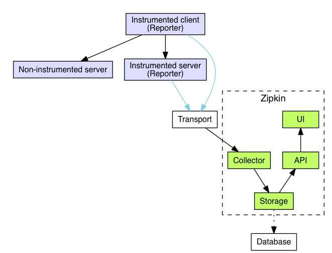

### 服务追踪系统
服务追踪系统的实现，主要包括三个部分。  
> 1、埋点数据收集，负责在服务端进行埋点，来收集服务调用的上下文数据。  
> 2、实时数据处理，负责对收集到的链路信息，按照 traceId 和 spanId 进行串联和存储。  
> 数据链路展示，把处理后的服务调用数据，按照调用链的形式展示出来。  

在业务代码的框架层开发调用拦截程序，在调用的前后收集相关信息，把信息传输给到一个统一的处理中心。然后处理中心需要实时处理收集到链路信息，并按照 traceId 和 spanId 进行串联，处理完以后再存到合适的存储中。最后还要能把存储中存储的信息，以调用链路图或者调用拓扑图的形式对外展示。  

### 服务追踪系统选型
业界比较有名的服务追踪系统实现有阿里的鹰眼（未开源）、Twitter 开源的 OpenZipkin，还有 Naver 开源的 Pinpoint，它们都是受 Google 发布的 Dapper 论文启发而实现的。  

**OpenZipkin**  
OpenZipkin 是 Twitter 开源的服务追踪系统，它的架构如图所示  

OpenZipkin 主要由四个核心部分组成。  
> Collector：负责收集探针 Reporter 埋点采集的数据，经过验证处理并建立索引。  
> Storage：存储服务调用的链路数据，默认使用的是 Cassandra，是因为 Twitter 内部大量使用了 Cassandra，你也可以替换成 Elasticsearch 或者 MySQL。  
> API：将格式化和建立索引的链路数据以 API 的方式对外提供服务，比如被 UI 调用。  
> UI：以图形化的方式展示服务调用的链路数据。  

工作原理如图来所示  
  

具体流程是，通过在业务的 HTTP Client 前后引入服务追踪代码，这样在 HTTP 方法“/foo”调用前，生成 trace 信息：TraceId：aa、SpanId：6b、annotation：GET /foo，以及当前时刻的 timestamp：1483945573944000，然后调用结果返回后，记录下耗时 duration，之后再把这些 trace 信息和 duration 异步上传给 Zipkin Collector。  

**Pinpoint**  
Pinpoint 是 Naver 开源的一款深度支持 Java 语言的服务追踪系统，它的架构如图所示  
  

Pinpoint 主要也由四个部分组成。  
> Pinpoint Agent：通过 Java 字节码注入的方式，来收集 JVM 中的调用数据，通过 UDP 协议传递给 Collector，数据采用 Thrift 协议进行编码。  
> Pinpoint Collector：收集 Agent 传过来的数据，然后写到 HBase Storgage。  
> HBase Storage：采用 HBase 集群存储服务调用的链路信息。  
> Pinpoint Web UI：通过 Web UI 展示服务调用的详细链路信息。  

工作原理如图来所示  
  

具体来看，就是请求进入 TomcatA，然后生成 TraceId：TomcatA^ TIME ^ 1、SpanId：10、pSpanId：-1（代表是根请求），接着 TomatA 调用 TomcatB 的 hello 方法，TomcatB 生成 TraceId：TomcatA^ TIME ^1、新的 SpanId：20、pSpanId：10（代表是 TomcatA 的请求），返回调用结果后将 trace 信息发给 Collector，TomcatA 收到调用结果后，将 trace 信息也发给 Collector。Collector 把 trace 信息写入到 HBase 中，Rowkey 就是 traceId，SpanId 和 pSpanId 都是列。然后就可以通过 UI 查询调用链路信息了。

**选型对比**  
1、埋点探针支持平台的广泛性  
OpenZipkin 提供了不同语言的 Library，不同语言实现时需要引入不同版本的 Library。官方提供了 C#、Go、Java、JavaScript、Ruby、Scala、PHP 等主流语言版本的 Library，而且开源社区还提供了更丰富的不同语言版本的 Library。  
Pinpoint 目前只支持 Java 语言。  
从探针支持的语言平台广泛性上来看，OpenZipkin 比 Pinpoint 的使用范围要广，而且开源社区很活跃，生命力更强。  

2、系统集成难易程度  
以 OpenZipkin 的 Java 探针 Brave 为例，它只提供了基本的操作 API，如果系统要想集成 Brave，必须在配置里手动里添加相应的配置文件并且增加 trace 业务代码。具体来讲，就是你需要先修改工程的 POM 依赖，以引入 Brave 相关的 JAR 包。然后，假如你想收集每一次 HTTP 调用的信息，你就可以使用 Brave 在 Apache Httpclient 基础上封装的 httpClient，它会记录每一次 HTTP 调用的信息，并上报给 OpenZipkin。  
Pinpoint 是通过字节码注入的方式来实现拦截服务调用，从而收集 trace 信息的，所以不需要代码做任何改动。就是 JVM 在加载 class 二进制文件时，动态地修改加载的 class 文件，在方法的前后执行拦截器的 before() 和 after() 方法，在 before() 和 after() 方法里记录 trace() 信息。而应用不需要修改业务代码，只需要在 JVM 启动时，添加类似下面的启动参数就可以了。  
从系统集成难易程度上看，Pinpoint 要比 OpenZipkin 简单。  

3、调用链路数据的精确度  
OpenZipkin 收集到的数据只到接口级别，进一步的信息就没有了。  
因为 Pinpoint 采用了字节码注入的方式实现 trace 信息收集，所以它能拿到的信息比 OpenZipkin 多得多。  
在绘制链路拓扑图时，OpenZipkin 只能绘制服务与服务之间的调用链路拓扑图，而 Pinpoint 不仅能够绘制服务与服务之间，还能绘制与 DB 之间的调用链路拓扑图。  
从调用链路数据的精确度上看，Pinpoint 要比 OpenZipkin 精确得多。  