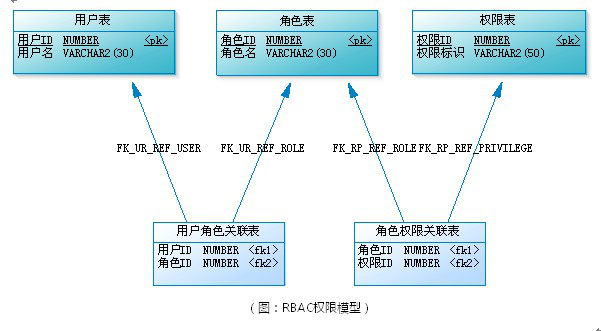
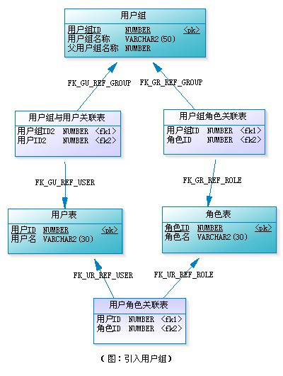
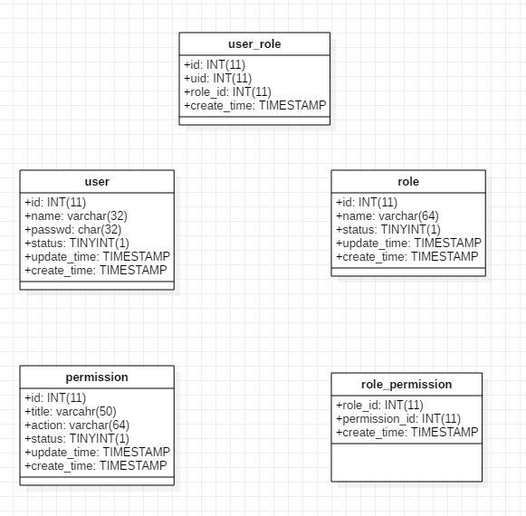

### 什么是 RBAC
RBAC（Role-Based Access Control ）基于角色的访问控制。  

RBAC 认为权限的过程可以抽象概括为：判断【Who 是否可以对 What 进行 How 的访问操作（Operator）】这个逻辑表达式的值是否为 True 的求解过程。即将权限问题转换为 Who、What、How 的问题（who、what、how 构成了访问权限三元组）。  

RBAC 支持公认的安全原则：最小特权原则、责任分离原则和数据抽象原则。  
> 最小特权原则得到支持，是因为在 RBAC 模型中可以通过限制分配给角色权限的多少和大小来实现，分配给与某用户对应的角色的权限只要不超过该用户完成其任务的需要就可以了。  
> 责任分离原则的实现，是因为在 RBAC 模型中可以通过在完成敏感任务过程中分配两个责任上互相约束的两个角色来实现，例如在清查账目时，只需要设置财务管理员和会计两个角色参加就可以了。  
> 数据抽象是借助于抽象许可权这样的概念实现的，如在账目管理活动中，可以使用信用、借方等抽象许可权，而不是使用操作系统提供的读、写、执行等具体的许可权。但 RBAC 并不强迫实现这些原则，安全管理员可以允许配置 RBAC 模型使它不支持这些原则。因此，RBAC 支持数据抽象的程度与 RBAC 模型的实现细节有关。  

在 RBAC 之中，包含用户 users (USERS)、角色 roles (ROLES)、目标 objects (OBS)、操作 operations (OPS)、许可权 permissions (PRMS) 五个基本数据元素，此模型指明用户、角色、访问权限和会话之间的关系。每个角色至少具备一个权限，每个用户至少扮演一个角色；可以对两个完全不同的角色分配完全相同的访问权限；会话由用户控制，一个用户可以创建会话并激活多个用户角色，从而获取相应的访问权限，用户可以在会话中更改激活角色，并且用户可以主动结束一个会话。  

**RBAC 优缺点**  
RBAC 的核心是用户只和角色关联，而角色代表对应的权限，这样设计的优势在于使得对用户而言，只需角色即可以，而某角色可以拥有各种各样的权限并可继承。  
在任何系统中都会涉及到权限管理的模块，无论复杂简单，我们都可以通过以 RBAC 模型为基础，进行相关灵活运用来解决我们的问题。  
简言之，RBAC 简化了用户和权限的关系，易于扩展和维护。  

RBAC 模型没有提供操作顺序控制机制，这一缺陷使得 RBAC 模型很难应用关于那些要求有严格操作次序的实体系统。  

### RBAC 的数据建模
RBAC 就是用户通过角色与权限进行关联。  
简单地说，一个用户拥有若干角色，每一个角色拥有若干权限。这样，就构造成 “用户 - 角色 - 权限” 的授权模型。在这种模型中，用户与角色之间，角色与权限之间，一般是多对多的关系。  
> 角色是一定数量的权限的集合，权限的载体

  

当用户的数量非常大时，要给系统每个用户逐一授权（授角色），是件非常烦琐的事情。  
这时，就需要给用户分组，每个用户组内有多个用户。除了可给用户授权外，还可以给用户组授权。这样一来，用户拥有的所有权限，就是用户个人拥有的权限与该用户所在用户组拥有的权限之和。  

  

### RBAC 的设计
基于 RBAC 模型的权限系统的功能模块组成、流程以及数据库的设计。  

**RBAC 功能模块**  
  

**RBAC 执行流程**  
  

**RBAC 数据库设计**  
  

### RBAC 简单实践
1、数据表及主要字段设计
```
用户表 users：id
角色表 roles：id，rules（规则id,规则id...）
用户角色关系表 user_role_relations：uid，rid
规则表 rules：id，pid，action
```

2、简要实现代码
```php
public function canAccess($user: User, $action = '/')
{
    if (static::isAdministrator($user)){
    	return true;
    }

    $roles = static::getUserRoles($user);
    if ($roles){
    	$rules = static::getUserRules($roles);
    	if (in_array($action, $rules, true)){
    		return true;
    	}
    }

    return false;
}

public function getRulesTree()
{
    $rules = Rules::select(['id', 'pid', 'action'])->orderBy(['pid' => 'asc'])->get()->toArray();
    $tree  = function($arr, $pid = 0) use (&$tree) {
	    $result = [];
	    foreach($arr as $item){
	        if ($item['pid'] === $pid){
	            if ($son = $tree($arr, $item['id'])){
	                $item['children'] = $son;
	            }
	            
	            $result[] = $item;
	        }
	    }
	    
	    return $result;
	};

	return $tree($rules);
}

public function getUserRoles($user: User)
{
	$relations = UserRoleRelations::select(['rid'])->where(['uid' => $user->id])->get();
	if($relations instanceof UserRoleRelations){
		$rids = $relations->pluck('rid');
		return Roles::where('id', 'in', $rids)->get();
	}

    return null;
}

public function getUserRules($roles: Roles[])
{
	$ruleIds = [];
	$rules   = $roles->pluck('rules');
	foreach ($rules as $key => $rule) {
		$ruleIds = array_merge($ruleIds, explode(',', $rule));
	}

	return $ruleIds ? Rules::where('id', 'in', $ruleIds)->get()->pluck('action') : [];
}
```