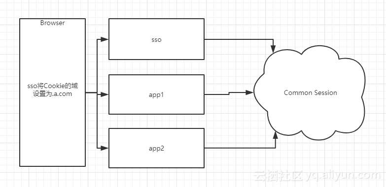

### sso 是什么
单点登录是认证方式里面较复杂的，实现方式也很多。  

单点登录英文全称是 Single Sign On，简称就是 SSO，即在多个应用系统中，只需要登录一次，就可以访问其他相互信任的应用系统。  

和 OAuth2 不同，OAuth2 是解决第三方授权登录，SSO 是为了解决内部系统一次登录到处使用，共享 Session 的问题。  

sso 的简单流程：  
1、Common Session 服务起负责存储 Session，每个系统去找它获取用户信息  
2、系统登陆时，跳转到 Common Session 服务，登陆后设置 Cookie、Domain 等信息  
3、切换系统，跳转到 Common Session 服务，重新设置 Cookie、Domain 等信息  
  

### sso 的简单实现
一个基于 Token（令牌）的、支持跨顶级域名的 SSO 系统：  

- 登录中心：即 SSO 系统本身，负责处理 SSO 的全部逻辑，域名假定为 login.mysite.com  
- 业务系统 A：某个具体的业务系统，需要通过 SSO 系统实现登录，域名假定为 www.hissite.com  
- 业务系统 B：某个具体的业务系统，需要通过 SSO 系统实现登录，域名假定为 www.hersite.com  

无论是业务系统 A 还是业务系统 B 都能够通过登录中心实现用户登录，并且用户只需要在 A 和 B 中的任意一个业务系统进行登录，另一个业务系统就能够自动登录。  

登陆中心需要一个页面提供给用户填写登录信息或者跳转第三方授权登录。  
如果是使用自身账号登陆。  
用户在页面填写账号密码后提交到登录中心进行验证，如果通过则返回服务票据（一个没有规律的、全局唯一的字符串）。  
如果业务系统提交过来的服务票据是合法的，登录系统则生成 Token 返回，同时需要将 Token 写入到登录系统所在顶级域名下。  
```java
@GetMapping(value = "/login")
public String login(String redirectURL, String returnURL, HttpServletRequest request, Map<String, Object> data) {
    // 先尝试在 mysite.com 下获取名为 MY_SITE_COOKIE 的 Cookie
    Cookie cookie = getCookie(request);
    if (null != cookie) {
        // 校验 cookie 中的 Token 是否有效
        if (verifyToken(cookie.getValue())) {
            // 生成 serviceTicket 进行回调
            String serviceTicket = xxx;
            return "redirect:" + returnURL + "?serviceTicket=" + serviceTicket + "&redirectURL=" + redirectURL;
        }
    }

    // Token 无效或没有 Cookie，返回登录页面，携带 redirectURL 和 returnURL
    data.put("redirectURL", redirectURL);
    data.put("returnURL", returnURL);
    return "login";
}

@PostMapping(value = "/auth")
public String auth(@RequestBody LoginForm loginForm) {
    // 进行登录信息校验
    boolean isValid = loginService.auth(loginForm);
    if (isValid) {
        // 生成一个服务票据，可以是任意不重复的字符串
        String serviceTicket = UUID.randomUUID().toString();
        // 将服务票据缓存，缓存值为当前登录用户的 ID，过期时间 60 秒
        CacheManager.setex(serviceTicket, userid, 60);
        // 跳转业务系统
        return "redirect:" + loginForm.getReturnURL() + "?serviceTicket=" + serviceTicket + "&redirectURL=" + loginForm.getRedirectURL();
    }
    // 登录信息校验失败，抛异常或者返回错误信息
    return null;
}

@GetMapping(value = "/checkTicket")
@ResponseBody
public String checkTicket(String serviceTicket, HttpServletResponse response) {
    boolean isValid = loginService.checkTicket(serviceTicket);
    if (isValid) {
        String token = xxxx; // 生成 Token
        CacheManager.setex(token, userid, 3600);
        Cookie cookie = ; // 创建 cookie
        // cookie 的 domain 为 mysite.com
        // key 为一个固定字符串 MY_SITE_COOKIE
        // value 为 Token
        response.addCookie(cookie);
        return token;
    }
    // 服务票据不合法，抛异常或者返回错误信息
}
```

如果是使用第三方登陆。  
当用户在登录中心提供的登录页面点击第三方登录时，登录中心需要将页面跳转到对应的第三方授权页面。利用第三方授权时提供的 state 参数来传递 redirectURL 和 returnURL，platform 参数表示使用的是哪个第三方平台。  
如果用户成功授权，第三方平台会回调我们配置的一个地址，我们需要在这个回调请求中继续处理。  
用户授权成功后第三方平台会返回一个授权码，用于下一步换取 AccessToken，我们将这个授权码和其他信息回调给业务系统。业务系统收到请求后立即凭借 code 和 platform 来请求登录中心的一个接口继续执行登录。  
业务系统收到服务票据之后，后面的流程和 「使用自身账号登录」 一致。  
```java
@GetMapping(value = "/goOAuth")
public String goOAuth(String redirectURL, String returnURL, String platform) {
    switch(platform) {
        case "QQ":
            return "redirect:" + QQ授权页和APPID等参数 + "&state=" + redirectURL + "$$" + returnURL + "$$" + platform;
        case "WeiXin:":
            return "redirect:" + 微信授权页和APPID等参数 + "&state=" + redirectURL + "$$" + returnURL + "$$" + platform;
        default:
            // 个性化处理
    }
}

@GetMapping(value = "/oAuthCallback")
public String oAuthCallback(String code, String state) {
    // 从 state 中解析出 returnURL、redirectURL、platform
    // 跳转业务系统
    return "redirect:" + returnURL + "?code=" + code + "&redirectURL=" + redirectURL + "&platform=" + platform;
}

@GetMapping(value = "doOAuth")
@ResponseBody
public String doOAuth(String code, String platform) {
    // 调用第三方平台的 API，使用 code 逐步换取 accessToken 和用户信息，最后拿到用户的 openID
    // 使用 openID 在数据库中查找用户，然后生成服务票据返回
    String serviceTicket = xxxx;
    CacheManager.setex(serviceTicket, userid, 60);
    return serviceTicket;
}
```

业务系统需要给登录中心一个 returnURL 用来接收登录中心的回调；在收到登录系统回调的 serviceTicket 或者第三方授权的 code 后，通过 AJAX（前端）或者 HTTP 工具（后端）继续和登录中心做认证，最终完成登录操作。  
