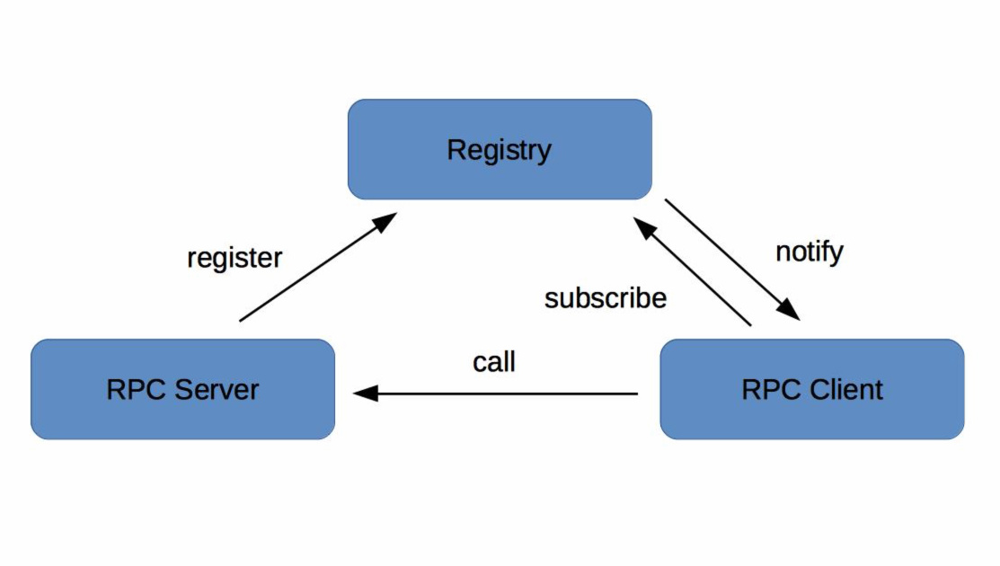
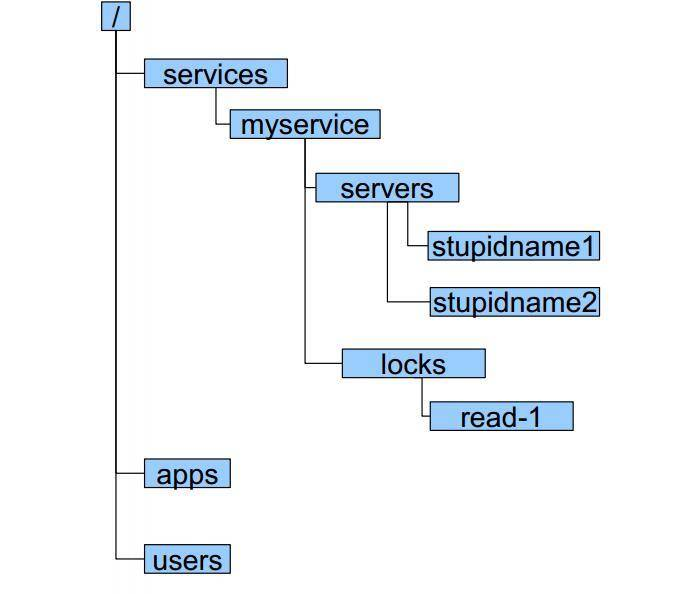
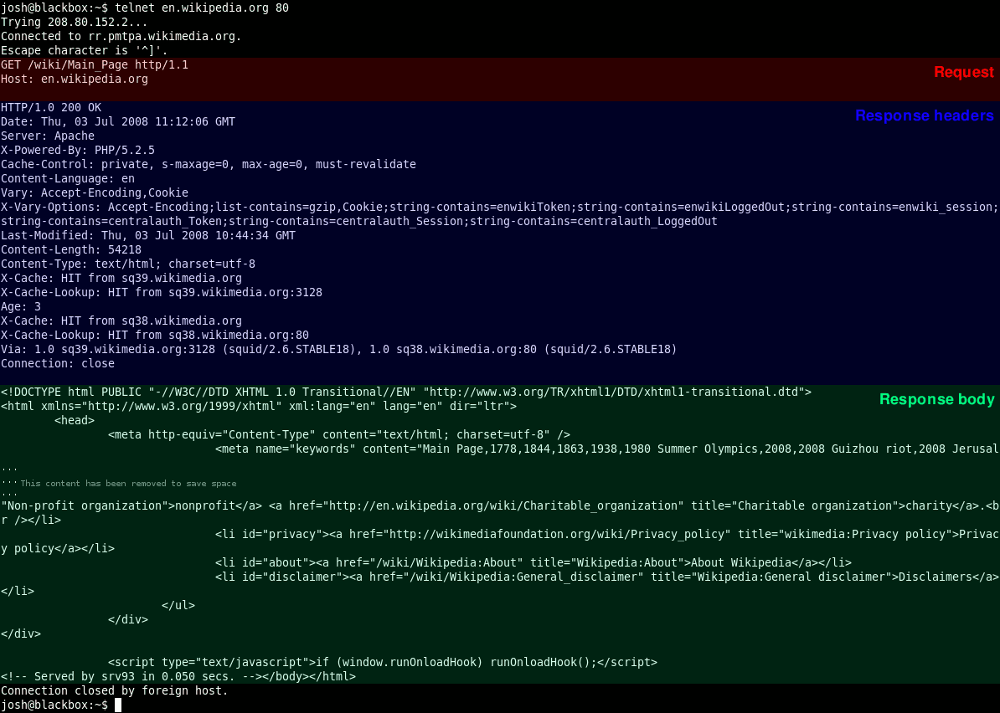
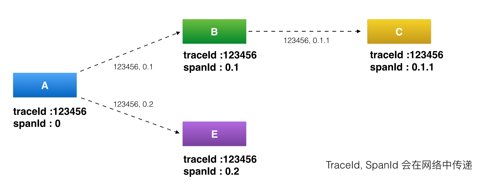
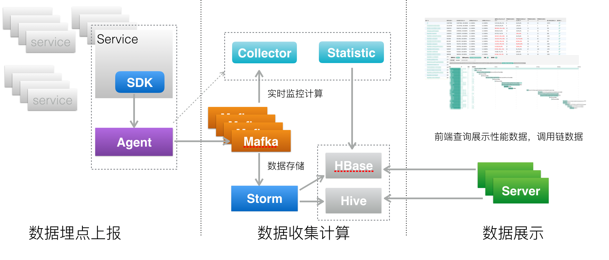
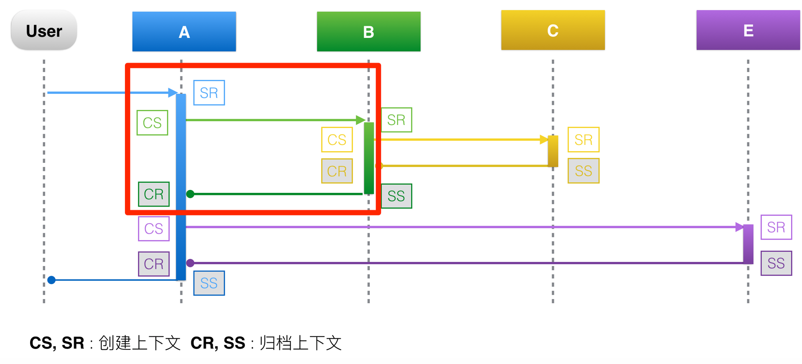
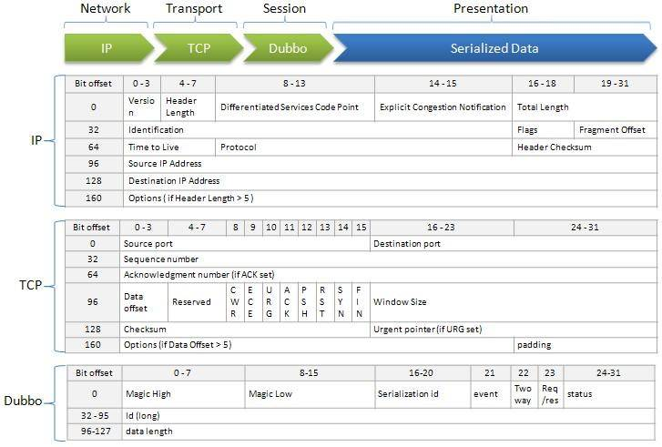
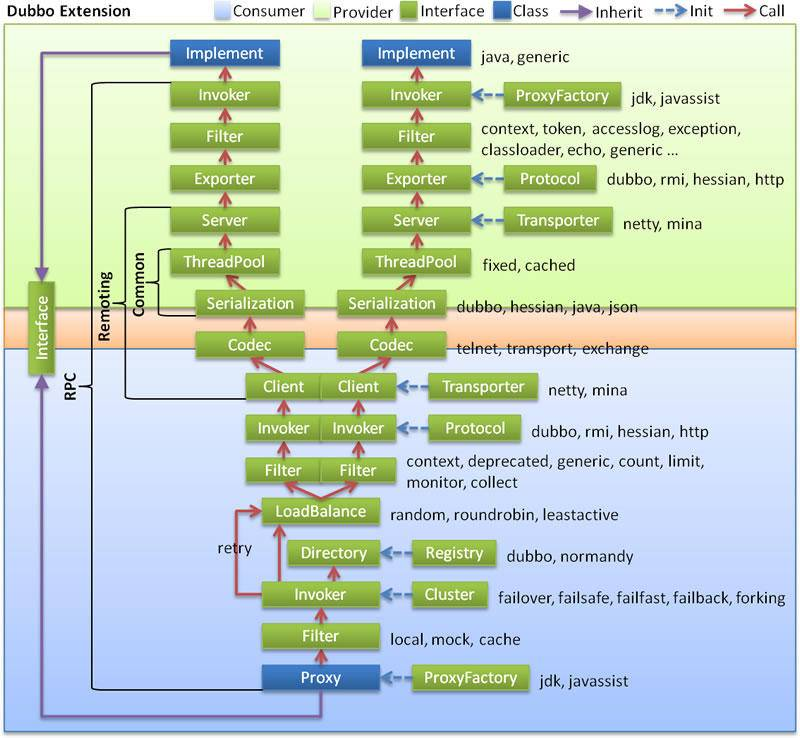

### 微服务
微服务是当下最火热的后端架构之一。  

微服务的概念最早是在 2014 年由 Martin Fowler 和 James Lewis 共同提出，他们定义了微服务是由单一应用程序构成的小服务，拥有自己的进程与轻量化处理，服务依业务功能设计，以全自动的方式部署，与其他服务使用 HTTP API 通讯。同时，服务会使用最小规模的集中管理 （例如 Docker）技术，服务可以用不同的编程语言与数据库等。  

单体应用架构的缺陷：部署效率低下、团队协作开发成本高、系统高可用性差、线上发布变慢。  

服务化就是把传统的单机应用中通过 JAR 包依赖产生的本地方法调用，改造成通过 RPC 接口产生的远程方法调用。
微服务相比服务化：服务拆分粒度更细、服务独立部署、服务独立维护、服务治理能力要求高。  
微服务架构是将复杂臃肿的单体应用进行细粒度的服务化拆分，每个拆分出来的服务各自独立打包部署，并交由小团队进行开发和运维，从而极大地提高了应用交付的效率，并被各大互联网公司所普遍采用。  

**服务化拆分时机**  
项目第一阶段的主要目标是快速开发和验证想法，证明产品思路是否可行；随着项目发展，需要大规模地扩张开发人员，以支撑多个功能的开发，一旦单体应用同时进行开发的人员超过 10 人就该进行服务化拆分。  

从单体应用迁移到微服务架构时必将面临的问题：  
1、服务如何定义  
对于单体应用来说，不同功能模块之前相互交互时，通常是以类库的方式来提供各个模块的功能；对于微服务来说，每个服务都运行在各自的进程之中，应该以接口的方式向外界传达自己的信息，无论采用哪种通讯协议，是 HTTP 还是 RPC，服务之间的调用都通过接口描述来约定，约定内容包括接口名、接口参数以及接口返回值。  
2、服务如何发布和订阅  
单体应用由于部署在同一个 WAR 包里，接口之间的调用属于进程内的调用；拆分为微服务独立部署后，服务提供者该如何对外暴露自己的地址，服务调用者通过注册中心（类似登记处的地方，能够记录每个服务提供者的地址以供服务调用者查询）查询所需要调用的服务的地址。  
3、服务如何监控  
QPS（调用量）、AvgTime（平均耗时）以及 P999（99.9% 的请求性能在多少毫秒以内）等这些指标需要一种通用的监控方案，能够覆盖业务埋点、数据收集、数据处理，最后到数据展示的全链路功能。  
4、服务如何治理  
拆分为微服务架构后，服务的数量变多了，依赖关系也变复杂了。比如一个服务的性能有问题时，依赖的服务都势必会受到影响。可以设定一个调用性能阈值，如果一段时间内一直超过这个值，那么依赖服务的调用可以直接返回，这就是熔断，也是服务治理最常用的手段之一。  
5、故障如何定位  
在单体应用拆分为微服务之后，一次用户调用可能依赖多个服务，每个服务又部署在不同的节点上，如果用户调用出现问题，你需要有一种解决方案能够将一次用户请求进行标记，并在多个依赖的服务系统中继续传递，以便串联所有路径，从而进行故障定位。  

**服务化拆分姿势**  
1、纵向拆分：从业务维度进行拆分，将不同的功能模块服务化，独立部署和运维；标准是按照业务的关联程度来决定，关联比较密切的业务适合拆分为一个微服务，而功能相对比较独立的业务适合单独拆分为一个微服务。比如社交 App 可以认为首页信息流是一个服务，评论是一个服务，消息通知是一个服务，个人主页也是一个服务。  
2、横向拆分：从公共且独立功能维度拆分；标准是按照是否有公共的被多个其他服务调用，且依赖的资源独立不与其他业务耦合。比如社交 App 无论是首页信息流、评论、消息箱还是个人主页，都需要显示用户的昵称。把用户的昵称功能单独部署成一个独立的服务，那么有什么变更我只需要上线这个服务即可，其他服务不受影响，开发和上线成本就大大降低了。  

### 微服务架构
微服务架构包含服务描述、注册中心、服务框架、服务监控、服务追踪、服务治理。  

服务提供者（即提供服务的一方）按照一定格式的服务描述，向注册中心注册服务，声明自己能够提供哪些服务以及服务的地址是什么，完成服务发布。  
服务消费者（即调用服务的一方）请求注册中心，查询所需要调用服务的地址，然后以约定的通信协议向服务提供者发起请求，得到请求结果后再按照约定的协议解析结果。  
在服务的调用过程中，服务的请求耗时、调用量以及成功率等指标都会被记录下来用作监控，调用经过的链路信息会被记录下来，用于故障定位和问题追踪。在这期间，如果调用失败，可以通过重试等服务治理手段来保证成功率。  

**服务描述**  
服务调用首先要解决的问题就是服务如何对外描述。  
比如对外提供的服务，服务名是什么？调用这个服务需要提供哪些信息？调用这个服务返回的结果是什么格式的？该如何解析？等等都是服务描述要解决的问题。  

常用的服务描述方式包括 RESTful API、XML 配置以及 IDL 文件三种。其中，RESTful API 方式通常用于 HTTP 协议的服务描述，并且常用 Wiki 或者 Swagger 来进行管理；XML 配置方式多用作 RPC 协议的服务描述，通过 *.xml 配置文件来定义接口名、参数以及返回值类型等；IDL 文件方式通常用作 Thrift 和 gRPC 这类跨语言服务调用框架中，比如 gRPC 就是通过 Protobuf 文件来定义服务的接口名、参数以及返回值的数据结构。  

**注册中心**  
注册中心是一个类似注册中心的角色，服务提供者将自己提供的服务以及地址登记到注册中心，服务消费者则从注册中心查询所需要调用的服务的地址，然后发起请求。

一般注册中心的工作流程是：  
1、服务提供者在启动时，根据服务发布文件中配置的发布信息向注册中心注册自己的服务。  
2、服务消费者在启动时，根据消费者配置文件中配置的服务信息向注册中心订阅自己所需要的服务。  
3、注册中心返回服务提供者地址列表给服务消费者。  
4、当服务提供者发生变化，比如有节点新增或者销毁，注册中心将变更通知给服务消费者。  

**服务框架**  
通过注册中心，服务消费者就可以获取到服务提供者的地址，有了地址后就可以发起调用。但在发起调用之前你还需要解决以下几个问题：  
1、服务通信采用什么协议？就是说服务提供者和服务消费者之间以什么样的协议进行网络通信，是采用四层 TCP、UDP 协议，还是采用七层 HTTP 协议，还是采用其他协议？  
2、数据传输采用什么方式？就是说服务提供者和服务消费者之间的数据传输采用哪种方式，是同步还是异步，是在单连接上传输，还是多路复用。  
3、数据压缩采用什么格式？通常数据传输都会对数据进行压缩，来减少网络传输的数据量，从而减少带宽消耗和网络传输时间，比如常见的 JSON 序列化、Java 对象序列化以及 Protobuf 序列化等。  

**服务监控**  
一旦服务消费者与服务提供者之间能够正常发起服务调用，你就需要对调用情况进行监控，以了解服务是否正常。  

通常，服务监控主要包括三个流程：  
1、指标收集。就是要把每一次服务调用的请求耗时以及成功与否收集起来，并上传到集中的数据处理中心。  
2、数据处理。有了每次调用的请求耗时以及成功与否等信息，就可以计算每秒服务请求量、平均耗时以及成功率等指标。  
3、数据展示。数据收集起来，经过处理之后，还需要以友好的方式对外展示，才能发挥价值。通常都是将数据展示在 Dashboard 面板上，并且每隔 10s 等间隔自动刷新，用作业务监控和报警等。  

**服务追踪**  
除了需要对服务调用情况进行监控之外，你还需要记录服务调用经过的每一层链路，以便进行问题追踪和故障定位。  

服务追踪的工作原理大致如下：  
服务消费者发起调用前，会在本地按照一定的规则生成一个 requestid，发起调用时，将 requestid 当作请求参数的一部分，传递给服务提供者。  
服务提供者接收到请求后，记录下这次请求的 requestid，然后处理请求。如果服务提供者继续请求其他服务，会在本地再生成一个自己的 requestid，然后把这两个 requestid 都当作请求参数继续往下传递。  
以此类推，通过这种层层往下传递的方式，一次请求，无论最后依赖多少次服务调用、经过多少服务节点，都可以通过最开始生成的 requestid 串联所有节点，从而达到服务追踪的目的。  

**服务治理**  
服务监控能够发现问题，服务追踪能够定位问题所在，而解决问题就得靠服务治理了。  
服务治理就是通过一系列的手段来保证在各种意外情况下，服务调用仍然能够正常进行。  

在生产环境中，你应该经常会遇到下面几种状况：  
1、单机故障。通常遇到单机故障，都是靠运维发现并重启服务或者从线上摘除故障节点。然而集群的规模越大，越是容易遇到单机故障，在机器规模超过一百台以上时，靠传统的人肉运维显然难以应对。而服务治理可以通过一定的策略，自动摘除故障节点，不需要人为干预，就能保证单机故障不会影响业务。  
2、单 IDC 故障。你应该经常听说某某 App，因为施工挖断光缆导致大批量用户无法使用的严重故障。而服务治理可以通过自动切换故障 IDC 的流量到其他正常 IDC，可以避免因为单 IDC 故障引起的大批量业务受影响。  
3、依赖服务不可用。比如你的服务依赖依赖了另一个服务，当另一个服务出现问题时，会拖慢甚至拖垮你的服务。而服务治理可以通过熔断，在依赖服务异常的情况下，一段时期内停止发起调用而直接返回。这样一方面保证了服务消费者能够不被拖垮，另一方面也给服务提供者减少压力，使其能够尽快恢复。  

### 微服务组件 -- 服务发布与引用  
服务描述最常见的三种方式：Restful Api、XML 配置以及 IDL 文件。  
通常情况下，如果只是企业内部之间的服务调用，并且都是 Java 语言的话，选择 XML 配置方式是最简单的；如果企业内部存在多个服务，并且服务采用的是不同语言平台，建议使用 IDL 文件方式进行描述服务；如果还存在对外开放服务调用的情形的话，使用 RESTful API 方式则更加通用。  

**Restful Api**  
RESTful API 的方式，主要被用作 HTTP 或者 HTTPS 协议的接口定义，即使在非微服务架构体系下，也被广泛采用。  

HTTP 协议本身是一个公开的协议，对于服务消费者来说几乎没有学习成本，所以比较适合用作跨业务平台之间的服务协议。  

**Xml**  
服务发布和引用 Xml 方式的主要步骤：  
1、服务提供者定义接口，并实现接口。  
2、服务提供者进程启动时，通过加载 server.xml 配置文件将接口暴露出去。  
3、服务消费者进程启动时，通过加载 client.xml 配置文件来引入要调用的接口。  

通过在服务提供者和服务消费者之间维持一份对等的 XML 配置文件，来保证服务消费者按照服务提供者的约定来进行服务调用。在这种方式下，如果服务提供者变更了接口定义，不仅需要更新服务提供者加载的接口描述文件 server.xml，还需要同时更新服务消费者加载的接口描述文件 client.xml。  

一般是私有 RPC 框架会选择 XML 配置这种方式来描述接口，因为私有 RPC 协议的性能要比 HTTP 协议高，所以在对性能要求比较高的场景下，采用 XML 配置的方式比较合适。但这种方式对业务代码侵入性比较高，XML 配置有变更的时候，服务消费者和服务提供者都要更新，所以适合公司内部联系比较紧密的业务之间采用。如果要应用到跨部门之间的业务调用，一旦有 XML 配置变更，需要花费大量精力去协调不同部门做升级工作。在我经历的实际项目里，就遇到过一次底层服务的接口升级，需要所有相关的调用方都升级，为此花费了大量时间去协调沟通不同部门之间的升级工作，最后经历了大半年才最终完成。所以对于 XML 配置方式的服务描述，一旦应用到多个部门之间的接口格式约定，如果有变更，最好是新增接口，不到万不得已不要对原有的接口格式做变更。  

**IDL**  
IDL 就是接口描述语言（interface description language）的缩写，通过一种中立的方式来描述接口，使得在不同的平台上运行的对象和不同语言编写的程序可以相互通信交流。  
IDL 主要是用作跨语言平台的服务之间的调用，有两种最常用的 IDL：一个是 Facebook 开源的 Thrift 协议，另一个是 Google 开源的 gRPC 协议。无论是 Thrift 协议还是 gRPC 协议，它们的工作原理都是类似的。  
`注意：在描述接口定义时，IDL 文件需要对接口返回值进行详细定义。`

gRPC 协议使用 Protobuf 简称 proto 文件来定义接口名、调用参数以及返回值类型。gRPC 协议的服务描述是通过 proto 文件来定义接口的，然后再使用 protoc 来生成不同语言平台的客户端和服务端代码，从而具备跨语言服务调用能力。  
```
// gRPC 协议 helloword.proto
// The greeter service definition.
service Greeter {
  // Sends a greeting
  rpc SayHello (HelloRequest) returns (HelloReply) {}
  rpc SayHelloAgain (HelloRequest) returns (HelloReply) {}
 
}
 
// The request message containing the user's name.
message HelloRequest {
  string name = 1;
}
 
// The response message containing the greetings
message HelloReply {
  string message = 1;
}  


// 服务提供者使用的是 Java 语言,利用 protoc 插件即可自动生成 Server 端的 Java 代码  
private class GreeterImpl extends GreeterGrpc.GreeterImplBase 
{
  @Override
  public void sayHello(HelloRequest req, StreamObserver<HelloReply> responseObserver) {
    HelloReply reply = HelloReply.newBuilder().setMessage("Hello " + req.getName()).build();
    responseObserver.onNext(reply);
    responseObserver.onCompleted();
  }
 
  @Override
  public void sayHelloAgain(HelloRequest req, StreamObserver<HelloReply> responseObserver) {
    HelloReply reply = HelloReply.newBuilder().setMessage("Hello again " + req.getName()).build();
    responseObserver.onNext(reply);
    responseObserver.onCompleted();
  }
}

// 服务消费者使用的是 PHP 语言，那么利用 protoc 插件即可自动生成 Client 端的 PHP 代码
$request = new Helloworld\HelloRequest();
$request->setName($name);
list($reply, $status) = $client->SayHello($request)->wait();
$message = $reply->getMessage();
list($reply, $status) = $client->SayHelloAgain($request)->wait();
$message = $reply->getMessage(); 
```

### 微服务组件 -- 注册和发现服务
在微服务架构下，主要有三种角色：服务提供者（RPC Server）、服务消费者（RPC Client）和服务注册中心（Registry）。它们的交互关系是：  
RPC Server 提供服务，在启动时，根据服务发布文件 server.xml 中的配置的信息，向 Registry 注册自身服务，并向 Registry 定期发送心跳汇报存活状态。  
RPC Client 调用服务，在启动时，根据服务引用文件 client.xml 中配置的信息，向 Registry 订阅服务，把 Registry 返回的服务节点列表缓存在本地内存中，并与 RPC Sever 建立连接。  
当 RPC Server 节点发生变更时，Registry 会同步变更，RPC Client 感知后会刷新本地内存中缓存的服务节点列表。  
RPC Client 从本地缓存的服务节点列表中，基于负载均衡算法选择一台 RPC Sever 发起调用。  

  

注册中心的实现主要涉及几个问题：注册中心需要提供哪些接口，该如何部署；如何存储服务信息；如何监控服务提供者节点的存活；如果服务提供者节点有变化如何通知服务消费者，以及如何控制注册中心的访问权限。  
1、注册中心 API  
根据注册中心原理的描述，注册中心必须提供以下最基本的 API  
> 服务注册接口：服务提供者通过调用服务注册接口来完成服务注册  
> 服务反注册接口：服务提供者通过调用服务反注册接口来完成服务注销  
> 心跳汇报接口：服务提供者通过调用心跳汇报接口完成节点存活状态上报  
> 服务订阅接口：服务消费者通过调用服务订阅接口完成服务订阅，获取可用的服务提供者节点列表  
> 服务变更查询接口：服务消费者通过调用服务变更查询接口，获取最新的可用服务节点列表  

除此之外，为了便于管理，注册中心还必须提供一些后台管理的 API  
> 服务查询接口：查询注册中心当前注册了哪些服务信息  
> 服务修改接口：修改注册中心中某一服务的信息

2、集群部署  
注册中心作为服务提供者和服务消费者之间沟通的桥梁，它的重要性不言而喻。所以注册中心一般都是采用集群部署来保证高可用性，并通过分布式一致性协议来确保集群中不同节点之间的数据保持一致。  

以开源注册中心 ZooKeeper 为例，ZooKeeper 集群中包含多个节点，服务提供者和服务消费者可以同任意一个节点通信，因为它们的数据一定是相同的。  
ZooKeeper 的工作原理：  
> 每个 Server 在内存中存储了一份数据，Client 的读请求可以请求任意一个 Server  
> ZooKeeper 启动时，将从实例中选举一个 leader（Paxos 协议）  
> Leader 负责处理数据更新等操作（ZAB 协议）  
> 一个更新操作成功，当且仅当大多数 Server 在内存中成功修改  

通过这种方式，ZooKeeper 保证了高可用性以及数据一致性  
  

3、目录存储  
注册中心存储服务信息一般采用层次化的目录结构，以 ZooKeeper 为例：  
> 每个目录在 ZooKeeper 中叫作 znode，并且其有一个唯一的路径标识  
> znode 可以包含数据和子 znode  
> znode 中的数据可以有多个版本，比如某一个 znode 下存有多个数据版本，那么查询这个路径下的数据需带上版本信息  

  

4、服务健康状态检测  
注册中心除了要支持最基本的服务注册和服务订阅功能以外，还必须具备对服务提供者节点的健康状态检测功能，这样才能保证注册中心里保存的服务节点都是可用的。  
以 ZooKeeper 为例，它是基于 ZooKeeper 客户端和服务端的长连接和会话超时控制机制，来实现服务健康状态检测的。在 ZooKeeper 中，客户端和服务端建立连接后，会话也随之建立，并生成一个全局唯一的 Session ID。服务端和客户端维持的是一个长连接，在 SESSION_TIMEOUT 周期内，服务端会检测与客户端的链路是否正常，具体方式是通过客户端定时向服务端发送心跳消息（ping 消息），服务器重置下次 SESSION_TIMEOUT 时间。如果超过 SESSION_TIMEOUT 后服务端都没有收到客户端的心跳消息，则服务端认为这个 Session 就已经结束了，ZooKeeper 就会认为这个服务节点已经不可用，将会从注册中心中删除其信息。  

5、服务状态变更通知  
一旦注册中心探测到有服务提供者节点新加入或者被剔除，就必须立刻通知所有订阅该服务的服务消费者，刷新本地缓存的服务节点信息，确保服务调用不会请求不可用的服务提供者节点。  
继续以 ZooKeeper 为例，基于 ZooKeeper 的 Watcher 机制，来实现服务状态变更通知给服务消费者的。服务消费者在调用 ZooKeeper 的 getData 方法订阅服务时，还可以通过监听器 Watcher 的 process 方法获取服务的变更，然后调用 getData 方法来获取变更后的数据，刷新本地缓存的服务节点信息。  

6、白名单机制  
在实际的微服务测试和部署时，通常包含多套环境，比如生产环境一套、测试环境一套。开发在进行业务自测、测试在进行回归测试时，一般都是用测试环境，部署的 RPC Server 节点注册到测试的注册中心集群。但经常会出现开发或者测试在部署时，错误的把测试环境下的服务节点注册到了线上注册中心集群，这样的话线上流量就会调用到测试环境下的 RPC Server 节点，可能会造成意想不到的后果。  
为了防止这种情况发生，注册中心需要提供一个保护机制，你可以把注册中心想象成一个带有门禁的房间，只有拥有门禁卡的 RPC Server 才能进入。在实际应用中，注册中心可以提供一个白名单机制，只有添加到注册中心白名单内的 RPC Server，才能够调用注册中心的注册接口，这样的话可以避免测试环境中的节点意外跑到线上环境中去。  

### 微服务组件 -- RPC 远程服务调用
RPC（Remote Procedure Call）是远程方法调用（相比于本地方法调用），指的是服务提供者和服务消费者运行在两台不同物理机上的不同进程内发起的调用。  

RPC 调用的原理：  
> 服务提供者（服务端）、服务消费者（客户端）通常位于网络上两个不同的地址，要完成一次 RPC 调用，就必须先建立网络连接  
> 建立连接后，双方还必须按照某种约定的协议进行网络通信，这个协议就是通信协议  
> 双方能够正常通信后，服务端接收到请求时，需要以某种方式进行处理，处理成功后，把请求结果返回给客户端  
> 为了减少传输的数据大小，还要对数据进行压缩，也就是对数据进行序列化  

要完成 RPC 调用，需要解决四个问题：  
1、客户端和服务端如何建立网络连接？  
2、服务端如何处理请求？  
3、数据传输采用什么协议？  
4、数据该如何序列化和反序列化？  

**客户端和服务端如何建立网络连接**  
客户端和服务端之间基于 TCP 协议建立网络连接最常用的途径有两种：HTTP 通信、Socket 通信。  
HTTP 通信是基于应用层 HTTP 协议的，而 HTTP 协议又是基于传输层 TCP 协议的。一次 HTTP 通信过程就是发起一次 HTTP 调用，而一次 HTTP 调用就会建立一个 TCP 连接，请求需要经历“三次握手”过程建立连接，完成请求后需要经历“四次挥手”过程断开连接。  

Socket 通信是基于 TCP/IP 协议的封装，建立一次 Socket 连接至少需要一对套接字，其中一个运行于客户端，称为 ClientSocket ；另一个运行于服务器端，称为 ServerSocket。  
Socket 通信的过程分为四个步骤：服务器监听、客户端请求、连接确认、数据传输。  
> 服务器监听：ServerSocket 通过调用 bind() 函数绑定某个具体端口，然后调用 listen() 函数实时监控网络状态，等待客户端的连接请求  
> 客户端请求：ClientSocket 调用 connect() 函数向 ServerSocket 绑定的地址和端口发起连接请求  
> 服务端连接确认：当 ServerSocket 监听到或者接收到 ClientSocket 的连接请求时，调用 accept() 函数响应 ClientSocket 的请求，同客户端建立连接  
> 数据传输：当 ClientSocket 和 ServerSocket 建立连接后，ClientSocket 调用 send() 函数，ServerSocket 调用 receive() 函数，ServerSocket 处理完请求后，调用 send() 函数，ClientSocket 调用 receive() 函数，就可以得到得到返回结果  

  

当客户端和服务端建立网络连接后，就可以发起请求了。但网络不一定总是可靠的，经常会遇到网络闪断、连接超时、服务端宕机等各种异常，通常的处理手段有两种：  
> 链路存活检测：客户端需要定时地发送心跳检测消息（一般是通过 ping 请求）给服务端，如果服务端连续 n 次心跳检测或者超过规定的时间都没有回复消息，则认为此时链路已经失效，这个时候客户端就需要重新与服务端建立连接  
> 断连重试：通常有多种情况会导致连接断开，比如客户端主动关闭、服务端宕机或者网络故障等。这个时候客户端就需要与服务端重新建立连接，但一般不能立刻完成重连，而是要等待固定的间隔后再发起重连，避免服务端的连接回收不及时，而客户端瞬间重连的请求太多而把服务端的连接数占满  

**服务端如何处理请求**  
服务端有三种处理请求的方式：  
> 同步阻塞方式（BIO），客户端每发一次请求，服务端就生成一个线程去处理。当客户端同时发起的请求很多时，服务端需要创建很多的线程去处理每一个请求，如果达到了系统最大的线程数瓶颈，新来的请求就没法处理了  
> 同步非阻塞方式 (NIO)，客户端每发一次请求，服务端并不是每次都创建一个新线程来处理，而是通过 I/O 多路复用技术进行处理。就是把多个 I/O 的阻塞复用到同一个 select 的阻塞上，从而使系统在单线程的情况下可以同时处理多个客户端请求。这种方式的优势是开销小，不用为每个请求创建一个线程，可以节省系统开销  
> 异步非阻塞方式（AIO），客户端只需要发起一个 I/O 操作然后立即返回，等 I/O 操作真正完成以后，客户端会得到 I/O 操作完成的通知，此时客户端只需要对数据进行处理就好了，不需要进行实际的 I/O 读写操作，因为真正的 I/O 读取或者写入操作已经由内核完成了。这种方式的优势是客户端无需等待，不存在阻塞等待问题  

BIO 适用于连接数比较小的业务场景，这样的话不至于系统中没有可用线程去处理请求；这种方式写的程序也比较简单直观，易于理解。  
NIO 适用于连接数比较多并且请求消耗比较轻的业务场景，比如聊天服务器；这种方式相比 BIO，相对来说编程比较复杂。  
AIO 适用于连接数比较多而且请求消耗比较重的业务场景，比如涉及 I/O 操作的相册服务器；这种方式相比另外两种，编程难度最大，程序也不易于理解。  

在服务提供者一侧基于 BIO、NIO 和 AIO 三种方式中的任意一种实现服务端请求处理，最后还需要再花费一些精力去解决服务消费者和服务提供者之间的网络可靠性问题。但是，对于 Socket 网络编程、多线程编程知识都要求比较高，建议使用成熟的开源方案如 Netty、MINA 等。  

**数据传输采用什么协议**  
数据传输最常用的有 HTTP 协议，它是一种开放的协议，各大网站的服务器和浏览器之间的数据传输大都采用了这种协议。还有一些定制的私有协议，比如阿里巴巴开源的 Dubbo 协议，也可以用于服务端和客户端之间的数据传输。  
无论是开放的还是私有的协议，都必须定义一个“契约”，以便服务消费和服务提供者之间能够达成共识。服务消费者按照契约，对传输的数据进行编码，然后通过网络传输过去；服务提供者从网络上接收到数据后，按照契约，对传输的数据进行解码，然后处理请求，再把处理后的结果进行编码，通过网络传输返回给服务消费者；服务消费者再对返回的结果进行解码，最终得到服务提供者处理后的返回值。  

通常协议契约包括两个部分：消息头和消息体。其中消息头存放的是协议的公共字段以及用户扩展字段，消息体存放的是传输数据的具体内容。  
以 HTTP 协议为例，下图展示了一段采用 HTTP 协议传输的数据响应报文，主要分为消息头和消息体两部分，其中消息头中存放的是协议的公共字段，比如 Server 代表是服务端服务器类型、Content-Length 代表返回数据的长度、Content-Type 代表返回数据的类型；消息体中存放的是具体的返回结果，这里就是一段 HTML 网页代码。  
  

**数据该如何序列化和反序列化**  
网络传输的耗时一方面取决于网络带宽的大小，另一方面取决于数据传输量。要想加快网络传输，要么提高带宽，要么减小数据传输量，而对数据进行编码的主要目的就是减小数据传输量。  
一般数据在网络中进行传输前，都要先在发送方一端对数据进行编码，经过网络传输到达另一端后，再对数据进行解码，这个过程就是序列化和反序列化。  

常用的序列化方式分为两类：文本类如 XML/JSON 等，二进制类如 PB/Thrift 等，而具体采用哪种序列化方式，主要取决于三个方面的因素：  
> 支持数据结构类型的丰富度。数据结构种类支持的越多越好，这样的话对于使用者来说在编程时更加友好，有些序列化框架如 Hessian 2.0 还支持复杂的数据结构比如 Map、List 等  
> 跨语言支持。序列化方式是否支持跨语言也是一个很重要的因素，否则使用的场景就比较局限，比如 Java 序列化只支持 Java 语言，就不能用于跨语言的服务调用了  
> 性能。主要看两点，一个是序列化后的压缩比，一个是序列化的速度。以常用的 PB 序列化和 JSON 序列化协议为例来对比分析，PB 序列化的压缩比和速度都要比 JSON 序列化高很多，所以对性能和存储空间要求比较高的系统选用 PB 序列化更合适；而 JSON 序列化虽然性能要差一些，但可读性更好，更适合对外部提供服务  

### 微服务组件 -- 监控微服务调用  
服务监控在微服务改造过程中的重要性不言而喻，没有强大的监控能力，就无法掌控各个不同服务的情况，在遇到调用失败时，如果不能快速发现系统的问题，对于业务来说就是一场灾难。  

对于一个微服务来说，你必须明确要监控哪些对象、哪些指标，并且还要从不同的维度进行监控，才能掌握微服务的调用情况。  

监控对象可以分为四个层次，由上到下可归纳为：  
> 1、用户端监控。通常是指业务直接对用户提供的功能的监控。以微博首页 Feed 为例，它向用户提供了聚合关注的所有人的微博并按照时间顺序浏览的功能，对首页 Feed 功能的监控就属于用户端的监控。  
> 2、接口监控。通常是指业务提供的功能所依赖的具体 RPC 接口的监控。继续以微博首页 Feed 为例，这个功能依赖于用户关注了哪些人的关系服务，每个人发过哪些微博的微博列表服务，以及每条微博具体内容是什么的内容服务，对这几个服务的调用情况的监控就属于接口监控。  
> 3、资源监控。通常是指某个接口依赖的资源的监控。比如用户关注了哪些人的关系服务使用的是 Redis 来存储关注列表，对 Redis 的监控就属于资源监控。  
> 4、基础监控。通常是指对服务器本身的健康状况的监控。主要包括 CPU 利用率、内存使用量、I/O 读写量、网卡带宽等。对服务器的基本监控也是必不可少的，因为服务器本身的健康状况也是影响服务本身的一个重要因素，比如服务器本身连接的网络交换机上联带宽被打满，会影响所有部署在这台服务器上的业务。  

需要监控具体哪些指标呢？  
> 1、请求量。请求量监控分为两个维度，一个是实时请求量，一个是统计请求量。实时请求量用 QPS（Queries Per Second）即每秒查询次数来衡量，它反映了服务调用的实时变化情况。统计请求量一般用 PV（Page View）即一段时间内用户的访问量来衡量，比如一天的 PV 代表了服务一天的请求量，通常用来统计报表。  
> 2、响应时间。大多数情况下，可以用一段时间内所有调用的平均耗时来反映请求的响应时间。但它只代表了请求的平均快慢情况，有时候我们更关心慢请求的数量。为此需要把响应时间划分为多个区间，比如 0～10ms、10ms～50ms、50ms～100ms、100ms～500ms、500ms 以上这五个区间，其中 500ms 以上这个区间内的请求数就代表了慢请求量，正常情况下，这个区间内的请求数应该接近于 0；在出现问题时，这个区间内的请求数会大幅增加，可能平均耗时并不能反映出这一变化。除此之外，还可以从 P90、P95、P99、P999 角度来监控请求的响应时间，比如 P99 = 500ms，意思是 99% 的请求响应时间在 500ms 以内，它代表了请求的服务质量，即 SLA。  
> 3、错误率。错误率的监控通常用一段时间内调用失败的次数占调用总次数的比率来衡量，比如对于接口的错误率一般用接口返回错误码为 503 的比率来表示。  

一般来说，要从多个维度来对业务进行监控，具体来讲可以包括下面几个维度：  
> 1、全局维度。从整体角度监控对象的的请求量、平均耗时以及错误率，全局维度的监控一般是为了让你对监控对象的调用情况有个整体了解。  
> 2、分机房维度。一般为了业务的高可用性，服务通常部署在不止一个机房，因为不同机房地域的不同，同一个监控对象的各种指标可能会相差很大，所以需要深入到机房内部去了解。  
> 3、单机维度。即便是在同一个机房内部，可能由于采购年份和批次的不同，位于不同机器上的同一个监控对象的各种指标也会有很大差异。一般来说，新采购的机器通常由于成本更低，配置也更高，在同等请求量的情况下，可能表现出较大的性能差异，因此也需要从单机维度去监控同一个对象。  
> 4、时间维度。同一个监控对象，在每天的同一时刻各种指标通常也不会一样，这种差异要么是由业务变更导致，要么是运营活动导致。为了了解监控对象各种指标的变化，通常需要与一天前、一周前、一个月前，甚至三个月前做比较。  
> 5、核心维度。业务上一般会依据重要性程度对监控对象进行分级，最简单的是分成核心业务和非核心业务。核心业务和非核心业务在部署上必须隔离，分开监控，这样才能对核心业务做重点保障。

我们要对服务调用进行监控，首先要能收集到每一次调用的详细信息，包括调用的响应时间、调用是否成功、调用的发起者和接收者分别是谁，这个过程叫作数据采集。  
采集到数据之后，要把数据通过一定的方式传输给数据处理中心进行处理，这个过程叫作数据传输。  
数据传输过来后，数据处理中心再按照服务的维度进行聚合，计算出不同服务的请求量、响应时间以及错误率等信息并存储起来，这个过程叫作数据处理。  
最后再通过接口或者 Dashboard 的形式对外展示服务的调用情况，这个过程叫作数据展示。  
所以，监控系统主要包括四个环节：数据采集、数据传输、数据处理和数据展示。  

**数据采集**  
通常有两种数据收集方式：  
> 1、服务主动上报，这种处理方式通过在业务代码或者服务框架里加入数据收集代码逻辑，在每一次服务调用完成后，主动上报服务的调用信息。  
> 2、代理收集，这种处理方式通过服务调用后把调用的详细信息记录到本地日志文件中，然后再通过代理去解析本地日志文件，然后再上报服务的调用信息。  

无论哪种数据采集方式，首先要考虑的问题就是采样率，也就是采集数据的频率。采样率决定了监控的实时性与精确度，一般来说，采样率越高，监控的实时性就越高，精确度也越高。但采样对系统本身的性能也会有一定的影响，尤其是采集后的数据需要写到本地磁盘的时候，过高的采样率会导致系统写入磁盘的 I/O 过高，进而会影响到正常的服务调用。所以设置合理的采用率是数据采集的关键，最好是可以动态控制采样率，在系统比较空闲的时候加大采样率，追求监控的实时性与精确度；在系统负载比较高的时候减小采样率，追求监控的可用性与系统的稳定性。  

**数据传输**  
数据传输最常用的方式有两种：  
> 1、UDP 传输，这种处理方式是数据处理单元提供服务器的请求地址，数据采集后通过 UDP 协议与服务器建立连接，然后把数据发送过去。  
> 2、Kafka 传输，这种处理方式是数据采集后发送到指定的 Topic，然后数据处理单元再订阅对应的 Topic，就可以从 Kafka 消息队列中读取到对应的数据。  

无论采用哪种传输方式，数据格式都十分重要，尤其是对带宽敏感以及解析性能要求比较高的场景，一般数据传输时采用的数据格式有两种：  
> 1、二进制协议，最常用的就是 PB 对象，它的优点是高压缩比和高性能，可以减少传输带宽并且序列化和反序列化效率特别高。  
> 2、文本协议，最常用的就是 JSON 字符串，它的优点是可读性好，但相比于 PB 对象，传输占用带宽高，并且解析性能也要差一些。  

**数据处理**  
数据处理是对收集来的原始数据进行聚合并存储。数据聚合通常有两个维度：  
> 1、接口维度聚合，这个维度是把实时收到的数据按照接口名维度实时聚合在一起，这样就可以得到每个接口的实时请求量、平均耗时等信息。  
> 2、机器维度聚合，这个维度是把实时收到的数据按照调用的节点维度聚合在一起，这样就可以从单机维度去查看每个接口的实时请求量、平均耗时等信息。  

聚合后的数据需要持久化到数据库中存储，所选用的数据库一般分为两种：  
> 1、索引数据库，比如 Elasticsearch，以倒排索引的数据结构存储，需要查询的时候，根据索引来查询。  
> 2、时序数据库，比如 OpenTSDB，以时序序列数据的方式存储，查询的时候按照时序如 1min、5min 等维度来查询。  

**数据展示**  
数据展示是把处理后的数据以 Dashboard 的方式展示给用户。数据展示有多种方式，比如曲线图、饼状图、格子图展示等。  
> 1、曲线图。一般是用来监控变化趋势的，比如下面的曲线图展示了监控对象随着时间推移的变化趋势，可以看出来这段时间内变化比较小，曲线也比较平稳。  
> 2、饼状图。一般是用来监控占比分布的。  
> 3、格子图。主要做一些细粒度的监控。  

### 微服务组件 -- 追踪微服务调用  
在微服务架构下，由于进行了服务拆分，一次请求往往需要涉及多个服务，每个服务可能是由不同的团队开发，使用了不同的编程语言，还有可能部署在不同的机器上，分布在不同的数据中心。如果请求失败，要查哪个服务导致就会是非常复杂的事情。服务追踪系统就是用来解决这样的问题。  

服务追踪的作用：  
> 1、能够快速定位请求失败的原因  
> 2、优化系统瓶颈  
> 通过记录调用经过的每一条链路上的耗时，我们能快速定位整个系统的瓶颈点在哪里。  
> 3、优化链路调用  
> 通过服务追踪可以分析调用所经过的路径，然后评估是否合理。比如一个服务调用下游依赖了多个服务，通过调用链分析，可以评估是否每个依赖都是必要的，是否可以通过业务优化来减少服务依赖。  
> 一般业务都会在多个数据中心都部署服务，以实现异地容灾，这个时候经常会出现一种状况就是服务 A 调用了另外一个数据中心的服务 B，而没有调用同处于一个数据中心的服务 B。而跨数据中心的调用视距离远近都会有一定的网络延迟，像北京和广州这种几千公里距离的网络延迟可能达到 30ms 以上，这对于有些业务几乎是不可接受的。通过对调用链路进行分析，可以找出跨数据中心的服务调用，从而进行优化，尽量规避这种情况出现。  
> 4、生成网络拓扑  
> 通过服务追踪系统中记录的链路信息，可以生成一张系统的网络调用拓扑图，它可以反映系统都依赖了哪些服务，以及服务之间的调用关系是什么样的，可以一目了然。除此之外，在网络拓扑图上还可以把服务调用的详细信息也标出来，也能起到服务监控的作用  
> 5、透明传输数据  
> 能把一些用户数据，从调用的开始一直往下传递，以便系统中的各个服务都能获取到这个信息。  

**服务追踪系统原理**  
核心理念就是调用链：通过一个全局唯一的 ID 将分布在各个服务节点上的同一次请求串联起来，从而还原原有的调用关系，可以追踪系统问题、分析调用数据并统计各种系统指标。  

美团的 MTrace 服务追踪系统原理相对容易一些。  
> traceId，用于标识某一次具体的请求 ID。当用户的请求进入系统后，会在 RPC 调用网络的第一层生成一个全局唯一的 traceId，并且会随着每一层的 RPC 调用，不断往后传递，这样的话通过 traceId 就可以把一次用户请求在系统中调用的路径串联起来。  
> spanId，用于标识一次 RPC 调用在分布式请求中的位置。当用户的请求进入系统后，处在 RPC 调用网络的第一层 A 时 spanId 初始值是 0，进入下一层 RPC 调用 B 的时候 spanId 是 0.1，继续进入下一层 RPC 调用 C 时 spanId 是 0.1.1，而与 B 处在同一层的 RPC 调用 E 的 spanId 是 0.2，这样的话通过 spanId 就可以定位某一次 RPC 请求在系统调用中所处的位置，以及它的上下游依赖分别是谁。  
> annotation，用于业务自定义埋点数据，可以是业务感兴趣的想上传到后端的数据，比如一次请求的用户 UID。  

  

简而言之，traceId 是用于串联某一次请求在系统中经过的所有路径，spanId 是用于区分系统不同服务之间调用的先后关系，而 annotation 是用于业务自定义一些自己感兴趣的数据，在上传 traceId 和 spanId 这些基本信息之外，添加一些自己感兴趣的信息。  

一个服务追踪系统可以分为三层：  
> 1、数据采集层，负责数据埋点并上报。  
> 2、数据处理层，负责数据的存储与计算。  
> 3、数据展示层，负责数据的图形化展示。  

  

**数据采集层**  
数据采集层的作用就是在系统的各个不同模块中进行埋点，采集数据并上报给数据处理层进行处理。

数据埋点的流程：  
> 以红色方框里圈出的 A 调用 B 的过程为例，一次 RPC 请求可以分为四个阶段  
> 1、CS（Client Send）阶段 : 客户端发起请求，并生成调用的上下文。  
> 2、SR（Server Recieve）阶段 : 服务端接收请求，并生成上下文。  
> 3、SS（Server Send）阶段 : 服务端返回请求，这个阶段会将服务端上下文数据上报。  
> 4、CR（Client Recieve）阶段 : 客户端接收返回结果，这个阶段会将客户端上下文数据上报。  
  

**数据处理层**  
数据处理层的作用就是把数据采集层上报的数据按需计算，然后落地存储供查询使用。  
数据处理的需求一般分为两类，一类是实时计算需求，一类是离线计算需求。  
实时计算需求对计算效率要求比较高，一般要求对收集的链路数据能够在秒级别完成聚合计算，以供实时查询。而离线计算需求对计算效率要求就没那么高了，一般能在小时级别完成链路数据的聚合计算即可，一般用作数据汇总统计。针对这两类不同的数据处理需求，采用的计算方法和存储也不相同。  
> 针对实时数据处理，一般采用 Storm 或者 Spark Streaming 来对链路数据进行实时聚合加工，存储一般使用 OLTP 数据仓库，比如 HBase，使用 traceId 作为 RowKey，能天然地把一整条调用链聚合在一起，提高查询效率。  
> 针对离线数据处理，一般通过运行 MapReduce 或者 Spark 批处理程序来对链路数据进行离线计算，存储一般使用 Hive。  

**数据展示层**  
数据展示层的作用就是将处理后的链路信息以图形化的方式展示给用户。  
实际项目中主要用到两种图形展示，一种是调用链路图，一种是调用拓扑图。  
> 调用链路图会展示服务整体情况、每一层的情况。调用链路图在实际项目中，主要是被用来做故障定位，比如某一次用户调用失败了，可以通过调用链路图查询这次用户调用经过了哪些环节，到底是哪一层的调用失败所导致。  
> 调用拓扑图是一种全局视野图，在实际项目中，主要用作全局监控，用于发现系统中异常的点，从而快速做出决策。比如，某一个服务突然出现异常，那么在调用链路拓扑图中可以看出对这个服务的调用耗时都变高了，可以用红色的图样标出来，用作监控报警。  

### 微服务组件 -- 微服务治理
服务治理要解决的问题：一次服务调用，服务提供者、注册中心、网络这三者都可能会有问题，服务治理需要确保服务消费者调用成功。  

**节点管理**  
节点管理是从服务节点健康状态角度来考虑。  

服务调用失败一般是由两类原因引起的，一类是服务提供者自身出现问题，如服务器宕机、进程意外退出等；一类是网络问题，如服务提供者、注册中心、服务消费者这三者任意两者之间的网络出现问题。  
无论是服务提供者自身出现问题还是网络发生问题，都有两种节点管理手段。  
> 1、注册中心主动摘除机制  
> 这种机制要求服务提供者定时的主动向注册中心汇报心跳，注册中心根据服务提供者节点最近一次汇报心跳的时间与上一次汇报心跳时间做比较，如果超出一定时间，就认为服务提供者出现问题，继而把节点从服务列表中摘除，并把最近的可用服务节点列表推送给服务消费者。  
> 2、服务消费者摘除机制  
> 虽然注册中心主动摘除机制可以解决服务提供者节点异常的问题，但如果是因为注册中心与服务提供者之间的网络出现异常，最坏的情况是注册中心会把服务节点全部摘除，导致服务消费者没有可用的服务节点调用，但其实这时候服务提供者本身是正常的。所以，将存活探测机制用在服务消费者这一端更合理，如果服务消费者调用服务提供者节点失败，就将这个节点从内存中保存的可用服务提供者节点列表中移除。  

**负载均衡**  
负载均衡是从服务节点访问优先级角度来考虑。  

一般情况下，服务提供者节点不是唯一的，多是以集群的方式存在，尤其是对于大规模的服务调用来说，服务提供者节点数目可能有上百上千个。  
由于机器采购批次的不同，不同服务节点本身的配置也可能存在很大差异，新采购的机器 CPU 和内存配置可能要高一些，同等请求量情况下，性能要好于旧的机器。对于服务消费者而言，在从服务列表中选取可用节点时，如果能让配置较高的新机器多承担一些流量的话，就能充分利用新机器的性能。这就需要对负载均衡算法做一些调整。  

常用的负载均衡算法主要包括以下几种：  
> 1、随机算法  
> 就是从可用的服务节点中随机选取一个节点。一般情况下，随机算法是均匀的，也就是说后端服务节点无论配置好坏，最终得到的调用量都差不多。  
> 2、轮询算法  
> 就是按照固定的权重，对可用服务节点进行轮询。如果所有服务节点的权重都是相同的，则每个节点的调用量也是差不多的。但可以给某些硬件配置较好的节点的权重调大些，这样的话就会得到更大的调用量，从而充分发挥其性能优势，提高整体调用的平均性能。   
> 3、最少活跃调用算法  
> 就是在服务消费者这一端的内存里动态维护着同每一个服务节点之间的连接数，当调用某个服务节点时，就给与这个服务节点之间的连接数加 1，调用返回后，就给连接数减 1。然后每次在选择服务节点时，根据内存里维护的连接数倒序排列，选择连接数最小的节点发起调用，也就是选择了调用量最小的服务节点，性能理论上也是最优的。  
> 4、一致性 Hash 算法  
> 就是相同参数的请求总是发到同一服务节点。当某一个服务节点出现故障时，原本发往该节点的请求，基于虚拟节点机制，平摊到其他节点上，不会引起剧烈变动。  

选择负载均衡算法要根据实际场景而定。如果后端服务节点的配置没有差异，同等调用量下性能也没有差异的话，选择随机或者轮询算法比较合适；如果后端服务节点存在比较明显的配置和性能差异，选择最少活跃调用算法比较合适。  

**服务路由**  
和负载均衡一样，服务路由也是从服务节点访问优先级角度来考虑。  

对于服务消费者而言，在内存中的可用服务节点列表中选择哪个节点不仅由负载均衡算法决定，还由路由规则确定。  
所谓的路由规则，就是通过一定的规则如条件表达式或者正则表达式来限定服务节点的选择范围。  
制定路由规则的原因主要有两个：  
> 1、业务存在灰度发布的需求  
> 比如，服务提供者做了功能变更，但希望先只让部分人群使用，然后根据这部分人群的使用反馈，再来决定是否做全量发布。这个时候，就可以通过类似按尾号进行灰度的规则限定只有一定比例的人群才会访问新发布的服务节点。  
> 2、多机房就近访问的需求  
> 大部分业务规模中等及以上的互联网公司，为了业务的高可用性，都会将自己的业务部署在不止一个 IDC 中。这个时候就存在一个问题，不同 IDC 之间的访问由于要跨 IDC，通过专线访问，尤其是 IDC 相距比较远时延迟就会比较大，比如北京和广州的专线延迟一般在 30ms 左右，这对于某些延时敏感性的业务是不可接受的，所以就要一次服务调用尽量选择同一个 IDC 内部的节点，从而减少网络耗时开销，提高性能。这时一般可以通过 IP 段规则来控制访问，在选择服务节点时，优先选择同一 IP 段的节点。  

路由规则的配置方式一般有如下两种：   
> 1、静态配置  
> 就是在服务消费者本地存放服务调用的路由规则，在服务调用期间，路由规则不会发生改变，要想改变就需要修改服务消费者本地配置，上线后才能生效。  
> 2、动态配置   
> 这种方式下，路由规则是存在注册中心的，服务消费者定期去请求注册中心来保持同步，要想改变服务消费者的路由配置，可以通过修改注册中心的配置，服务消费者在下一个同步周期之后，就会请求注册中心来更新配置，从而实现动态更新。  

**服务容错**  
服务容错是从调用的健康状态角度来考虑。  

服务调用并不总是一定成功的，
可能因为服务提供者节点自身宕机、进程异常退出或者服务消费者与提供者之间的网络出现故障等原因。对于服务调用失败的情况，需要有手段自动恢复，来保证调用成功。  
常用的手段主要有以下几种：  
> FailOver：失败自动切换。就是服务消费者发现调用失败或者超时后，自动从可用的服务节点列表总选择下一个节点重新发起调用，也可以设置重试的次数。这种策略要求服务调用的操作必须是幂等的，也就是说无论调用多少次，只要是同一个调用，返回的结果都是相同的，一般适合服务调用是读请求的场景。  
> FailBack：失败通知。就是服务消费者调用失败或者超时后，不再重试，而是根据失败的详细信息，来决定后续的执行策略。比如对于非幂等的调用场景，如果调用失败后，不能简单地重试，而是应该查询服务端的状态，看调用到底是否实际生效，如果已经生效了就不能再重试了；如果没有生效可以再发起一次调用。  
> FailCache：失败缓存。就是服务消费者调用失败或者超时后，不立即发起重试，而是隔一段时间后再次尝试发起调用。比如后端服务可能一段时间内都有问题，如果立即发起重试，可能会加剧问题，反而不利于后端服务的恢复。如果隔一段时间待后端节点恢复后，再次发起调用效果会更好。  
> FailFast：快速失败。就是服务消费者调用一次失败后，不再重试。实际在业务执行时，一般非核心业务的调用，会采用快速失败策略，调用失败后一般就记录下失败日志就返回了。  

它们的使用场景是不同的，一般情况下对于幂等的调用，可以选择 FailOver 或者 FailCache，非幂等的调用可以选择 FailBack 或者 FailFast。  

### Dubbo 框架里的微服务组件
[Dubbo 源码](https://github.com/apache/dubbo)  
[Dubbo 官方文档](http://dubbo.apache.org/zh-cn/docs/user/quick-start.html)  

  

**服务发布与引用**  
Dubbo 框架的服务发布与引用主要是使用 XML 配置方式。  

首先是服务发布的过程，服务提供者的 XML 配置如下：  
```xml
<?xml version="1.0" encoding="UTF-8"?>
<beans xmlns="http://www.springframework.org/schema/beans"
    xmlns:xsi="http://www.w3.org/2001/XMLSchema-instance"
    xmlns:dubbo="http://dubbo.apache.org/schema/dubbo"
    xsi:schemaLocation="http://www.springframework.org/schema/beans        http://www.springframework.org/schema/beans/spring-beans-4.3.xsd        http://dubbo.apache.org/schema/dubbo        http://dubbo.apache.org/schema/dubbo/dubbo.xsd">
 
    <!-- 提供方应用信息，用于计算依赖关系 -->
    <dubbo:application name="hello-world-app"  />
 
    <!-- 使用 multicast 广播注册中心暴露服务地址 -->
    <dubbo:registry address="multicast://224.5.6.7:1234" />
 
    <!-- 用 dubbo 协议在 20880 端口暴露服务 -->
    <dubbo:protocol name="dubbo" port="20880" />
 
    <!-- 声明需要暴露的服务接口 -->
    <dubbo:service interface="com.alibaba.dubbo.demo.DemoService" ref="demoService" />
 
    <!-- 和本地 bean 一样实现服务 -->
    <bean id="demoService" class="com.alibaba.dubbo.demo.provider.DemoServiceImpl" />
</beans>
```
Dubbo 会把以上配置项解析成 URL 格式（比如 dubbo://host-ip:20880/com.alibaba.dubbo.demo.DemoService），然后基于扩展点自适应机制，通过 URL 的“dubbo://”协议头识别，就会调用 DubboProtocol 的 export() 方法，打开服务端口 20880，就可以把服务 demoService 暴露到 20880 端口了。  

再看服务引用，服务消费者的 xml 配置如下：  
```xml
<?xml version="1.0" encoding="UTF-8"?>
<beans xmlns="http://www.springframework.org/schema/beans"
    xmlns:xsi="http://www.w3.org/2001/XMLSchema-instance"
    xmlns:dubbo="http://dubbo.apache.org/schema/dubbo"
    xsi:schemaLocation="http://www.springframework.org/schema/beans        http://www.springframework.org/schema/beans/spring-beans-4.3.xsd        http://dubbo.apache.org/schema/dubbo        http://dubbo.apache.org/schema/dubbo/dubbo.xsd">
 
    <!-- 消费方应用名，用于计算依赖关系，不是匹配条件，不要与提供方一样 -->
    <dubbo:application name="consumer-of-helloworld-app"  />
 
    <!-- 使用 multicast 广播注册中心暴露发现服务地址 -->
    <dubbo:registry address="multicast://224.5.6.7:1234" />
 
    <!-- 生成远程服务代理，可以和本地 bean 一样使用 demoService -->
    <dubbo:reference id="demoService" interface="com.alibaba.dubbo.demo.DemoService" />
</beans>
```
Dubbo 会把以上配置项解析成 URL 格式（比如 dubbo://com.alibaba.dubbo.demo.DemoService）然后基于扩展点自适应机制，通过 URL 的“dubbo://”协议头识别，就会调用 DubboProtocol 的 refer() 方法，得到服务 demoService 引用，完成服务引用过程。  

**服务注册与发现**  
先来看下服务提供者注册服务的过程，继续以前面服务提供者的 XML 配置为例，其中“dubbo://registry”开头的配置项声明了注册中心的地址，Dubbo 会把以上配置项解析成 URL 格式（registry://multicast://224.5.6.7:1234/com.alibaba.dubbo.registry.RegistryService?export=URL.encode("dubbo://host-ip:20880/com.alibaba.dubbo.demo.DemoService")），然后基于扩展点自适应机制，通过 URL 的“registry://”协议头识别，就会调用 RegistryProtocol 的 export() 方法，将 export 参数中的提供者 URL，注册到注册中心。  

再来看下服务消费者发现服务的过程，同样以前面服务消费者的 XML 配置为例，其中“dubbo://registry”开头的配置项声明了注册中心的地址，跟服务注册的原理类似，Dubbo 也会把以上配置项解析成 URL 格式（比如 registry://multicast://224.5.6.7:1234/com.alibaba.dubbo.registry.RegistryService?refer=URL.encode("consummer://host-ip/com.alibaba.dubbo.demo.DemoService")），然后基于扩展点自适应机制，通过 URL 的“registry://”协议头识别，就会调用 RegistryProtocol 的 refer() 方法，基于 refer 参数中的条件，查询服务 demoService 的地址。  

**服务调用**  
我们通常把服务消费者叫作客户端，服务提供者叫作服务端，发起一次服务调用需要解决四个问题：  
> 1、客户端和服务端如何建立网络连接？  
> 2、服务端如何处理请求？  
> 3、数据传输采用什么协议？  
> 4、数据该如何序列化和反序列化？  

前两个问题客户端和服务端如何建立连接和服务端如何处理请求是通信框架要解决的问题，Dubbo 支持多种通信框架，比如 Netty 4，需要在服务端和客户端的 XML 配置中添加下面的配置项。  
```
# 服务端
<dubbo:protocol server="netty4" />

# 客户端
<dubbo:consumer client="netty4" />
```
这样基于扩展点自适应机制，客户端和服务端之间的调用会通过 Netty 4 框架来建立连接，并且服务端采用 NIO 方式来处理客户端的请求。  

Dubbo 的数据传输采用什么协议呢？Dubbo 不仅支持私有的 Dubbo 协议，还支持其他协议比如 Hessian、RMI、HTTP、Web Service、Thrift 等。下面这张图描述了私有 Dubbo 协议的协议头约定。  
  

至于数据序列化和反序列方面，Dubbo 同样也支持多种序列化格式，比如 Dubbo、Hession 2.0、JSON、Java、Kryo 以及 FST 等，可以通过在 XML 配置中添加下面的配置项。例如：  
```
<dubbo:protocol name="dubbo" serialization="kryo"/>
```

**服务监控**  
服务监控主要包括四个流程：数据采集、数据传输、数据处理和数据展示，其中服务框架的作用是进行埋点数据采集，然后上报给监控系统。  

在 Dubbo 框架中，无论是服务提供者还是服务消费者，在执行服务调用的时候，都会经过 Filter 调用链拦截，来完成一些特定功能，比如监控数据埋点就是通过在 Filter 调用链上装备了 MonitorFilter 来实现的。  
[代码实现参考](https://github.com/apache/incubator-dubbo/blob/7a48fac84b14ac6a21c1bdfc5958705dd8dda84d/dubbo-monitor/dubbo-monitor-api/src/main/java/org/apache/dubbo/monitor/support/MonitorFilter.java)  

**服务治理**  
服务治理手段包括节点管理、负载均衡、服务路由、服务容错等，下面这张图给出了 Dubbo 框架服务治理的具体实现。  
  

图中的 Invoker 是对服务提供者节点的抽象，Invoker 封装了服务提供者的地址以及接口信息。  
> 节点管理：Directory 负责从注册中心获取服务节点列表，并封装成多个 Invoker，可以把它看成“List<Invoker>” ，它的值可能是动态变化的，比如注册中心推送变更时需要更新。  
> 负载均衡：LoadBalance 负责从多个 Invoker 中选出某一个用于发起调用，选择时可以采用多种负载均衡算法，比如 Random、RoundRobin、LeastActive 等。  
> 服务路由：Router 负责从多个 Invoker 中按路由规则选出子集，比如读写分离、机房隔离等。  
> 服务容错：Cluster 将 Directory 中的多个 Invoker 伪装成一个 Invoker，对上层透明，伪装过程包含了容错逻辑，比如采用 Failover 策略的话，调用失败后，会选择另一个 Invoker，重试请求。  

**一次服务调用的流程**  
微服务架构中各个组件分别对应到下面这张图中是如何实现的。  
> 服务发布与引用：对应实现是图里的 Proxy 服务代理层，Proxy 根据客户端和服务端的接口描述，生成接口对应的客户端和服务端的 Stub，使得客户端调用服务端就像本地调用一样。  
> 服务注册与发现：对应实现是图里的 Registry 注册中心层，Registry 根据客户端和服务端的接口描述，解析成服务的 URL 格式，然后调用注册中心的 API，完成服务的注册和发现。  
> 服务调用：对应实现是 Protocol 远程调用层，Protocol 把客户端的本地请求转换成 RPC 请求。然后通过 Transporter 层来实现通信，Codec 层来实现协议封装，Serialization 层来实现数据序列化和反序列化。  
> 服务监控：对应实现层是 Filter 调用链层，通过在 Filter 调用链层中加入 MonitorFilter，实现对每一次调用的拦截，在调用前后进行埋点数据采集，上传给监控系统。  
> 服务治理：对应实现层是 Cluster 层，负责服务节点管理、负载均衡、服务路由以及服务容错。  

  

微服务架构各个组件是如何串联起来组成一个完整的微服务框架呢？  
以 Dubbo 框架下一次服务调用的过程为例，先看客户端发起调用的过程  
> 1、根据接口定义，通过 Proxy 层封装好的透明化接口代理，发起调用  
> 2、在通过 Registry 层封装好的服务发现功能，获取所有可用的服务提供者节点列表  
> 3、再根据 Cluster 层的负载均衡算法从可用的服务节点列表中选取一个节点发起服务调用，如果调用失败，根据 Cluster 层提供的服务容错手段进行处理  
> 4、同时通过 Filter 层拦截调用，实现客户端的监控统计  
> 5、最后在 Protocol 层，封装成 Dubbo RPC 请求，发给服务端节点  

客户端的请求就从一个本地调用转化成一个远程 RPC 调用，经过服务调用框架的处理，通过网络传输到达服务端。其中服务调用框架包括通信协框架 Transporter、通信协议 Codec、序列化 Serialization 三层处理。  

服务端从网络中接收到请求后的处理过程是这样的：  
> 1、在 Protocol 层，把网络上的请求解析成 Dubbo RPC 请求  
> 2、通过 Filter 拦截调用，实现服务端的监控统计  
> 3、最后通过 Proxy 层的处理，把 Dubbo RPC 请求转化为接口的具体实现，执行调用  

