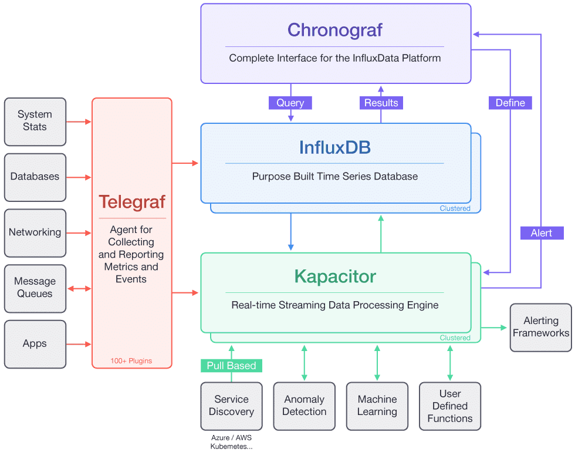

### 监控系统
一个监控系统的组成主要涉及四个环节：数据收集、数据传输、数据处理和数据展示。不同的监控系统实现方案，在这四个环节所使用的技术方案不同，适合的业务场景也不一样。  

### 监控系统选型
比较流行的开源监控系统实现方案主要有两种：以 ELK 为代表的集中式日志解决方案，以及 Graphite、TICK 和 Prometheus 等为代表的时序数据库解决方案。

**ELK**  
ELK 是 Elasticsearch、Logstash、Kibana 三个开源软件产品首字母的缩写，它们三个通常配合使用，所以被称为 ELK Stack，它的架构如图  
  

ELK 三个软件的功能各不相同：  

- Logstash 负责数据收集和传输，它支持动态地从各种数据源收集数据，并对数据进行过滤、分析、格式化等，然后存储到指定的位置。
- Elasticsearch 负责数据处理，它是一个开源分布式搜索和分析引擎，具有可伸缩、高可靠和易管理等特点，基于 Apache Lucene 构建，能对大容量的数据进行接近实时的存储、搜索和分析操作，通常被用作基础搜索引擎。
- Kibana 负责数据展示，也是一个开源和免费的工具，通常和 Elasticsearch 搭配使用，对其中的数据进行搜索、分析并且以图表的方式展示。

这种架构因为需要在各个服务器上部署 Logstash 来从不同的数据源收集数据，所以比较消耗 CPU 和内存资源，容易造成服务器性能下降，因此后来又在 Elasticsearch、Logstash、Kibana 之外引入了 Beats 作为数据收集器。  
相比于 Logstash，Beats 所占系统的 CPU 和内存几乎可以忽略不计，可以安装在每台服务器上做轻量型代理，从成百上千或成千上万台机器向 Logstash 或者直接向 Elasticsearch 发送数据。  

Beats 支持多种数据源，主要包括：  

- Packetbeat，用来收集网络流量数据。
- Topbeat，用来收集系统、进程的 CPU 和内存使用情况等数据。
- Filebeat，用来收集文件数据。
- Winlogbeat，用来收集 Windows 事件日志收据。

Beats 将收集到的数据发送到 Logstash，经过 Logstash 解析、过滤后，再将数据发送到 Elasticsearch，最后由 Kibana 展示，架构就变成下面这张图所示  
  

ELK 可以对日志的任意字段索引，适合多维度的数据查询，在存储时间序列数据方面与时间序列数据库相比会有额外的性能和存储开销。  
Kibana 包含的数据展示功能比较强大，但只支持 Elasticsearch，而且界面展示 UI 效果不如 Grafana 美观。  
ELK 的技术栈比较成熟，应用范围也比较广，除了可用作监控系统外，还可以用作日志查询和分析。  

**Graphite**  
Graphite 的组成主要包括三部分：Carbon、Whisper、Graphite-Web，它的架构如图所示  
  

Carbon 负责数据处理，Whisper 负责数据存储，Graphite-Web 负责数据展示

- Carbon：主要作用是接收被监控节点的连接，收集各个指标的数据，将这些数据写入 carbon-cache 并最终持久化到 Whisper 存储文件中去。
- Whisper：一个简单的时序数据库，主要作用是存储时间序列数据，可以按照不同的时间粒度来存储数据，比如 1 分钟 1 个点、5 分钟 1 个点、15 分钟 1 个点三个精度来存储监控数据。
- Graphite-Web：一个 Web App，其主要功能绘制报表与展示，即数据展示。为了保证 Graphite-Web 能及时绘制出图形，Carbon 在将数据写入 Whisper 存储的同时，会在 carbon-cache 中同时写入一份数据，Graphite-Web 会先查询 carbon-cache，如果没有再查询 Whisper 存储。

Graphite 自身并不包含数据采集组件，但可以接入 StatsD 等开源数据采集组件来采集数据，再传送给 Carbon。  

Graphite 通过 Graphite-Web 支持正则表达式匹配、sumSeries 求和、alias 给监控项重新命名等函数功能，同时还支持这些功能的组合。  

Graphite 自带的展示功能都比较弱，界面也不好看，不过好在支持 Grafana 来做数据展示。

**TICK**  
TICK 是 Telegraf、InfluxDB、Chronograf、Kapacitor 四个软件首字母的缩写，是由 InfluxData 开发的一套开源监控工具栈，因此也叫作 TICK Stack，它的架构如图所示  
  

其中 Telegraf 负责数据收集，InfluxDB 负责数据存储，Chronograf 负责数据展示，Kapacitor 负责数据告警。  
InfluxDB 通过类似 SQL 语言的 InfluxQL，能对监控数据进行复杂操作，比如查询一分钟 CPU 的使用率。  

TICK 自带的展示功能都比较弱，界面也不好看，不过好在支持 Grafana 来做数据展示。

**Prometheus**  
Prometheus 是一套开源的系统监控报警框架，受 Google 的集群监控系统 Borgmon 启发，由工作在 SoundCloud 的 Google 前员工在 2012 年创建，后来作为社区开源项目进行开发，并于 2015 年正式发布，2016 年正式加入 CNCF（Cloud Native Computing Foundation），成为受欢迎程度仅次于 Kubernetes 的项目。Prometheus 存储数据也是用的时间序列数据库，它的架构如图所示  
  

Prometheus 主要包含下面几个组件：  

- Prometheus Server：用于拉取 metrics 信息并将数据存储在时间序列数据库。
- Jobs/exporters：用于暴露已有的第三方服务的 metrics 给 Prometheus Server，比如 StatsD、Graphite 等，负责数据收集。
- Pushgateway：主要用于短期 jobs，由于这类 jobs 存在时间短，可能在 Prometheus Server 来拉取 metrics 信息之前就消失了，所以这类的 jobs 可以直接向 Prometheus Server 推送它们的 metrics 信息。
- Alertmanager：用于数据报警。
- Prometheus web UI：负责数据展示。

Prometheus 的工作流程大致是：  

- Prometheus Server 定期从配置好的 jobs 或者 exporters 中拉取 metrics 信息，或者接收来自 Pushgateway 发过来的 metrics 信息。  
- Prometheus Server 把收集到的 metrics 信息存储到时间序列数据库中，并运行已经定义好的 alert.rules，向 Alertmanager 推送警报。
- Alertmanager 根据配置文件，对接收的警报进行处理，发出告警。
- 通过 Prometheus web UI 进行可视化展示。  

Prometheus 自带的展示功能都比较弱，界面也不好看，不过好在支持 Grafana 来做数据展示。
