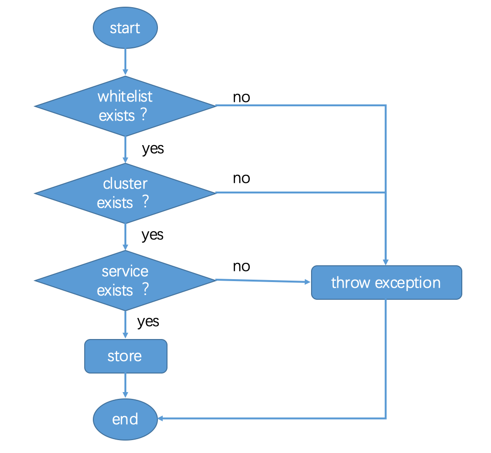
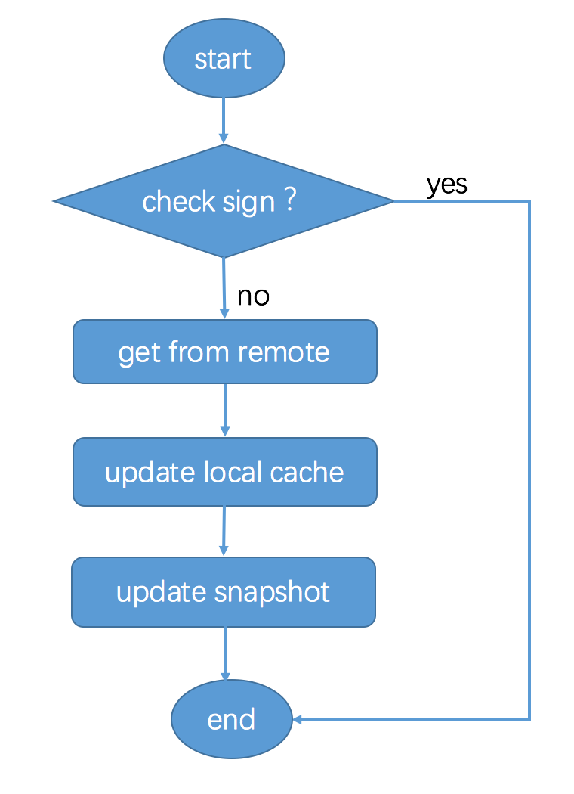
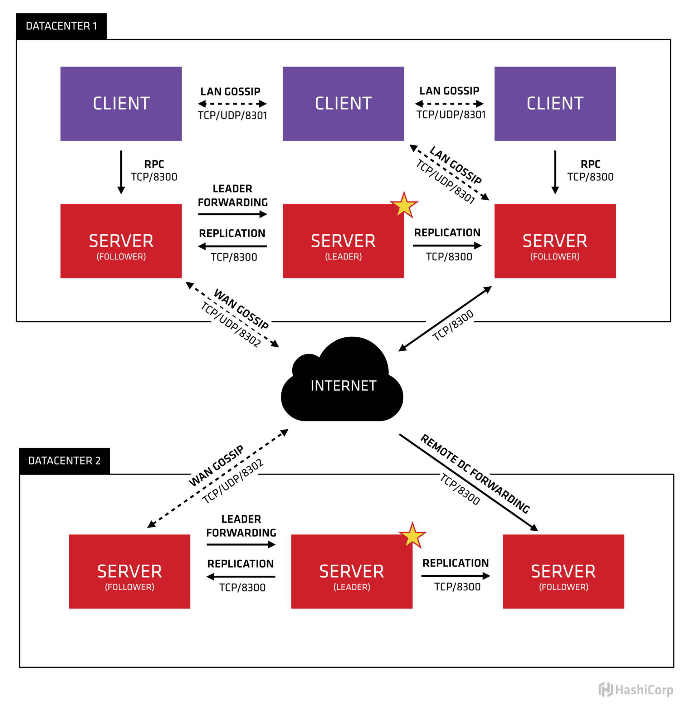

### 注册中心
注册中心具体包括四个流程：服务提供者注册流程、服务提供者反注册流程、服务消费者查询流程和服务消费者订阅变更流程。  

**注册中心如何存储服务信息**  
服务信息除了包含节点信息（IP 和端口号）以外，还包含其他一些信息，比如请求失败时重试的次数、请求结果是否压缩等信息。因此服务信息通常用 JSON 字符串来存储，包含多个字段，每个字段代表不同的含义。除此之外，服务一般会分成多个不同的分组，每个分组的目的不同。一般来说有下面几种分组方式：  
> 1、核心与非核心，从业务的核心程度来分  
> 2、机房，从机房的维度来分  
> 3、线上环境与测试环境，从业务场景维度来区分  

所以，注册中心存储的服务信息一般包含三部分内容：分组、服务名以及节点信息，节点信息又包括节点地址和节点其他信息。具体存储的时候，一般是按照“服务 - 分组 - 节点信息”三层结构来存储。Service 代表服务的具体分组，Cluster 代表服务的接口名，节点信息用 KV 存储。  
```
{
    "service": "xxx",
    "cluster": "com.xxx",
    "nodes": {
        "working": [{
            "host": "xxx",
            "extInfo": "xxx"
        }],
        "unreachable": []
    }
}
```

**注册中心是如何工作的**  
1、如何注册节点  
服务注册流程主要有下面几个步骤：  
> 1、查看要注册的节点是否在白名单内？如果不在就抛出异常，在的话继续下一步。  
> 2、要查看注册的 Cluster（服务的接口名）是否存在？如果不存在就抛出异常，存在的话继续下一步。  
> 3、要检查 Service（服务的分组）是否存在？如果不存在则抛出异常，存在的话继续下一步。  
> 4、将节点信息添加到对应的 Service 和 Cluster 下面的存储中。  

  

2、如何反注册  
节点反注册流程主要包含下面几个步骤：  
> 1、查看 Service（服务的分组）是否存在，不存在就抛出异常，存在就继续下一步。  
> 2、查看 Cluster（服务的接口名）是否存在，不存在就抛出异常，存在就继续下一步。  
> 3、删除存储中 Service 和 Cluster 下对应的节点信息。  
> 4、更新 Cluster 的 sign 值。

  

3、如何查询节点信息  
服务消费者查询节点信息主要分为下面几个步骤：  
>> 1、从 localcache（本机内存）中查找，如果没有就继续下一步。这里为什么服务消费者要把服务信息存在本机内存呢？主要是因为服务节点信息并不总是时刻变化的，并不需要每一次服务调用都要调用注册中心获取最新的节点信息，只需要在本机内存中保留最新的服务提供者的节点列表就可以。  
>> 2、从 snapshot（本地快照）中查找，如果没有就继续下一步。这里为什么服务消费者要在本地磁盘存储一份服务提供者的节点信息的快照呢？这是因为服务消费者同注册中心之间的网络不一定总是可靠的，服务消费者重启时，本机内存中还不存在服务提供者的节点信息，如果此时调用注册中心失败，那么服务消费者就拿不到服务节点信息了，也就没法调用了。本地快照就是为了防止这种情况的发生，即使服务消费者重启后请求注册中心失败，依然可以读取本地快照，获取到服务节点信息。  

  

4、如何订阅服务变更  
主要分为下面几个步骤：  
> 1、服务消费者从注册中心获取了服务的信息后，就订阅了服务的变化，会在本地保留 Cluster 的 sign 值。  
> 2、务消费者每隔一段时间，调用 getSign() 函数，从注册中心获取服务端该 Cluster 的 sign 值，并与本地保留的 sign 值做对比，如果不一致，就从服务端拉取新的节点信息，并更新 localcache 和 snapshot。  

  

### 注册中心常见问题  
1、多注册中心  
对于服务消费者来说，要能够同时从多个注册中心订阅服务；对于服务提供者来说，要能够同时向多个注册中心注册服务。  

服务消费者可能订阅了多个服务，多个服务可能是由多个业务部门提供的，而且每个业务部门都有自己的注册中心，提供的服务只在自己的注册中心里有记录。这样的话，就要求服务消费者要具备在启动时，能够从多个注册中心订阅服务的能力。  
一个服务提供者提供了某个服务，可能作为静态服务对外提供，有可能又作为动态服务对外提供，这两个服务部署在不同的注册中心，所以要求服务提供者在启动的时候，要能够同时向多个注册中心注册服务。

2、并行订阅服务  
一个服务消费者订阅了几十个不同的服务，每个服务都有自己的方法列表以及节点列表。服务消费者在服务启动时，会加载订阅的服务配置，调用注册中心的订阅接口，获取每个服务的节点列表并初始化连接。  
使用串行订阅的方式，每订阅一个服务，服务消费者调用一次注册中心的订阅接口，获取这个服务的节点列表并初始化连接，总共需要执行几十次这样的过程。在某些服务节点的初始化连接过程中，出现连接超时的情况，后续所有的服务节点的初始化连接都需要等待它完成，导致服务消费者启动变慢，最后耗费了将近五分钟时间来完成所有服务节点的初始化连接过程。  
使用并行订阅的方式，每订阅一个服务就单独用一个线程来处理，这样的话即使遇到个别服务节点连接超时，其他服务节点的初始化连接也不受影响，最慢也就是这个服务节点的初始化连接耗费的时间，最终所有服务节点的初始化连接耗时控制在了 30 秒以内。   

3、批量反注册服务  
在与注册中心的多次交互中，可能由于网络抖动、注册中心集群异常等原因，导致个别调用失败。对于注册中心来说，偶发的注册调用失败对服务调用基本没有影响，其结果顶多就是某一个服务少了一个可用的节点。但偶发的反注册调用失败会导致不可用的节点残留在注册中心中，变成“僵尸节点”，但服务消费者端还会把它当成“活节点”，继续发起调用，最终导致调用失败。  
这时候需要定时去清理注册中心中的“僵尸节点”。  
预防方面，可以通过优化反注册逻辑，对于下线机器、节点销毁的场景，通过调用注册中心提供的批量反注册接口，一次调用就可以把该节点上提供的所有服务同时反注册掉，从而避免了“僵尸节点”的出现。  

4、服务变更信息增量更新  
服务消费者端启动时，除了会查询订阅服务的可用节点列表做初始化连接，还会订阅服务的变更，每隔一段时间从注册中心获取最新的服务节点信息标记 sign，并与本地保存的 sign 值作比对，如果不一样，就会调用注册中心获取最新的服务节点信息。  
为了减少服务消费者从注册中心中拉取的服务可用节点信息的数据量，这个时候可以通过增量更新的方式，注册中心只返回变化的那部分节点信息，尤其在只有少数节点信息变更时，此举可以大大减少服务消费者从注册中心拉取的数据量，从而最大程度避免产生网络风暴。  

### 注册中心的选型
当下主流的服务注册与发现的解决方案，主要有两种：  
> 1、应用内注册与发现：注册中心提供服务端和客户端的 SDK，业务应用通过引入注册中心提供的 SDK，通过 SDK 与注册中心交互，来实现服务的注册和发现。  
> 2、应用外注册与发现：业务应用本身不需要通过 SDK 与注册中心打交道，而是通过其他方式与注册中心交互，间接完成服务注册与发现。  

**应用内注册与发现**  
采用应用内注册与发现的方式，最典型的案例要属 Netflix 开源的 Eureka。  
  

Eureka 的架构主要由三个重要的组件组成：  
> 1、Eureka Server：注册中心的服务端，实现了服务信息注册、存储以及查询等功能  
> 2、服务端的 Eureka Client：集成在服务端的注册中心 SDK，服务提供者通过调用 SDK，实现服务注册、反注册等功能  
> 3、客户端的 Eureka Client：集成在客户端的注册中心 SDK，服务消费者通过调用 SDK，实现服务订阅、服务更新等功能  

应用内的解决方案一般适用于服务提供者和服务消费者同属于一个技术体系。  

**应用外注册与发现**  
采用应用外方式实现服务注册和发现，最典型的案例是开源注册中心 Consul。  
  

Consul 实现应用外服务注册和发现主要依靠三个重要的组件：  
> 1、Consul：注册中心的服务端，实现服务注册信息的存储，并提供注册和发现服务  
> 2、Registrator：一个开源的第三方服务管理器项目，它通过监听服务部署的 Docker 实例是否存活，来负责服务提供者的注册和销毁  
> 3、Consul Template：定时从注册中心服务端获取最新的服务提供者节点列表并刷新 LB 配置（比如 Nginx 的 upstream），这样服务消费者就通过访问 Nginx 就可以获取最新的服务提供者信息  

应用外的解决方案一般适合服务提供者和服务消费者采用了不同技术体系的业务场景，比如服务提供者提供的是 C++ 服务，而服务消费者是一个 Java 应用，这时候采用应用外的解决方案就不依赖于具体一个技术体系。同时，对于容器化后的云应用来说，一般不适合采用应用内 SDK 的解决方案，因为这样会侵入业务，而应用外的解决方案正好能够解决这个问题。  

**注册中心选型要考虑的两个问题**  
在选择注册中心解决方案的时候，除了要考虑是采用应用内注册还是应用外注册的方式以外，还有两个最值得关注的问题，一个是高可用性，一个是数据一致性。  

高可用性  
注册中心作为服务提供者和服务消费者之间沟通的纽带，它的高可用性十分重要。试想，如果注册中心不可用了，那么服务提供者就无法对外暴露自己的服务，而服务消费者也无法知道自己想要调用的服务的具体地址，后果将不堪设想。  
实现高可用性的方法主要有两种：  
> 1、集群部署，顾名思义就是通过部署多个实例组成集群来保证高可用性，这样的话即使有部分机器宕机，将访问迁移到正常的机器上就可以保证服务的正常访问  
> 2、多 IDC 部署，就是部署在不止一个机房，这样能保证即使一个机房因为断电或者光缆被挖断等不可抗力因素不可用时，仍然可以通过把请求迁移到其他机房来保证服务的正常访问  

以 Consul 为例，一方面，它在每个数据中心（DATACENTER）内都有多个注册中心 Server 节点可供访问；另一方面还可以部署在多个数据中心来保证多机房高可用性。  
  

数据一致性  
为了保证注册中心的高可用性，注册中心的部署往往都采用集群部署，并且还通常部署在不止一个数据中心，这样的话就会引出另一个问题，多个数据中心之间如何保证数据一致？如何确保访问数据中心中任何一台机器都能得到正确的数据？这里就涉及分布式系统中著名的 CAP 理论，即同时满足一致性、可用性、分区容错性这三者是不可能的，其中 C（Consistency）代表一致性，A（Availability）代表可用性，P（Partition Tolerance）代表分区容错性。  
为什么说 CAP 三者不能被同时满足的呢？你可以想象在一个分布式系统里面，包含了多个节点，节点之间通过网络连通在一起。正常情况下，通过网络，从一个节点可以访问任何别的节点上的数据。但是，有可能出现网络故障，导致整个网络被分成了互不连通的区域，这就叫作分区。一旦出现分区，那么一个区域内的节点就没法访问其他节点上的数据了，最好的办法是把数据复制到其他区域内的节点，这样即使出现分区，也能访问任意区域内节点上的数据，这就是*分区容错性*。但是，把数据复制到多个节点就可能出现数据不一致的情况，这就是*一致性*。要保证一致，就必须等待所有节点上的数据都更新成功才可用，这就是*可用性*。总之，就是数据节点越多，分区容错性越高，但数据一致性越难保证。为了保证数据一致性，又会带来可用性的问题。   

注册中心一般采用分布式集群部署，也面临着 CAP 的问题，根据 CAP 不能同时满足，所以不同的注册中心解决方案选择的方向也就不同，大致可分为两种。  
> 1、CP 型注册中心，牺牲可用性来保证数据强一致性，最典型的例子就是 ZooKeeper，etcd，Consul 了。ZooKeeper 集群内只有一个 Leader，而且在 Leader 无法使用的时候通过 Paxos 算法选举出一个新的 Leader。这个 Leader 的目的就是保证写信息的时候只向这个 Leader 写入，Leader 会同步信息到 Followers，这个过程就可以保证数据的强一致性。但如果多个 ZooKeeper 之间网络出现问题，造成出现多个 Leader，发生脑裂的话，注册中心就不可用了。而 etcd 和 Consul 集群内都是通过 raft 协议来保证强一致性，如果出现脑裂的话，注册中心也不可用。  
> 2、AP 型注册中心，牺牲一致性来保证可用性，最典型的例子就是 Eureka 了。对比下 Zookeeper，Eureka 不用选举一个 Leader，每个 Eureka 服务器单独保存服务注册地址，因此有可能出现数据信息不一致的情况。但是当网络出现问题的时候，每台服务器都可以完成独立的服务。  

对于注册中心来说，最主要的功能是服务的注册和发现，在网络出现问题的时候，可用性的需求要远远高于数据一致性。即使因为数据不一致，注册中心内引入了不可用的服务节点，也可以通过其他措施来避免，比如客户端的快速失败机制等，只要实现最终一致性，对于注册中心来说就足够了。因此，选择 AP 型注册中心，一般更加合适。


