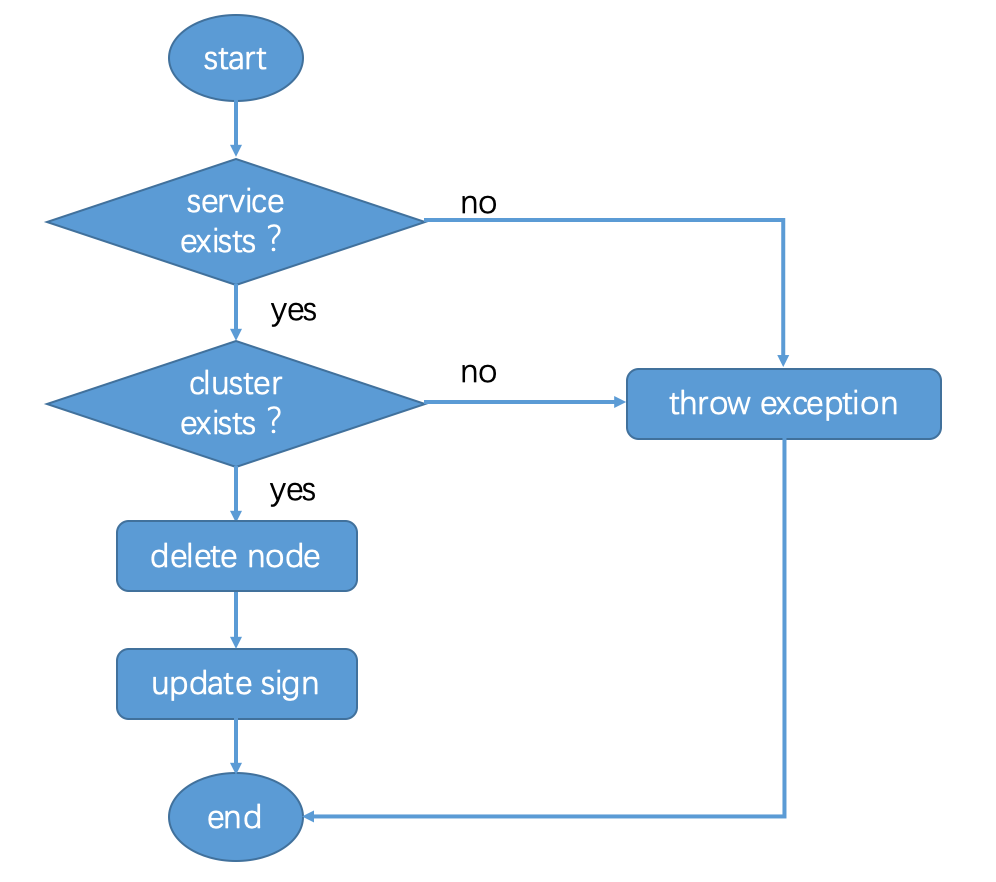
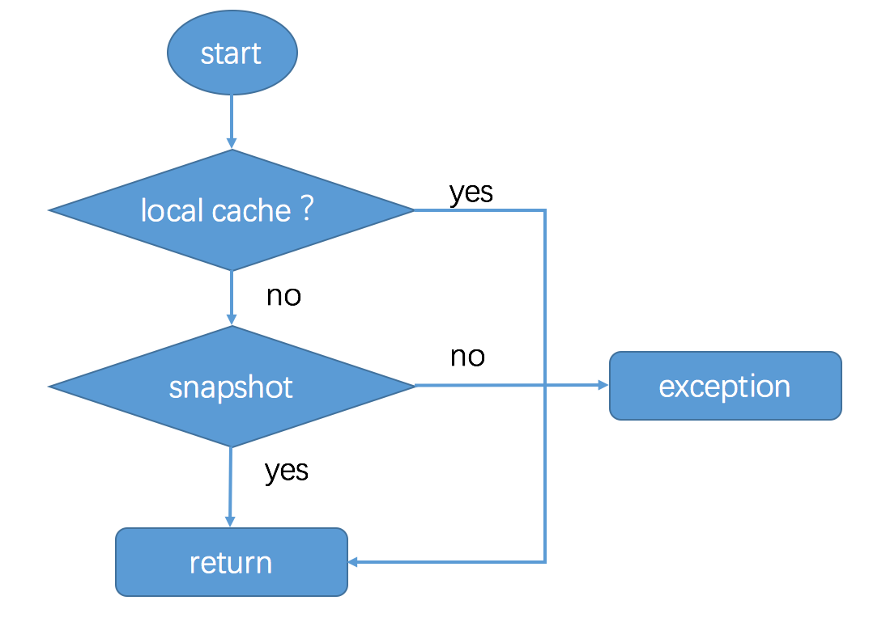

### 注册中心
注册中心具体包括四个流程：服务提供者注册流程、服务提供者反注册流程、服务消费者查询流程和服务消费者订阅变更流程。  

**注册中心如何存储服务信息**  
服务信息除了包含节点信息（IP 和端口号）以外，还包含其他一些信息，比如请求失败时重试的次数、请求结果是否压缩等信息。因此服务信息通常用 JSON 字符串来存储，包含多个字段，每个字段代表不同的含义。除此之外，服务一般会分成多个不同的分组，每个分组的目的不同。一般来说有下面几种分组方式：  
> 1、核心与非核心，从业务的核心程度来分  
> 2、机房，从机房的维度来分  
> 3、线上环境与测试环境，从业务场景维度来区分  

所以，注册中心存储的服务信息一般包含三部分内容：分组、服务名以及节点信息，节点信息又包括节点地址和节点其他信息。具体存储的时候，一般是按照“服务 - 分组 - 节点信息”三层结构来存储。Service 代表服务的具体分组，Cluster 代表服务的接口名，节点信息用 KV 存储。  
```
{
    "service": "xxx",
    "cluster": "com.xxx",
    "nodes": {
        "working": [{
            "host": "xxx",
            "extInfo": "xxx"
        }],
        "unreachable": []
    }
}
```

**注册中心是如何工作的**  
1、如何注册节点  
服务注册流程主要有下面几个步骤：  
> 1、查看要注册的节点是否在白名单内？如果不在就抛出异常，在的话继续下一步。  
> 2、要查看注册的 Cluster（服务的接口名）是否存在？如果不存在就抛出异常，存在的话继续下一步。  
> 3、要检查 Service（服务的分组）是否存在？如果不存在则抛出异常，存在的话继续下一步。  
> 4、将节点信息添加到对应的 Service 和 Cluster 下面的存储中。  

  

2、如何反注册  
节点反注册流程主要包含下面几个步骤：  
> 1、查看 Service（服务的分组）是否存在，不存在就抛出异常，存在就继续下一步。  
> 2、查看 Cluster（服务的接口名）是否存在，不存在就抛出异常，存在就继续下一步。  
> 3、删除存储中 Service 和 Cluster 下对应的节点信息。  
> 4、更新 Cluster 的 sign 值。

  

3、如何查询节点信息  
服务消费者查询节点信息主要分为下面几个步骤：  
>> 1、从 localcache（本机内存）中查找，如果没有就继续下一步。这里为什么服务消费者要把服务信息存在本机内存呢？主要是因为服务节点信息并不总是时刻变化的，并不需要每一次服务调用都要调用注册中心获取最新的节点信息，只需要在本机内存中保留最新的服务提供者的节点列表就可以。  
>> 2、从 snapshot（本地快照）中查找，如果没有就继续下一步。这里为什么服务消费者要在本地磁盘存储一份服务提供者的节点信息的快照呢？这是因为服务消费者同注册中心之间的网络不一定总是可靠的，服务消费者重启时，本机内存中还不存在服务提供者的节点信息，如果此时调用注册中心失败，那么服务消费者就拿不到服务节点信息了，也就没法调用了。本地快照就是为了防止这种情况的发生，即使服务消费者重启后请求注册中心失败，依然可以读取本地快照，获取到服务节点信息。  

  

4、如何订阅服务变更  
主要分为下面几个步骤：  
> 1、服务消费者从注册中心获取了服务的信息后，就订阅了服务的变化，会在本地保留 Cluster 的 sign 值。  
> 2、务消费者每隔一段时间，调用 getSign() 函数，从注册中心获取服务端该 Cluster 的 sign 值，并与本地保留的 sign 值做对比，如果不一致，就从服务端拉取新的节点信息，并更新 localcache 和 snapshot。  

  

### 注册中心常见问题  
1、多注册中心  
对于服务消费者来说，要能够同时从多个注册中心订阅服务；对于服务提供者来说，要能够同时向多个注册中心注册服务。  

服务消费者可能订阅了多个服务，多个服务可能是由多个业务部门提供的，而且每个业务部门都有自己的注册中心，提供的服务只在自己的注册中心里有记录。这样的话，就要求服务消费者要具备在启动时，能够从多个注册中心订阅服务的能力。  
一个服务提供者提供了某个服务，可能作为静态服务对外提供，有可能又作为动态服务对外提供，这两个服务部署在不同的注册中心，所以要求服务提供者在启动的时候，要能够同时向多个注册中心注册服务。

2、并行订阅服务  
一个服务消费者订阅了几十个不同的服务，每个服务都有自己的方法列表以及节点列表。服务消费者在服务启动时，会加载订阅的服务配置，调用注册中心的订阅接口，获取每个服务的节点列表并初始化连接。  
使用串行订阅的方式，每订阅一个服务，服务消费者调用一次注册中心的订阅接口，获取这个服务的节点列表并初始化连接，总共需要执行几十次这样的过程。在某些服务节点的初始化连接过程中，出现连接超时的情况，后续所有的服务节点的初始化连接都需要等待它完成，导致服务消费者启动变慢，最后耗费了将近五分钟时间来完成所有服务节点的初始化连接过程。  
使用并行订阅的方式，每订阅一个服务就单独用一个线程来处理，这样的话即使遇到个别服务节点连接超时，其他服务节点的初始化连接也不受影响，最慢也就是这个服务节点的初始化连接耗费的时间，最终所有服务节点的初始化连接耗时控制在了 30 秒以内。   

3、批量反注册服务  
在与注册中心的多次交互中，可能由于网络抖动、注册中心集群异常等原因，导致个别调用失败。对于注册中心来说，偶发的注册调用失败对服务调用基本没有影响，其结果顶多就是某一个服务少了一个可用的节点。但偶发的反注册调用失败会导致不可用的节点残留在注册中心中，变成“僵尸节点”，但服务消费者端还会把它当成“活节点”，继续发起调用，最终导致调用失败。  
这时候需要定时去清理注册中心中的“僵尸节点”。  
预防方面，可以通过优化反注册逻辑，对于下线机器、节点销毁的场景，通过调用注册中心提供的批量反注册接口，一次调用就可以把该节点上提供的所有服务同时反注册掉，从而避免了“僵尸节点”的出现。  

4、服务变更信息增量更新  
服务消费者端启动时，除了会查询订阅服务的可用节点列表做初始化连接，还会订阅服务的变更，每隔一段时间从注册中心获取最新的服务节点信息标记 sign，并与本地保存的 sign 值作比对，如果不一样，就会调用注册中心获取最新的服务节点信息。  
为了减少服务消费者从注册中心中拉取的服务可用节点信息的数据量，这个时候可以通过增量更新的方式，注册中心只返回变化的那部分节点信息，尤其在只有少数节点信息变更时，此举可以大大减少服务消费者从注册中心拉取的数据量，从而最大程度避免产生网络风暴。  


