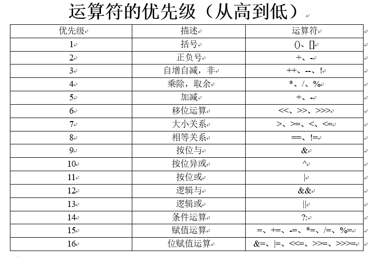

### Java 初识
Java 介于编译型语言和解释型语言之间。  

随着 Java 的发展，Java 又分出了三个不同版本：  
J2SE(Java 2 Platform Standard Edition)标准版是为开发普通桌面和商务应用程序提供的解决方案，该技术体系是其他两者的基础，可以完成一些桌面应用程序的开发。   
J2ME(Java 2 Platform Micro Edition)小型版是为开发电子消费产品和嵌入式设备提供的解决方案。  
J2EE(Java 2 Platform Enterprise Edition)企业版是为开发企业环境下的应用程序提供的一套解决方案，该技术体系中包含的技术如 Servlet、Jsp 等，主要针对于 Web 应用程序、开发数据库、消息服务等。  
Java SE 是整个 Java 平台的核心，而 Java EE 是进一步学习 Web 应用所必须的(Spring 等框架都是 Java EE 开源生态系统的一部分)。

Java 语言特点：简单性、面向对象、健壮性、结构中立、高性能、多线程、动态、安全性、跨平台。  
跨平台：只要在需要运行 java 应用程序的操作系统上，先安装一个 Java 虚拟机 JVM (Java Virtual Machine) 即可。由 JVM 来负责 Java 程序在该系统中的运行。  
```
           --- jvm --- windows
Java 语言 -|-- jvm --- linux
           --- jvm --- macos
```

使用 JDK 开发完成的 java 程序，最终交给 JRE 去运行。  
JRE(Java Runtime Environment) Java 运行环境，包括 Java 虚拟机 JVM(Java Virtual Machine) 和 Java 程序所需的核心类库等，如果想要运行一个开发好的 Java 程序，计算机中只需要安装 JRE 即可。  
JDK(Java Development Kit) Java 开发工具包，JDK 是提供给 Java 开发人员使用的，其中包含了 java 的开发工具，也包括了 JRE。所以安装了 JDK，就不用在单独安装 JRE 了。其中的开发工具：编译工具 javac.exe 和打包工具 jar.exe 等。  

JSR 规范(Java Specification Request)，为了保证 Java 语言的规范性。凡是想给 Java 平台加一个功能，比如说访问数据库的功能，大家要先创建一个 JSR 规范，定义好接口，这样，各个数据库厂商都按照规范写出 Java 驱动程序。  
负责审核 JSR 的组织就是 JCP(Java Community Process)。  
一个 JSR 规范发布时，为了让大家有个参考，还要同时发布如下套件：  
RI：Reference Implementation 参考实现  
TCK：Technology Compatibility Kit 兼容性测试套件  

Java 的学习曲线：  
1、先学习 Java SE，掌握 Java 语言本身、Java 核心开发技术以及 Java 标准库的使用；  
2、如果继续学习 Java EE，Spring 框架、数据库开发、分布式架构就是需要学习的；  
3、如果学习大数据开发，那么 Hadoop、Spark、Flink 这些大数据平台就是需要学习的，他们都基于 Java 或 Scala 开发；  
4、如果学习移动开发，那么就深入 Android 平台，掌握 Android App 开发。  

### Java 安装
JDK 的下载：http://www.oracle.com  

Java 环境变量配置：添加变量 JAVAHOME(java/jdk-xx)，添加 path 环境变量(%JAVA_HOME%\bin;)，添加 CLASSPATH 环境变量(.;%JAVA_HOME%\lib\tools.jar;%JAVA_HOME%\lib\dt.jar)  
`添加环境变量 path 的意义是 javac 和 java 命令可以在任意目录下使用；classpath 环境变量则是让 class 文件在任意目录运行`
```bash
# ubuntu 下安装 java
sudo apt update
sudo add-apt-repository ppa:linuxuprising/java
sudo apt install oracle-java12-installer
# 若系统 java 多版本，设置默认 java12
sudo apt -y install oracle-java12-set-default

# 设置 java 环境
sudo vim /etc/profile.d/jdk.sh
# 中增加以下两行
# export JAVA_HOME=/usr/lib/jvm/java-12-oracle
# export PATH=$PATH:$JAVA_HOME/bin:/usr/lib/jvm/java-12-oracle/db/bin
source /etc/profile.d/jdk.sh
```

IDE：https://www.jetbrains.com/idea/

### Hello, java
```java
/**
 * HelloJava class
 * 
 * 类名必须以英文字母开头，后接字母，数字和下划线的组合（习惯以大写字母开头）
 * public 是访问修饰符，表示该 class 是公开的
 */
public class HelloJava {
	// 固定入口方法
	public static void main(String [] args) {
		System.out.println("Hello, java");
	}
}
```
代码执行过程；
HelloJava.java -> javac 编译(javac HelloJava.java) -> Java 字节码文件 HelloJava.class -> java 执行(java HelloJava) -> 运行结果 Hello, java

### Java 关键字和标识符
关键字：被 Java 语言赋予特定含义的单词，组成关键字的字母全部小写，比如 public  
`注意：goto 和 const 作为保留字存在，目前并未使用`
[关键字汇总参考](http://cyw3.github.io/YalesonChan/2016/Java-key.html)   

标识符：给类、接口、方法、变量等起名字时使用的字符序列，由英文大小写字母、数字字符、$ 和 _ 组成，比如 myName   
`注意：不能以数字开头，不能使用 Java 关键字（goto 和 const 也不能哦），区分大小写`  

### Java 注释
注释是一个程序员必须要具有的良好编程习惯。  
注释是用于解释说明程序的文字，提高程序的阅读性，帮助我们调试程序。  
```java
// 单行注释文字
/* 多行注释文字 */
/** 文档注释文字 */
```

### Java 常量与变量
常量：在程序执行的过程中其值不可以发生改变，分为字面值常量和自定义常量（比如整数常量 1，布尔常量 true 和 false，空常量 null等）    
变量：在程序执行的过程中，在某个范围内其值可以发生改变的量，类似数学中的未知数  
`注意：语句块中定义的变量有一个作用域{}，就是从定义处开始，到语句块结束；定义变量时，要遵循作用域最小化原则，尽量将变量定义在尽可能小的作用域，并且不要重复使用变量名`  

```java
// 定义常量，通常全字符大写
public static final double PI = 3.1415926;

// 定义变量，没有初始化不能直接使用
// 虽然一行可以定义多个变量，但是建议只定义一个
int number;
// 定义并初始化
int number = 1;
// 省略类型，使用 var（编译器会根据赋值语句自动推断出变量 str_builder 的类型是 StringBuilder）
var str_builder = new StringBuilder();
```

### Java 数据类型
Java语言是强类型语言，对于每一种数据都定义了明确的具体数据类型，在内存总分配了不同大小的内存空间。  

Java 提供了两种变量类型：基本类型和引用类型。  

基本类型是 CPU 可以直接进行运算的类型。 
```
# 整数类型（没有无符号类型）
byte：8 位，-128 ~ 127 (-2^7 ~ 2^7 - 1)，封装器类 Byte
short: 16 位，-32768 ~ 32767 (-2^15 ~ 2^15-1)，封装器类 Short
int（默认）: 32 位，-2147483648 ~ 2147483647 (-2^31 ~ 2^31-1)，封装器类 Integer
long: 64 位，-9223372036854775808 ~ 9223372036854775807 (-2^63 ~ 2^63-1)，封装器类 Long

# 浮点数类型
float：32 位，-3.403E38 ~ 3.403E38（需要加上 f 后缀，区分双精度），封装器类 Float
double（默认）：64 位，-1.798E308 ~ 1.798E308，封装器类 Double

# 字符类型
# 存储 Unicode 码如 'A'，使用单引号赋值（注意与双引号的字符串类型区分）
char: 16 位，1，封装器类 Character 

# 布尔类型
# 理论上存储布尔类型只需要 1 bit，但是通常 JVM 内部会把 boolean 表示为 4 字节整数
# 封装器类 Boolean
true
false
```
基本类型的类型转换  
1、默认转换：byte,short,char —> int —> long —> float —> double  
2、强制转换：变量名=(目标类型)(被转换的数据);  
3、boolean 类型不能转换为其他的数据类型  

引用类型底层结构和基本类型差别较大
```
# 类
class

# 接口
interface

# 数组
[]

# 枚举 
enum

# 标注
Annotation
```

### Java 运算符
Java 的运算符包括算术运算符、赋值运算符、比较运算符、逻辑运算符、位运算符、三目运算符。  
```java
int number1 = 2019;
int number2 = 2020;
int maxNumber = number1 > number2 ? number1 : number2;
```

一些需要注意的地方
> 1、整数由于存在范围限制，如果计算结果超出了范围，就会产生溢出；而溢出不会出错，却会得到一个奇怪的结果  
> 2、浮点数运算在除数为 0 时，不会报错，但会返回几个特殊值：
> NaN 表示 Not a Number
> Infinity 表示无穷大
> -Infinity 表示负无穷大

  

### Java 键盘操作
键盘录入，提高程序的灵活性。
```java 
import java.util.Scanner;

Scanner sc = new Scanner(System.in)
int inputNumber = sc.nextInt();
```

### Java 控制结构
```java
// If 条件语句
int number = 10;
if (number == 10){
    System.out.println("= 10");
} else if (number > 10) {
    System.out.println("> 10");
} else {
    System.out.println("< 10");
}

// While循环
int counterWhile = 0;
while(counterWhile < 100)
{
    System.out.println(counterWhile);
    // 增加计数器 counterWhile 0->99
    counterWhile++;
}
// 输出 100
System.out.println(counterWhile);
// Do While循环
int counterDoWhile = 0;
do
{
    System.out.println(counterDoWhile);
    //增加计数器 counterDoWhile 0->99
    counterDoWhile++;
}while(counterDoWhile < 100);
// 输出 100
System.out.println(counterWhile);

// For 循环
int counterFor;
//for 循环结构 => for(<起始语句>; <循环进行的条件>; <步长>)
for(counterFor = 0; counterFor < 10; counterFor++){
    // counterFor 0->9
    System.out.println(counterFor);
}

// Switch Case 语句
int month = 3;
String monthString;
switch (month){
    case 1:
            monthString = "January";
            break;
    case 2:
            monthString = "February";
            break;
    case 3:
            monthString = "March";
            break;
    default:
            monthString = "Other month";
            break;
}
```

### Java 类与函数
Java 中函数被称作方法。
```java
class Bicycle {
    public int cadence; // Public: 任意位置均可访问
    private int speed;  // Private: 只在同类中可以访问
    protected int gear; // Protected: 可以在同类与子类中可以访问
    String name; // Default public: 可以在包内中可以访问

    // 默认构造函数（初始化一个对象的方式）
    public Bicycle() {
        gear = 1;
        cadence = 50;
        speed = 5;
        name = "Bontrager";
    }

    // 含有参数的构造函数
    public Bicycle(int startCadence, int startSpeed, int startGear, String name) {
        this.gear = startGear;
        this.cadence = startCadence;
        this.speed = startSpeed;
        this.name = name;
    }

    // 函数语法:
    // <public/private/protected> <返回值类型> <函数名称>(<参数列表>)
    public int getCadence() {
        return cadence;
    }

    // void 说明函数没有返回值
    public void setCadence(int newValue) {
        cadence = newValue;
    }

    // @Override 表示需要重载的方法
    // 返回对象属性的方法
    @Override
    public String toString() {
        return " cadence: " + cadence;
    }
}

// PennyFarthing 是 Bicycle 的子类
class PennyFarthing extends Bicycle {
    public PennyFarthing(int startCadence, int startSpeed){
        // 通过 super 调用父类的构造函数
        super(startCadence, startSpeed, 0, "PennyFarthing");
    }

    
    @Override
    public void setCadence(int newValue) {
        setCadence = newValue + 1;
    }
}
```


