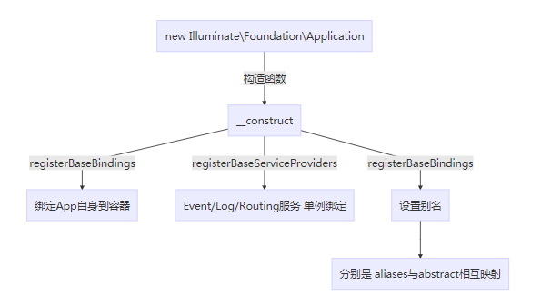
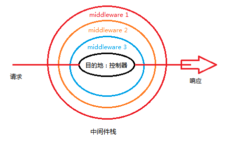

### Laravel 生命周期
整体流程：  
入口（public/index.php）  
-> App 初始化容器（尚未启动）  
-> 绑定 Kernel 内核和异常处理  
-> Kernel 捕捉并处理请求  
-> 响应请求    

Application 初始化：  
初始化容器  
-> Events/Log/Router 注册基础服务  
-> 设置容器中 abstract 与 alias 的映射关系  
  

Kernel 流程：  
初始化 Kernel（设置中间件：给路由设置中间件固定优先级列表，设置中间件分组和路由中间件）  
-> 捕获请求（路由调度，中间件栈，自定义异常处理）  
-> 处理请求（绑定 request），启动 Application（加载 .env 配置，加载 config 目录配置，设置错误和异常的 handler，设置 Facade 别名自动加载，注册服务提供者，启动服务提供者），使用管道和路由调度把请求通过中间件和路由  
-> 发送响应  
-> Kernel 终止  

### Laravel 源码解读基础

**依赖注入和控制反转**  
依赖注入的目的在于解耦，通过把控制权交给外部达到控制的反转。  
如下，日志的实现可以有文件、数据库等等，记录用户登陆的日志信息的实现方式就可以通过构造函数的参数传递；当需要增加或切换日志实现方式时，不影响用户操作类，完美符合设计模式原则。  
```php
interface Log
{
    public function write($message);   
}

class FileLog implements Log
{
    public function write($message)
    {
        echo "Filelog::write:{$message}";
    }   
}

class DatabaseLog implements Log
{
    public function write($message)
    {
        echo "DatabaseLog::write:{$message}";
    }   
}

class User 
{
    protected $log;

    public function __construct(Log $log)
    {
        $this->log = $log;   
    }

    public function login()
    {
        // ... 
        $this->log->write("xxx Logined at " . date('Y-m-d H:i:s'));
    }
}

$user = new User(new DatabaseLog());
$user->login();
```

**反射**  
反射可以理解成根据类名返回该类的任何信息，比如该类有什么方法，参数，变量等等。  
```php
// 继续上面依赖注入的代码
//
// 获取 User 的反射对象
$reflector = new reflectionClass(User::class);
// 获取 User 的构造函数
$constructor = $reflector->getConstructor();
/*
ReflectionMethod {#234
  +name: "__construct"
  +class: "User"
  parameters: {
    $log: ReflectionParameter {#243
      +name: "log"
      position: 0
      typeHint: "Log"
    }
  }
  extra: {
    file: "当前文件路径"
    line: "28 to 31"
    isUserDefined: true
  }
  modifiers: "public"
}
 */
// 获取 User 构造函数的所有依赖参数
$dependencies = $constructor->getParameters();
/*
array:1 [
  0 => ReflectionParameter {#235
    +name: "log"
    position: 0
    typeHint: "Log"
  }
]
 */
// 创建 user 对象
// $reflector->newInstance($dependencies = []);
$user = $reflector->newInstance(new DatabaseLog());

// make 通过反射机制完成依赖注入
function make($concrete){
    $reflector = new ReflectionClass($concrete);
    $constructor = $reflector->getConstructor();
    if(null === $constructor) {
        return $reflector->newInstance();
    }

    $dependencies = $constructor->getParameters();
    $instances = getAllDependencies($dependencies);

    return $reflector->newInstanceArgs($instances);
}

function getAllDependencies($paramters) {
    $dependencies = [];
    foreach ($paramters as $paramter) {
        $dependencies[] = make($paramter->getClass()->name);
    }

    return $dependencies;
}

$user = make('User');
$user->login()
```

### Laravel 容器和服务提供者
Ioc 容器的实现思路：  
1、Ioc 容器维护 binding 数组记录 bind 方法传入的键值对，如 log => FileLog  
2、在 ioc->make ('user') 的时候，通过反射得到 User 的构造函数及其参数，发现参数 log 通过反射得到 FileLog 的构造函数及其参数，以此类推...  
3、通过反射机制创建 user 的依赖 $log = new FileLog ();...  
4、通过 newInstanceArgs 再去创建 User 的对象 new User($log);  
```php
class Ioc
{
    public $binding = [];

    public function bind($abstract, $concrete)
    {
        // 使用 closure 目的是延迟对象实例化
        $this->binding[$abstract]['concrete'] = function($ioc) use ($concrete){
            return $ioc->build($concrete);
        };
    }

    public function make($abstract)
    {
        $concrete = $this->binding[$abstract]['concrete'];

        return $concrete($this);
    }

    public function build($concrete)
    {
        $reflector = new ReflectionClass($concrete);
        $constructor = $reflector->getConstructor();
        if(null === $constructor) {
            return $reflector->newInstance();
        }

        $dependencies = $constructor->getParameters();
        $instances = $this->getAllDependencies($dependencies);

        return $reflector->newInstanceArgs($instances);
    }

    public function getAllDependencies($paramters) 
    {
        $dependencies = [];
        foreach ($paramters as $paramter) {
            $dependencies[] = $this->make($paramter->getClass()->name);
        }

        return $dependencies;
    }
}

// 创建 Ioc 容器实例
$ioc = new Ioc();
$ioc->bind('log', 'FileLog');
$ioc->bind('user', 'User');
// user 是服务提供者
$user = $ioc->make('user');
$user->login();
```

在 laravel 的 config 目录找到 app.php 中 providers 定义的就是已经写好的服务提供者，服务提供者都是通过调用 register 方法注册到 ioc 中（其中的 app 就是 Ioc 容器，singleton 则可以理解成上面的 bind 方法 + 单例模式）。  
register 的执行时机是在 Laravel Kernel 的内核绑定。    

### Laravel 契约
契约就是所谓的面向接口编程。  
契约定义了 class 必须要实现的方法，统一对外接口，进而使用依赖注入解耦应用。  

在 Laravel 中，定义的契约规范在 Illuminate\Contracts 中。比如 Cache 的契约规范就在 Illuminate\Contracts\Cache\Repository 文件中，我们可以写多种缓存方式如 file,redis,memcached 以实现这个契约中的 set,get,remove 等方法，然后在使用的时候就可以随意切换了。  

### Laravel Facade
Facade 核心实现原理就是提前把 Facade 注入到 Ioc 容器。  
1、定义一个服务提供者的外观类，定义静态方法 getFacadeAccessor 返回 ioc 容器绑定的 key  
2、绑定 ioc 容器    
3、通过静态魔术方法 __callStatic 获取当前调用的方法  
```php
class UserFacade
{
    protected static function getFacadeAccessor()
    {
        return 'user';
    }

    protected static $ioc;

    public static function setFacadeIoc($ioc)
    {
        static::$ioc = $ioc;
    }

    public static function __callStatic($method, $args)
    {
        $instance = static::$ioc->make(static::getFacadeAccessor());

        return $instance->$method(...$args);
    }
}

// 创建 Ioc 容器实例
$ioc = new Ioc();
$ioc->bind('log', 'FileLog');
$ioc->bind('user', 'User');
// 绑定 Ioc 容器
UserFacade::setFacadeIoc($ioc);
UserFacade::login();
```

在 laravel 的 config 目录找到 app.php 中 aliases 定义的就是 Facade。  
laravel Facade 的提前注入 ioc 时机也是在 Laravel Kernel 的内核绑定。  

Facade 主要是提供了简单，易记的语法，从而无需手动注入或配置长长的类名；并且由于 Facade 对 PHP 静态方法的独特调用，使得测试起来更加容易。  

### Laravel 中间件与管道
Laravel 中间件提供了一种方便的机制来过滤进入应用的 HTTP 请求，通过中间件扩展或处理一些功能。  
  

```php
interface Middleware 
{
    public static function handle(Closure $next);
}

class ValidateAuth implements Middleware 
{
    public static function handle(Closure $next)
    {
        echo 'validate auth' . PHP_EOL;

        $next();
    }
}

class ValidateCsrfToken implements Middleware 
{
    public static function handle(Closure $next)
    {
        echo 'validate csrf Token' . PHP_EOL;

        $next();
    }
}

$handle = function() {
    echo 'do something' . PHP_EOL;
};

$pipes = [
    "ValidateAuth",
    "ValidateCsrfToken"
];
// 由于栈的先进后出特性，正常顺序需要反转一下
$pipes = array_reverse($pipes);
// array_reduce 用回调函数迭代地将数组简化单一值，返回 closure
$callback = array_reduce($pipes, function($stack, $pipe) {
    return function() use($stack, $pipe){
        return $pipe::handle($stack);
    };
},$handle);
call_user_func($callback);
// 返回结果
// validate auth
// validate csrf Token
// do something
```

在 Laravel 中，中间件的实现其实是依赖于 Illuminate\Pipeline\Pipeline 实现，它的调用在 Illuminate\Routing\Router 中。
```php
// 实例化管道（客户端发过来的请求被一个又一个的中间件处理，前一个中间件处理往之后的结果交给了下一个中间件）
return (new Pipeline($this->container))
    ->send($request)
    ->through($middleware)
    ->then(function ($request) use ($route) {
        return $this->prepareResponse(
            $request,
            $route->run($request)
        );
});

// 中间件执行过程调用了三个方法
// 
// send 方法设置了需要在中间件中流水处理的对象，在这里就是 HTTP 请求实例
public function send($passable){
    $this->passable = $passable;

    return $this;
}
// through 方法设置需要经过哪些中间件处理
public function through($pipes){
    $this->pipes = is_array($pipes) ? $pipes :func_get_args();
    return $this;
}
// then 方法接收一个闭包作为参数，输出请求向路由传递，返回相应的函数
public function then(Closure $destination){
    // 经过 getInitialSlice 包装（也是一个闭包）
   $firstSlice = $this->getInitialSlice($destination);
   // 反转中间件数组，主要是利用了栈的特性
   $pipes = array_reverse($this->pipes);
   // call_user_func 执行了一个 array_reduce 返回的闭包
   return call_user_func(
       //array_reduce 用来包装回调函数处理的数组
       array_reduce($pipes, $this->getSlice(), $firstSlice), $this->passable
   );
}
// getInitialSlice 方法主要是对原有的 destination 添加了一个 $passable 的参数
protected function getInitialSlice(Closure $destination)
{
    return function ($passable) use ($destination) {
        return call_user_func($destination, $passable);
    };
}
// getSlice 方法实例化每个要执行的中间件
// 处理中间件的过程比作剥洋葱，一个中间件的执行过程就是剥一片洋葱
protected function getSlice(){
    return function ($stack, $pipe) {
        return function ($passable) use ($stack, $pipe) {
            if ($pipe instanceof Closure) {
                return call_user_func($pipe, $passable, $stack);
            } else {
                // 根据中间件的类名去分离出要实例化的中间件类，和实例化中间件可能需要的参数
                list($name, $parameters) = $this->parsePipeString($pipe);
                return call_user_func_array(
                    // 调用某个类中方法的写法
                    // 其中 $this->container->make($name) 是使用服务容器去实例化要调用的中间件对象
                    // $this->method 就是 handle 函数
                    [$this->container->make($name), $this->method],
                    // 用中间件所需要的参数
                    // $passable(请求实例 $request) 和下一个中间件的回调函数 $stack
                    array_merge([$passable, $stack],
                    $parameters)
                );
            }
        };
    };
}
```

