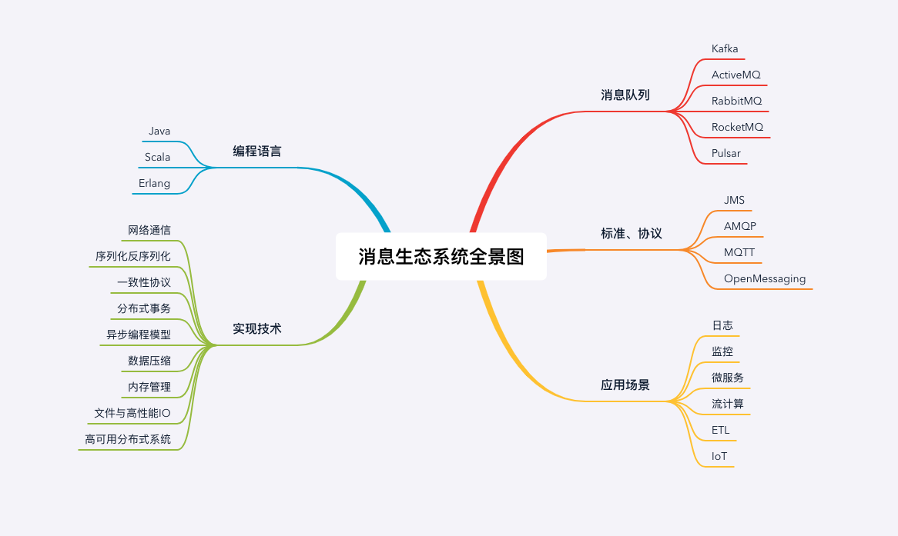

### 消息队列是什么
消息队列（Message queue）是一种进程间通信或同一进程的不同线程间的通信方式。  
消息队列技术是分布式应用间交换信息的一种技术。消息队列可驻留在内存或磁盘上，队列存储消息直到它们被应用程序读出。通过消息队列，应用程序可独立地执行，它们不需要知道彼此的位置、或在继续执行前不需要等待接收程序接收此消息。简单来说，发送者和消费者的生产效率通常是不一致的，那么我们就需要一种抽象模型去解耦，因此这里就可以引入消息队列，将任务暂时写入消息中间件，待消费者慢慢处理。  

消息队列更适合异步需求，而同步需求则考虑远程过程调用 (PRC)。目前很多消息队列软件同时支持 RPC 功能，很多 RPC 系统也能异步调用。  
消息队列主要实现异步处理、流量控制、服务解耦、存储转发、分布式事务、发布订阅、基于内容的路由、点对点连接等等。  

消息中间件目前已经有了很多选择，例如 RocketMQ、Kafka、Pulsar 等等，消息队列带来很多便利的同时，也引入了一些技术上的复杂性，就像一个黑盒子一样，所以了解实现原理就显得异常重要。

### 消息队列产品选型
  

1、ActiveMQ  
最老牌的开源消息队列，目前已进入老年期，社区不活跃。无论是功能还是性能方面，ActiveMQ 都与现代的消息队列存在明显的差距，它存在的意义仅限于兼容那些还在用的爷爷辈儿的系统。  

2、ZeroMQ  
ZeroMQ 是一个基于消息队列的多线程网络库，如果你的需求是将消息队列的功能集成到你的系统进程中，可以考虑使用 ZeroMQ。

3、[RabbitMQ](https://rocketmq.apache.org/docs/quick-start/)  
RabbitMQ 俗称兔子 MQ。RabbitMQ 是使用一种比较小众的编程语言：Erlang 语言编写的，它最早是为电信行业系统之间的可靠通信设计的，也是少数几个支持 AMQP 协议的消息队列之一。  
RabbitMQ 开箱即用易于维护的产品，但性能不高。  
RabbitMQ 的路由配置，在生产者（Producer）和队列（Queue）之间增加了一个 Exchange 模块（可以理解为交换机），根据配置的路由规则将生产者发出的消息分发到不同的队列中。  
优点：轻量，迅捷，容易部署和使用，拥有灵活的路由配置，支持语言最多  
缺点：性能和吞吐量较差，不易进行二次开发  

4、[RocketMQ](http://rocketmq.cloud/zh-cn/ )  
RocketMQ 是阿里巴巴在 2012 年开源的消息队列产品，后来捐赠给 Apache 软件基金会，2017 正式毕业，成为 Apache 的顶级项目。阿里内部也是使用 RocketMQ 作为支撑其业务的消息队列，经历过多次 “双十一” 考验，性能、稳定性和可靠性都是值得信赖的。  
优点：性能好，稳定可靠，有活跃的中文社区，特点响应快  
缺点：兼容性较差，但随意影响力的扩大，该问题会有改善  

5、[Kafka](http://kafka.apache.org/documentation/)    
Kafka 最早是由 LinkedIn 开发，目前也是 Apache 的顶级项目。Kafka 最初的设计目的是用于处理海量的日志。    
Kafka 使用 Scala 和 Java 语言开发，设计上大量使用了批量和异步的思想，这种设计使得 Kafka 能做到超高的性能。  
优点：拥有强大的性能及吞吐量，兼容性很好  
缺点：由于 “攒一波再处理” 导致延迟比较高，不太适合在线业务场景  

6、Pulsar  
采用存储和计算分离的设计，是消息队列里产品中黑马，值得持续关注  

### 消息队列的实现
消息队列的实现包括消息的推送，接收处理。  
消息队列框架是本地应用程序（命令行程序），为了让他在后台运行，需要实现守护进程。  
有些业务场景入队非常快，但处理起来所花的时间就比较长，容易出现队列堆积现象。增加多线程可能更有效利用硬件资源，提高业务处理能力。

[SOA](https://github.com/netkiller/SOA)  

#### 存储层
消息队列最核心的组件之一就是存储层，消息如何落地、如何读取，这里的技术选型是比较重要的。  
比如 RocketMQ 以及 Kafka 都是选择存储到本机（即本地文件系统），Pulsar 则是选择存储到分布式文件系统 bookKeeper 中，而  Redis 自身也是支持 publish/consume 模型的。  
具体的选择哪一种实现方式只要还是看自己的业务场景，如果可靠性要求较高但对性能并不那么敏感的场景可以选择数据库作为存储介质。  

选择本地文件系统去实现一个分布式消息队列相对来说是这几种最复杂的，不仅仅需要自己实现文件的 IO 细节，对于复制、一致性 (当出现网络异常或者系统异常宕机时如何根据日志恢复系统的状态) 也都需要自己实现，而这每一部分都需要相当一部分精力去研究。  
基于分布式 KV 的方案相对来说也是不错的方案，性能很不错，而且接口也比较人性化，但是可靠性差了一点，对于类似交易、缓存同步这种对可靠性要求比较高的场景来说不那么适用。  
```
producer -> redis (job) -> consumer
```
基于数据库的方式性能上会有很大的损失，DB 的数据结构本质上就不适合去实现消息队列，速度和一致性只能选择一个。  

消息队列的场景，单线程写多线程读，这里需要引入 topic 分区的概念，一般如果某些 topic 比较活跃，吞吐量比较高，那么我们可以将消息分区，实现思路一般是将 topic 再从细粒度切分为子 topic，并将每个子 topic 分布到不同的 broker 上，从而实现性能的线性提升，也就是说这里的单线程写具体指的是单个分区，多线程读相对来说比较容易理解，而 HDFS 正好适合这个场景，而且我们也不用去管 replica、写分片、刷盘策略等等，减少了很多实现的复杂性，BookKeeper 在这方面是不错的选择。  
  

#### 客户端 Api 实现
对于使用者而言，接触到的更多的是客户端暴漏的 API, 而客户端和服务器端 Broker 也需要一种方式通讯。  
对于 RocketMQ 以及 Kafka 都是选择实现了自定义的协议，消息队列如果想要达到极高的吞吐量，实现一种高性能的网络通讯框架是相当重要的一环，RocketMQ 是基于 Netty 之上构建的，而 Kafka 是直接基于 NIO 实现的，相对来说要复杂一点，如果看过源码的话会有所了解，Kafka 客户端提交之后是先放到一个本地队列，然后根据 broker、topic、分区信息等合并提交到服务器端，而 Pulsar 印象中是基于 Protocol buffer 实现的，这样相对自定义协议很多好处，首先如果协议后期实现过程有变动的话，如何兼容老的协议等这些细节已经由 Protocol buffer 帮你解决了，另外很重要的一点是，Protocol buffer 可以帮你生成各个不同语言的 API，如果是自定义协议这个又要费相当的精力去实现。  

### 一致性
对于消息队列的场景，每条消息都是一旦落盘之后，就不再支持更新操作，对于读取也都是顺序读，consumer 抓取到的消息也都是已经落盘的或者已经 commit 的记录，因此一致性在消息队列中相对来说还是比较容易实现的。  

### 高可用
首先就存储层来说，我们的技术选型就已经决定了本质上就是高可用的，因为 BookKeeper 本身就支持指定复制到几个 slave 以及 ack 的机制，例如需要写入到所有的分区才向客户端返回成功，而对于 broker 端，因为我们的消息队列是存储和计算分离的，也就是说 broker 本身是无状态的，当 producer/consumer 连接的 broker 宕机或者网络超时的断开连接时，可以直接由另一个 broker 接着提供服务，当然这里还有很多细节问题，但是复杂性相对 RocketMQ 等已经降低了很多。  

### 消费者进度存储
消息存在三种语义: at most once、at least once、exactly once。  
消费者 offset 的存储于同步机制就一定程度上决定了我们具体是什么语义，例如发送端，如果发送失败不重试的话就是 at most once，如果发送失败选择一定次数的重试，那么就是 at least once，这里就可能造成消息重复落盘从而造成重复消费，例如说消息实际已经落盘但是发送提交响应的过程出现了网络异常，就会出现这种情况，而 exactly once 的场景就会比较复杂一点。  
我们回到 offset 的场景，RocketMQ 以及 Kafka 默认都是定时去同步当前的消费进度，那么这个消费进度存储到哪里又是一个问题。  
RocketMQ 的方式是存储到本地文件系统中，Kafka 在 0.8 版本之前是选择存储到了 Zookeeper 中，后面改成存储到另外一个 topic 中，那么这两种方式有什么优缺点呢:

性能 / 横向扩展: Zookeeper 是一个一致性系统，它保留的 API 也都是基于 key/value 的格式，ZK 本质上是不支持大量写的，同时 ZK 不支持横向扩展，因为每个节点都会同步所有的 transaction 并保持整个数据集，实际上 ZK 是基于单个日志写并同步复制到其他节点的分布式系统。ZK 的吞吐量据我测试差不多 1W/S 写左右，但是假如说我们有几十上百万个 topic，每秒同步一次消费进度，这个时候 ZK 已经完全不能满足需要，而且并不能横向扩展，只能通过分片的方式解决，而这又引入了一个代理层。  
实现的复杂性：基于本地文件系统性能虽然可观，但是和消息存储同理，需要考虑很多实现的细节，例如为了保证高可用，我们还需要考虑如何将本地 offet 快照文件同步到其他备机。  

因此我们这里参考 Kafka 最新的实现，我们选择将消费进度也存储到 BookKeeper 中，这样就可以支持大量的写，而且支持线性扩展，BK 也会将小的 log 合并存储到一个文件中，避免了性能被一些不活跃的 topic 所影响。  
