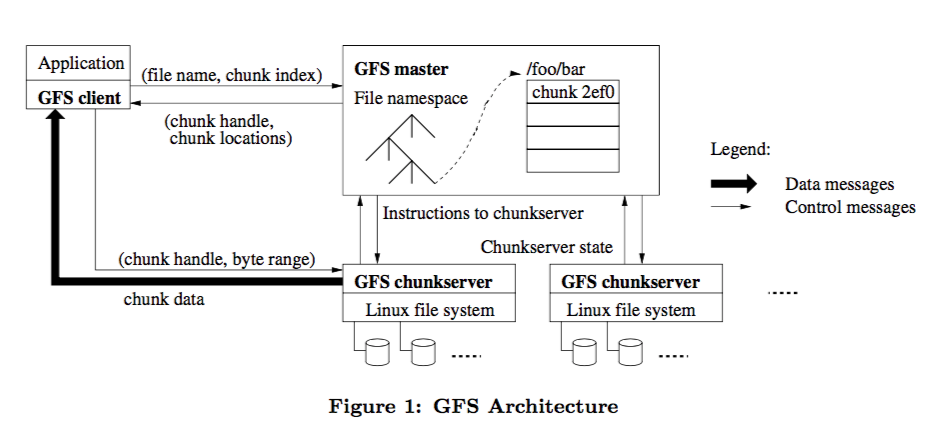

### 消息队列是什么
消息队列（Message queue）是一种进程间通信或同一进程的不同线程间的通信方式。  
消息队列技术是分布式应用间交换信息的一种技术。消息队列可驻留在内存或磁盘上，队列存储消息直到它们被应用程序读出。通过消息队列，应用程序可独立地执行，它们不需要知道彼此的位置、或在继续执行前不需要等待接收程序接收此消息。简单来说，发送者和消费者的生产效率通常是不一致的，那么我们就需要一种抽象模型去解耦，因此这里就可以引入消息队列，将任务暂时写入消息中间件，待消费者慢慢处理。  

消息队列更适合异步需求，而同步需求则考虑远程过程调用 (PRC)。目前很多消息队列软件同时支持 RPC 功能，很多 RPC 系统也能异步调用。  
消息队列主要实现异步处理、流量控制、服务解耦、存储转发、分布式事务、发布订阅、基于内容的路由、点对点连接等等。  

消息中间件目前已经有了很多选择，例如 RocketMQ、Kafka、Pulsar 等等，消息队列带来很多便利的同时，也引入了一些技术上的复杂性，就像一个黑盒子一样，所以了解实现原理就显得异常重要。

### 消息队列产品选型
  

1、ActiveMQ  
最老牌的开源消息队列，目前已进入老年期，社区不活跃。无论是功能还是性能方面，ActiveMQ 都与现代的消息队列存在明显的差距，它存在的意义仅限于兼容那些还在用的爷爷辈儿的系统。  

2、ZeroMQ  
ZeroMQ 是一个基于消息队列的多线程网络库，如果你的需求是将消息队列的功能集成到你的系统进程中，可以考虑使用 ZeroMQ。

3、[RabbitMQ](https://rocketmq.apache.org/docs/quick-start/)  
RabbitMQ 俗称兔子 MQ。RabbitMQ 是使用一种比较小众的编程语言：Erlang 语言编写的，它最早是为电信行业系统之间的可靠通信设计的，也是少数几个支持 AMQP 协议的消息队列之一。  
RabbitMQ 开箱即用易于维护的产品，但性能不高。  
RabbitMQ 的路由配置，在生产者（Producer）和队列（Queue）之间增加了一个 Exchange 模块（可以理解为交换机），根据配置的路由规则将生产者发出的消息分发到不同的队列中。  
优点：轻量，迅捷，容易部署和使用，拥有灵活的路由配置，支持语言最多  
缺点：性能和吞吐量较差，不易进行二次开发  

4、[RocketMQ](http://rocketmq.cloud/zh-cn/ )  
RocketMQ 是阿里巴巴在 2012 年开源的消息队列产品，后来捐赠给 Apache 软件基金会，2017 正式毕业，成为 Apache 的顶级项目。阿里内部也是使用 RocketMQ 作为支撑其业务的消息队列，经历过多次 “双十一” 考验，性能、稳定性和可靠性都是值得信赖的。  
优点：性能好，稳定可靠，有活跃的中文社区，特点响应快  
缺点：兼容性较差，但随意影响力的扩大，该问题会有改善  

5、[Kafka](http://kafka.apache.org/documentation/)    
Kafka 最早是由 LinkedIn 开发，目前也是 Apache 的顶级项目。Kafka 最初的设计目的是用于处理海量的日志。    
Kafka 使用 Scala 和 Java 语言开发，设计上大量使用了批量和异步的思想，这种设计使得 Kafka 能做到超高的性能。  
优点：拥有强大的性能及吞吐量，兼容性很好  
缺点：由于 “攒一波再处理” 导致延迟比较高，不太适合在线业务场景  

6、Pulsar  
采用存储和计算分离的设计，是消息队列里产品中黑马，值得持续关注  

### 消息队列模型
队列是先进先出（FIFO, First-In-First-Out）的线性表（Linear List）。在具体应用中通常用链表或者数组来实现。队列只允许在后端（称为 rear）进行插入操作，在前端（称为 front）进行删除操作。  
> 先进先出，保证消息严格有序，按照什么顺序写进队列，必须按照同样的顺序 从队列中读出来  
> 不过，队列是没有“读”这个操作的，“读”就是出队，也就是从队列 中“删除”这条消息  

队列和主题的区别，背后实际上对应着两种不同的消息模型：队列模型和发布 - 订阅模型。  

生产者 （Producer）发消息就是入队操作，消费者（Consumer）收消息就是出队也就是删除操作，服务端存放消息的容器自然就称为“队列”。
```
生产者（Producer） -- 发送 --> 队列（0，1，2...）-- 接收 --> 消费者（Consumer）
```

如果需要将一份消息数据分发给多个消费者，要求每个消费者都能收到全量的消息。例如，对于一份订单数据，风控系统、分析系统、支付系统等都需要接收消息。可行的解决方式是，为每个消费者创建一个单独的队列，让生产者发送多份。但是，同样的一份消息数据被复制到多个队列中会浪费资源，并且更重要的是生产者必须知道有多少个消费者。为每个消费者单独发送一份消息，这实际上违背了消 息队列“解耦”这个设计初衷。    
为了解决这个问题，演化出了另外一种消息模型：“发布 - 订阅模型（PublishSubscribe Pattern）”。  
```
# 订阅者在接收消息之前需要先“订阅主题”
                                    -----------订阅----------
                                    |                       |
                                    v         -- 接收 --> 订阅者（Subscriber）
发布者（Publisher） -- 发送 --> 主题（Topic）--|
                                    ^         -- 接收 --> 订阅者（Subscriber）
                                    |                       |
                                    -----------订阅----------
```
在发布 - 订阅模型中，如果只有一个订阅者，那它和队列模型就基本是一样 的了。即发布 - 订阅模型在功能层面上是可以兼容队列模型的。  

RabbitMQ 是少数坚持使用队列模型的产品之一，通过 Exchange 上配置的策略来决定消息投递到哪些队列中，从而变相实现新的发布 - 订阅模型；  
RocketMQ 则是使用标准的发布 - 订阅模型，同时也有队列的概念，通过主题下添加队列概念，每个主题包含多个队列实现多实例并行生产和消费；  
Kafka 的消息模式和 RocketMQ 完全一样，区别在于队列在 Kafka 中称为分区（Partition），而且实现方式不一样。  
```
# RocketMQ、Kafka 的生产消费过程中请求 - 确认机制（确保消息不会在传递过程中由于网络或服务器故障丢失）
                 -- 若未收到响应，再次发送 -->                     -- 若未收到响应，再次发送 -->
生产者（Producer）-- 发送 --> 服务端（Broker）接收后，写入主题或队列 -- 接收 --> 消费者（Consumer）
      ^                                        | ^                                |
      |                                        V |                                V
      ---------------确认/失败响应--------------- -------------消费确认--------------
```

### Rabbitmq 安装
```bash
#centeros7 安装 erlang
yum install erlang
#启动扩展源
yum install epel-release
#下载rabbitmq源文件
wget http://www.rabbitmq.com/releases/rabbitmq-server/v3.6.6/rabbitmq-server-3.6.6-1.el7.noarch.rpm
#安装
yum install rabbitmq-server-3.6.6-1.el7.noarch.rpm 
#尝试执行
yum install socat
# 添加开机启动RabbitMQ服务
chkconfig rabbitmq-server on
# 启动服务
/sbin/service rabbitmq-server start
# 查看服务状态
/sbin/service rabbitmq-server status 
# 停止服务
 /sbin/service rabbitmq-server stop
# 查看当前所有用户
 rabbitmqctl list_users
# 查看默认guest用户的权限
 rabbitmqctl list_user_permissions guest
由于RabbitMQ默认的账号用户名和密码都是guest。为了安全起见, 先删掉默认用户
rabbitmqctl delete_user guest
# 添加新用户
rabbitmqctl add_user username password
# 设置用户
rabbitmqctl set_user_tags username administrator
# 赋予用户默认vhost的全部操作权限
rabbitmqctl set_permissions -p / username ".*" ".*" ".*"
# 查看用户的权限
rabbitmqctl list_user_permissions username
#这是打开管理插件的命令.
rabbitmq-plugins enable rabbitmq_management
```

### 消息队列的实现
消息队列的实现包括消息的推送，接收处理。  
消息队列框架是本地应用程序（命令行程序），为了让他在后台运行，需要实现守护进程。  
有些业务场景入队非常快，但处理起来所花的时间就比较长，容易出现队列堆积现象。增加多线程可能更有效利用硬件资源，提高业务处理能力。

[SOA](https://github.com/netkiller/SOA)  

#### 存储层
消息队列最核心的组件之一就是存储层，消息如何落地、如何读取，这里的技术选型是比较重要的。  
比如 RocketMQ 以及 Kafka 都是选择存储到本机（即本地文件系统），Pulsar 则是选择存储到分布式文件系统 bookKeeper 中，而  Redis 自身也是支持 publish/consume 模型的。  
具体的选择哪一种实现方式只要还是看自己的业务场景，如果可靠性要求较高但对性能并不那么敏感的场景可以选择数据库作为存储介质。  

选择本地文件系统去实现一个分布式消息队列相对来说是这几种最复杂的，不仅仅需要自己实现文件的 IO 细节，对于复制、一致性 (当出现网络异常或者系统异常宕机时如何根据日志恢复系统的状态) 也都需要自己实现，而这每一部分都需要相当一部分精力去研究。  
基于分布式 KV 的方案相对来说也是不错的方案，性能很不错，而且接口也比较人性化，但是可靠性差了一点，对于类似交易、缓存同步这种对可靠性要求比较高的场景来说不那么适用。  
```
producer -> redis (job) -> consumer
```
基于数据库的方式性能上会有很大的损失，DB 的数据结构本质上就不适合去实现消息队列，速度和一致性只能选择一个。  

消息队列的场景，单线程写多线程读，这里需要引入 topic 分区的概念，一般如果某些 topic 比较活跃，吞吐量比较高，那么我们可以将消息分区，实现思路一般是将 topic 再从细粒度切分为子 topic，并将每个子 topic 分布到不同的 broker 上，从而实现性能的线性提升，也就是说这里的单线程写具体指的是单个分区，多线程读相对来说比较容易理解，而 HDFS 正好适合这个场景，而且我们也不用去管 replica、写分片、刷盘策略等等，减少了很多实现的复杂性，BookKeeper 在这方面是不错的选择。  
  

#### 客户端 Api 实现
对于使用者而言，接触到的更多的是客户端暴漏的 API, 而客户端和服务器端 Broker 也需要一种方式通讯。  
对于 RocketMQ 以及 Kafka 都是选择实现了自定义的协议，消息队列如果想要达到极高的吞吐量，实现一种高性能的网络通讯框架是相当重要的一环，RocketMQ 是基于 Netty 之上构建的，而 Kafka 是直接基于 NIO 实现的，相对来说要复杂一点，如果看过源码的话会有所了解，Kafka 客户端提交之后是先放到一个本地队列，然后根据 broker、topic、分区信息等合并提交到服务器端，而 Pulsar 印象中是基于 Protocol buffer 实现的，这样相对自定义协议很多好处，首先如果协议后期实现过程有变动的话，如何兼容老的协议等这些细节已经由 Protocol buffer 帮你解决了，另外很重要的一点是，Protocol buffer 可以帮你生成各个不同语言的 API，如果是自定义协议这个又要费相当的精力去实现。  

#### 一致性
对于消息队列的场景，每条消息都是一旦落盘之后，就不再支持更新操作，对于读取也都是顺序读，consumer 抓取到的消息也都是已经落盘的或者已经 commit 的记录，因此一致性在消息队列中相对来说还是比较容易实现的。  

#### 高可用
首先就存储层来说，我们的技术选型就已经决定了本质上就是高可用的，因为 BookKeeper 本身就支持指定复制到几个 slave 以及 ack 的机制，例如需要写入到所有的分区才向客户端返回成功，而对于 broker 端，因为我们的消息队列是存储和计算分离的，也就是说 broker 本身是无状态的，当 producer/consumer 连接的 broker 宕机或者网络超时的断开连接时，可以直接由另一个 broker 接着提供服务，当然这里还有很多细节问题，但是复杂性相对 RocketMQ 等已经降低了很多。  

#### 消费者进度存储
消息存在三种语义: at most once、at least once、exactly once。  
消费者 offset 的存储于同步机制就一定程度上决定了我们具体是什么语义，例如发送端，如果发送失败不重试的话就是 at most once，如果发送失败选择一定次数的重试，那么就是 at least once，这里就可能造成消息重复落盘从而造成重复消费，例如说消息实际已经落盘但是发送提交响应的过程出现了网络异常，就会出现这种情况，而 exactly once 的场景就会比较复杂一点。  
我们回到 offset 的场景，RocketMQ 以及 Kafka 默认都是定时去同步当前的消费进度，那么这个消费进度存储到哪里又是一个问题。  
RocketMQ 的方式是存储到本地文件系统中，Kafka 在 0.8 版本之前是选择存储到了 Zookeeper 中，后面改成存储到另外一个 topic 中，那么这两种方式有什么优缺点呢:

性能 / 横向扩展: Zookeeper 是一个一致性系统，它保留的 API 也都是基于 key/value 的格式，ZK 本质上是不支持大量写的，同时 ZK 不支持横向扩展，因为每个节点都会同步所有的 transaction 并保持整个数据集，实际上 ZK 是基于单个日志写并同步复制到其他节点的分布式系统。ZK 的吞吐量据我测试差不多 1W/S 写左右，但是假如说我们有几十上百万个 topic，每秒同步一次消费进度，这个时候 ZK 已经完全不能满足需要，而且并不能横向扩展，只能通过分片的方式解决，而这又引入了一个代理层。  
实现的复杂性：基于本地文件系统性能虽然可观，但是和消息存储同理，需要考虑很多实现的细节，例如为了保证高可用，我们还需要考虑如何将本地 offet 快照文件同步到其他备机。  

因此我们这里参考 Kafka 最新的实现，我们选择将消费进度也存储到 BookKeeper 中，这样就可以支持大量的写，而且支持线性扩展，BK 也会将小的 log 合并存储到一个文件中，避免了性能被一些不活跃的 topic 所影响。  

### 消息队列事务分布式
消息队列中的“事务”，主要解决的是消息生产者和消息消费者的数据一致性问题。  

什么是事务？就是所有相关操作要么都成功，要么都失败。  
一个严格意义的事务实现，应该具有 4 个属性：原子性、一致性、隔离性、持久性，这四个属性通常称为 ACID 特性。  
原子性，是指一个事务操作不可分割，要么成功，要么失败，不能有一半成功一半失败的情况。  
一致性，是指这些数据在事务执行完成这个时间点之前，读到的一定是更新前的数据，之后读到的一定是更新后的数据，不应该存在一个时刻，让用户读到更新过程中的数据。  
隔离性，是指一个事务的执行不能被其他事务干扰。即一个事务内部的操作及使用的数据对正在进行的其他事务是隔离的，并发执行的各个事务之间不能互相干扰，这个有点儿像我们打网游中的副本，我们在副本中打的怪和掉的装备，与其他副本没有任何关联也不会互相影响。  
持久性，是指一个事务一旦完成提交，后续的其他操作和故障都不会对事务的结果产生任何影响。  

比如，电商里的创建订单。  
购物车系统订阅相应的主题，接收订单创建的消息，然后清理购物车，在购物车中删除订单中的商品，这里就需要保证订单库和购物车库这两个库的数据一致性。  
  

分布式事务就是要在分布式系统中的实现事务。  
在分布式系统中，严格实现 ACID 代价大到无法接受。所以分布式事务，更多情况下，是在分布式系统中事务的不完整实现。  
在实际应用中，比较常见的分布式事务实现有 2PC（Two-phase Commit，也叫二阶段提交）、TCC(Try-Confirm-Cancel) 和事务消息。每一种实现都有其特定的使用场景，也有各自的问题，都不是完美的解决方案。事务消息适用的场景主要是那些需要异步更新数据，并且对数据实时性要求不太高的场景，比如上面电商创建订单后的清除购物车。  
  
半消息不是说消息内容不完整，它包含的内容就是完整的消息内容，半消息和普通消息的唯一区别是，在事务提交之前，对于消费者来说，这个消息是不可见的。  
第 4 步提交事务失败的处理方法，Kafka 的解决方案比较简单粗暴，直接抛出异常，让用户自行处理；而 RocketMQ 增加了事务反查的机制来解决事务消息提交失败的问题（在提交或者回滚事务消息时发生网络异常，RocketMQ 的 Broker 没有收到提交或者回滚的请求，Broker 会定期去 Producer 上反查这个事务对应的本地事务的状态，然后根据反查结果决定提交或者回滚这个事务）。  
RocketMQ 反查本地事务的实现，并不依赖消息的发送方，也就是订单服务的某个实例节点上的任何数据。即使是发送事务消息的那个订单服务节点宕机了，RocketMQ 依然可以通过其他订单服务的节点来执行反查，确保事务的完整性。  
反查本地事务的逻辑也可以很简单，我们只要根据消息中的订单 ID，在订单库中查询这个订单是否存在即可。  
  

### 消息可靠性保证机制
现在主流的消息队列产品都提供了非常完善的消息可靠性保证机制，完全可以做到在消息传递过程中，即使发生网络中断或者硬件故障，也能确保消息的可靠传递，不丢消息。  

检测消息丢失的方法：  
1、 IT 基础设施比较完善的公司，一般都有分布式链路追踪系统，使用类似的追踪系统可以很方便地追踪每一条消息  
2、可以利用消息队列的有序性来验证是否有消息丢失。原理就是在 Producer 端，我们给每个发出的消息附加一个连续递增的序号，然后在 Consumer 端来检查这个序号的连续性。大多数消息队列的客户端都支持拦截器机制，你可以利用这个拦截器机制，在 Producer 发送消息之前的拦截器中将序号注入到消息中，在 Consumer 收到消息的拦截器中检测序号的连续性，这样实现的好处是消息检测的代码不会侵入到你的业务代码中，待你的系统稳定后，也方便将这部分检测的逻辑关闭或者删除。  

在分布式系统中，像 Kafka 和 RocketMQ 这样的消息队列是不保证在 Topic 上的严格顺序的，只能保证分区上的消息是有序的，所以我们在发消息的时候必须要指定分区，并且在每个分区单独检测消息序号的连续性。  
如果你的系统中 Producer 是多实例的，由于并不好协调多个 Producer 之间的发送顺序，所以也需要每个 Producer 分别生成各自的消息序号，并且需要附加上 Producer 的标识，在 Consumer 端按照每个 Producer 分别来检测序号的连续性。Consumer 实例的数量最好和分区数量一致，做到 Consumer 和分区一一对应，这样会比较方便地在 Consumer 内检测消息序号的连续性。  

  

生产阶段:  
从消息在 Producer 创建出来，经过网络传输发送到 Broker 端。消息队列通过最常用的请求确认机制，来保证消息的可靠传递。  
这个阶段，正确处理 Broker 返回值或者捕获异常（异步发送则需要在回调中检查），就可以保证这个阶段的消息不会丢失。  

存储阶段:  
消息在 Broker 端存储，如果是集群，消息会在这个阶段被复制到其他的副本上。  
保证 Broker 正常运行就不会丢失消息。  
对消息的可靠性要求非常高，可以通过配置 Broker 参数来避免因为宕机丢消息。  
对于单个节点的 Broker，需要配置 Broker 参数，在收到消息后，将消息写入磁盘后再给 Producer 返回确认响应，这样即使发生宕机，由于消息已经被写入磁盘，就不会丢失消息，恢复后还可以继续消费（ 如 RocketMQ 需要将刷盘方式 flushDiskType 配置为 SYNC_FLUSH 同步刷盘）。  
多个节点组成的集群，需要将 Broker 集群配置成：至少将消息发送到 2 个以上的节点，再给客户端回复发送确认响应。这样当某个 Broker 宕机时，其他的 Broker 可以替代宕机的 Broker，也不会发生消息丢失。  

消费阶段:  
Consumer 从 Broker 上拉取消息，经过网络传输发送到 Consumer 上。  
消费阶段采用和生产阶段类似的确认机制来保证消息的可靠传递，客户端从 Broker 拉取消息后，执行用户的消费业务逻辑，成功后，才会给 Broker 发送消费确认响应。如果 Broker 没有收到消费确认响应，下次拉消息的时候还会返回同一条消息，确保消息不会在网络传输过程中丢失，也不会因为客户端在执行消费逻辑中出错导致丢失。  
`注意：不要在收到消息后就立即发送消费确认，而是应该在执行完所有消费业务逻辑之后，再发送消费确认`  

### 消息重复处理

