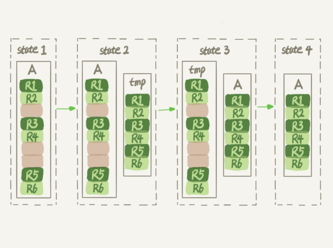

### 数据删除
一个 InnoDB 表包含两部分：表结构定义和数据。  

在 MySQL 8.0 版本以前，表结构是存在以.frm 为后缀的文件里（表结构定义占用的空间很小），而 MySQL 8.0 版本，则允许把表结构定义放在系统数据表中。  

表数据既可以存在共享表空间里，也可以是单独的文件。这个行为是由参数 innodb_file_per_table 控制的：  
> 参数设置为 OFF 表示的是，表的数据放在系统共享表空间，也就是跟数据字典放在一起（如果是放在共享表空间中，即使表删掉了，空间也是不会回收的）；   
> 参数设置为 ON 表示的是，每个 InnoDB 表数据存储在一个以 .ibd 为后缀的文件中（MySQL 5.6.6 版本开始，默认值是 ON）。

不论使用 MySQL 的哪个版本，推荐设置 innodb_file_per_table 为 ON。  

### 数据删除流程
要删除某条记录，InnoDB 引擎只会把该记录标记为删除（磁盘文件的大小并不会缩小）；如果之后要再插入一个 ID 在该记录所在范围之间的记录时，可能会复用这个位置。InnoDB 的数据是按页存储的，如果我们删掉了一个数据页上的所有记录，整个数据页就可以被复用了。  

但是，数据页的复用跟记录的复用是不同的。  
记录的复用，只限于符合范围条件的数据。但是当整个页从 B+ 树里面摘掉以后，可以复用到任何位置；比如，如果将数据页 page A 上的所有记录删除以后，page A 会被标记为可复用，这时候如果要插入一条记录需要使用新页的时候，page A 是可以被复用的。如果相邻的两个数据页利用率都很小，系统就会把这两个页上的数据合到其中一个页上，另外一个数据页就被标记为可复用。  
delete 命令其实只是把记录的位置，或者数据页标记为了“可复用”，但磁盘文件的大小是不会变的。也就是说，通过 delete 命令是不能回收表空间的。这些可以复用，而没有被使用的空间，看起来就像是“空洞”。  
> 实际上，不止是删除数据会造成空洞，插入数据也会  
> 如果数据是按照索引递增顺序插入的，那么索引是紧凑的；但是，如果数据是随机插入的，就 可能造成索引的数据页分裂  
> 
> 另外，更新索引上的值，可以理解为删除一个旧的值，再插入一个新值。不难理解，这也 是会造成空洞的  
> 所以，经过大量增删改的表，都是可能是存在空洞的。

**重建表**  
重建表能够把这些空洞去掉，从而达到收缩表空间的目的。  

重建表可以是新建一个与表 A 结构相同的表 B，然后按照主键 ID 递增的顺序，把数据一行一行地从表 A 里读出来再插入到表 B 中。由于表 B 是新建的表，所以表 A 主键索引上的空洞，在表 B 中就都不存在了。显然表 B 的主键索引更紧凑，数据页的利用率也更高。如果我们把表 B 作为临时表，数据从表 A 导入表 B 的操作完成后，用表 B 替换 A，从效果上看，就起到了收缩表 A 空间的作用。  
重建表也可以使用 alter table A engine=InnoDB 命令，MySQL 会自动完成转存数据、交换表名、删除旧表的操作。  

花时间多的步骤是往临时表插入数据的过程，如果在这个过程中，有新的数据要写入到表 A 的话，就会造成数据丢失。  
在 MySQL 5.6 版本开始引入的 Online DDL，对这个操作流程做了优化。引入了 Online DDL 之后，重建表的流程：  
> 1、建立一个临时文件，扫描表 A 主键的所有数据页；  
> 2、用数据页中表 A 的记录生成 B+ 树，存储到临时文件中；  
> 3、生成临时文件的过程中，将所有对 A 的操作记录在一个日志文件（row log）中，对应 的是下图中 state2 的状态，由于日志文件记录和重放操作这个功能的存在，这个方案在重建表的过程中，允许对表 A 做增删改操作；  
> 4、临时文件生成后，将日志文件中的操作应用到临时文件，得到一个逻辑数据上与表 A 相 同的数据文件，对应的就是下图中 state3 的状态；  
> 5、 用临时文件替换表 A 的数据文件。

  

为了保护自己，禁止其他线程对这个表同时做 DDL，写锁在真正拷贝数据之前会退化成读锁；为了实现 Online，MDL 读锁不会阻塞增删改操作。  
重建表的这个语句 alter table t engine=InnoDB，其实隐含的意思是 alter table t engine=InnoDB,ALGORITHM=inplace。与 inplace 对应的是拷贝表的方式 alter tabel t engine=InnoDB,ALGORITHM=copy，inplace 在 Online 中，对于 server 层来说，没有把
数据挪动到临时表，这是一个“原地”操作。  

扫描原表数据和构建临时文件。对于很大的表来说，这个操作是很消耗 IO 和 CPU 资源的。因此，如果是线上服务，你要很小心地控制操作时间。如果想要比较安全的操作的话，推荐使用 GitHub 开源的 gh-ost 来做。  

