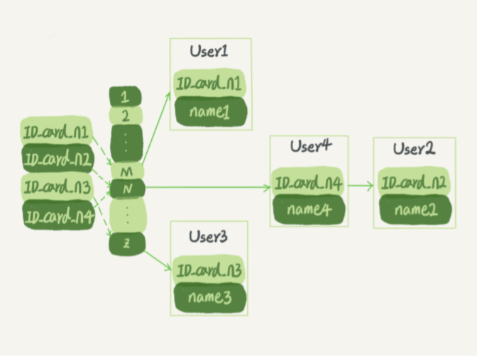
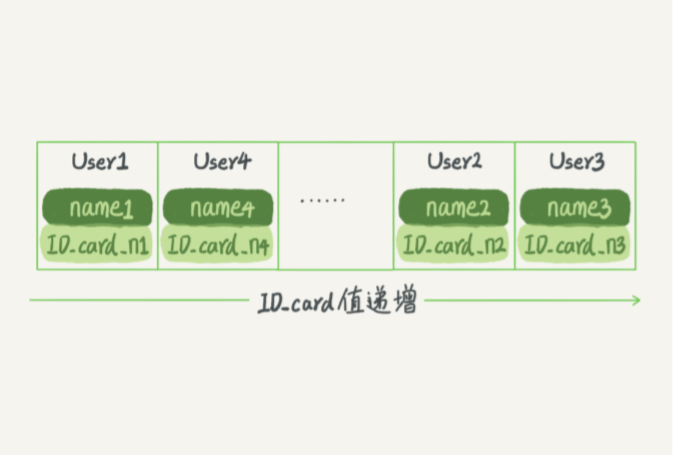

### 索引
索引的出现其实就是为了提高数据查询的效率，就像书的目录一样。  

实现索引的方式有很多种。这里主要说说三种常见的索引模型，分别是哈希表、有序数组和搜索树。  
哈希表是一种以键 - 值（key-value）存储数据的结构，我们只要输入待查找的值即 key， 就可以找到其对应的值即 Value。哈希的思路很简单，把值放在数组里，用一个哈希函数 把 key 换算成一个确定的位置，然后把 value 放在数组的这个位置。不可避免地，多个 key 值经过哈希函数的换算，会出现同一个值的情况。处理这种情况的一种方法是，拉出一个链表。哈希表这种结构适用于只有等值查询的场景。  

  

图中，User2 和 User4 根据身份证号算出来的值都是 N，但没关系，后面还跟了一个链 表。假设，这时候你要查 ID_card_n2 对应的名字是什么，处理步骤就是：首先，将 ID_card_n2 通过哈希函数算出 N；然后，按顺序遍历，找到 User2。需要注意的是，图中四个 ID_card_n 的值并不是递增的，这样做的好处是增加新的 User 时速度会很快，只需要往后追加。但缺点是，因为不是有序的，所以哈希索引做区间查询 的速度是很慢的。  

有序数组在等值查询和范围查询场景中的性能就都非常优秀。假设身份证号没有重复，这个数组就是按照身份证号递增的顺序保存的。这时候如果你要查 ID_card_n2 对应的名字，用二分法就可以快速得到，这个时间复杂度是 O(log(N))。如果仅仅看查询效率，有序数组就是最好的数据结构了。但是，在需要更新数据的时候就 麻烦了，你往中间插入一个记录就必须得挪动后面所有的记录，成本太高。所以，有序数组索引只适用于静态存储引擎。  

  

二叉搜索树的特点是：每个节点的左儿子小于父节点，父节点又小于右儿子。这样如果你要查 ID_card_n2 的话，按照下图中的搜索顺序就是按照 UserA -> UserC -> UserF -> User2 这个路径得到。这个时间复杂度是 O(log(N))。为了维持 O(log(N)) 的查询复杂度，你就需要保持这棵树是平衡二叉树。为了做这个 保证，更新的时间复杂度也是 O(log(N))。    
树可以有二叉，也可以有多叉。多叉树就是每个节点有多个儿子，儿子之间的大小保证从 左到右递增。二叉树是搜索效率最高的，但是实际上大多数的数据库存储却并不使用二叉 树。其原因是，索引不止存在内存中，还要写到磁盘上。  
为了让一个查询尽量少地读磁盘，就必须让查询过程访问尽量少的数据块。那么，我们就 不应该使用二叉树，而是要使用“N 叉”树。这里，“N 叉”树中的“N”取决于数据块的大小。N 叉树由于在读写上的性能优点，以及适配磁盘的访问模式，已经被广泛应用在数据库引擎中。

  

不管是哈希还是有序数组，或者 N 叉树，它们都是不断迭代、不断优化的产物或者解决方 案。数据库技术发展到今天，跳表、LSM 树等数据结构也被用于引擎设计中。  

### InnoDB 的索引模型 
在 InnoDB 中，表都是根据主键顺序以索引的形式存放的，这种存储方式的表称为索引组 织表。InnoDB 使用了 B+ 树索引模型，所以数据都是存储在 B+ 树中的，每一个索引在 InnoDB 里面对应一棵 B+ 树。  

根据叶子节点的内容，索引类型分为主键索引和非主键索引。主键索引的叶子节点存的是整行数据。在 InnoDB 里，主键索引也被称为聚簇索引 （clustered index）。  
非主键索引的叶子节点内容是主键的值。在 InnoDB 里，非主键索引也被称为二级索引 （secondary index）。  

基于主键索引和普通索引的查询：  
如果语句是 select * from T where ID=500，即主键查询方式，则只需要搜索 ID 这棵 B+ 树；  
如果语句是 select * from T where k=5，即普通索引查询方式，则需要先搜索 k 索引 树，得到 ID 的值为 500，再到 ID 索引树搜索一次。这个过程称为回表。  
也就是说，基于非主键索引的查询需要多扫描一棵索引树。因此，我们在应用中应该尽量 使用主键查询。   

**索引维护**  
B+ 树为了维护索引有序性，在插入新值的时候需要做必要的维护。
插入新行需要在最新记录后插入新的记录，但是如果在数据中间插入数据，则需要逻辑上挪动后面的数据。更糟糕的是如果节点所在数据页满了的情况还需要申请一个新的数据页，然后挪动部分数据过去，这个过程叫页分裂。  

除了性能外，页分裂操作还影响数据页的利用率。原本放在一个页的数据，现在分到两个页中，整体空间利用率降低大约 50%。  
当然有分裂就有合并。当相邻两个页由于删除了数据，利用率很低之后，会将数据页做合 并。合并的过程，可以认为是分裂过程的逆过程。  

基于上面的索引维护过程，自增主键的插入数据模式，正符合了递增插入的场景。每次插入一条新记录，都是追加操作，都不涉及到挪动其他记录，也不会触发叶子节点的分裂。由于每个非主键索引的叶子节点上都是主键的值，主键长度越小，普通索引的叶子节点就越小，普通索引占用的空间也就越小。  
而有业务逻辑的字段做主键，则往往不容易保证有序插入，这样写数据成本相对较高。用业务字段直接做主键的场景通常是 KV 场景，由于没有其他索引，所以也就不用考虑其他索引的叶子节点大小的问题。  

优先考虑“尽量使用主键查询”原则，直接将这个索引设置为主键，可以避免每次查询需要搜索两棵树。

### 覆盖索引
覆盖索引指的是可以直接提供查询结果，不需要回表。  
于覆盖索引可以减少树的搜索次数，显著提升查询性能，所以使用覆盖索引是一个常用的性能优化手段。  

我们知道，身份证号是市民的唯一标识。也就是说，如果有根据身份证号查询市民信息的需求，我们只要在身份证号字段上建立索引就够了。而再建立一个（身份证号、姓名）的联合索引，是不是浪费空间？  
如果现在有一个高频请求，要根据市民的身份证号查询他的姓名，这个联合索引就有意义了。它可以在这个高频请求上用到覆盖索引，不再需要回表查整行记录，减少语句的执行时间。  
当然，索引字段的维护总是有代价的。因此，在建立冗余索引来支持覆盖索引时就需要权衡考虑了。

### 最左前缀原则  
索引项是按照索引定义里面出现的字段顺序排序的。B+ 树这种索引结构，可以利用索引的“最左前缀”，来定位记录。  

不只是索引的全部定义，只要满足左前缀，就可以利用索引来加速检索。这个最左前缀可以是联合索引的左 N 个字段，也可以是字符串索引的左 M 个字符。  

在建立联合索引的时候，如何安排索引内的字段顺序呢？  
第一原则是，如果通过调整顺序，可以少维护一个索引，那么这个顺序往往就是需要优先考虑采用的。  
接着，我们要考虑的原则就是索引字段所占用的空间。  

**索引下推**  
MySQL 5.6 引入的索引下推优化（index condition pushdown)，可以在索引遍历过程中，对索引中包含的字段先做判断，直接过滤掉不满足条件的记录，减少回表次数。  

