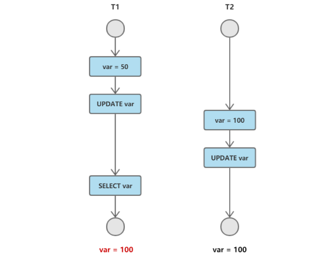
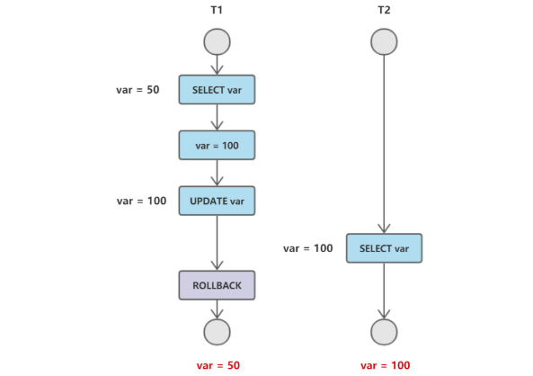
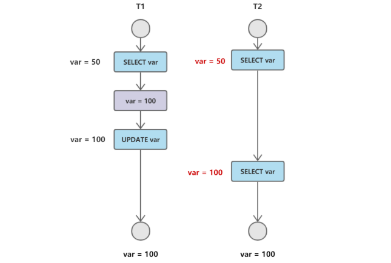
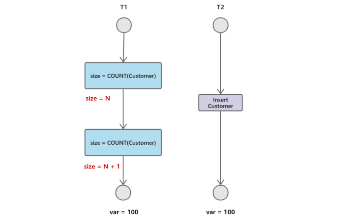

### 事务
事务指的是满足 ACID 特性的一组操作，可以通过 Commit 提交一个事务，也可以使用 Rollback 进行回滚。  
> ACID 指的是原子性、一致性、隔离性、持久性。  
> 1、原子性（Atomicity）  
> 事务被视为不可分割的最小单元，事务的所有操作要么全部提交成功，要么全部失败回滚。  
> 回滚可以用回滚日志来实现，回滚日志记录着事务所执行的修改操作，在回滚时反向执行这些修改操作即可。  
> 2. 一致性（Consistency）  
> 数据库在事务执行前后都保持一致性状态。在一致性状态下，所有事务对一个数据的读取结果都是相同的。  
> 3. 隔离性（Isolation）  
> 一个事务所做的修改在最终提交以前，对其它事务是不可见的。  
> 4. 持久性（Durability）  
> 一旦事务提交，则其所做的修改将会永远保存到数据库中。即使系统发生崩溃，事务执行的结果也不能丢失。  
> 使用重做日志来保证持久性。  

MySQL 默认采用自动提交模式。也就是说，如果不显式使用 START TRANSACTION 语句来开始一个事务，那么每个查询都会被当做一个事务自动提交。  

begin/start transaction 命令并不是一个事务的起点，在执行到它们之后的第一个操作 InnoDB 表的语句，事务才真正启动。如果你想要马上启动一个事务，可以使用 start transaction with consistent snapshot 这个命令。  

### 事务的并发一致性问题
在并发环境下，事务的隔离性很难保证，因此会出现很多并发一致性问题。  

**丢失修改**  
T1 和 T2 两个事务都对一个数据进行修改，T1 先修改，T2 随后修改，T2 的修改覆盖了 T1 的修改。  
  

**读脏数据**  
T1 修改一个数据，T2 随后读取这个数据。如果 T1 撤销了这次修改，那么 T2 读取的数据是脏数据。  
  

**不可重复读**  
T2 读取一个数据，T1 对该数据做了修改。如果 T2 再次读取这个数据，此时读取的结果和第一次读取的结果不同。  
  

**幻读**  
T1 读取某个范围的数据，T2 在这个范围内插入新的数据，T1 再次读取这个范围的数据，此时读取的结果和和第一次读取的结果不同。  
  

产生并发不一致性问题主要原因是破坏了事务的隔离性，解决方法是通过并发控制来保证隔离性。  
并发控制可以通过锁来实现，但是锁操作需要用户自己控制，相当复杂。数据库管理系统提供了事务的隔离级别，让用户以一种更轻松的方式处理并发一致性问题。  

### 事务的隔离性与隔离级别
当数据库上有多个事务同时执行的时候，就可能出现脏读（dirty read）、不可重复读 （non-repeatable read）、幻读（phantom read）的问题，为了解决这些问题，就有 了“隔离级别”的概念。  

SQL 标准的事务隔离级别包括：读未提交（read uncommitted）、读提交（read committed）、可重复读（repeatable read）和串行 化（serializable ）。  
> 读未提交是指一个事务还没提交时，它做的变更就能被别的事务看到。  
> 读提交是指一个事务提交之后，它做的变更才会被其他事务看到。  
> 可重复读是指一个事务执行过程中看到的数据，总是跟这个事务在启动时看到的数据 是一致的（当然在可重复读隔离级别下，未提交变更对其他事务也是不可见的）。  
> 串行化，顾名思义是对于同一行记录，“写”会加“写锁”，“读”会加“读锁”。当 出现读写锁冲突的时候，后访问的事务必须等前一个事务执行完成，才能继续执行。  

在实现上，数据库里面会创建一个视图，访问的时候以视图的逻辑结果为准。  
在“可重复读”隔离级别下，这个视图是在事务启动时创建的，整个事务存在期间都用这个视图（Mysql 默认隔离级别是“可重复读”）。  
在“读提交”隔离级别下，这个视图是在每个 SQL 语句开始执行的时候创建的（Oracle 数据库的默认隔离级别是“读提交”）。  
这里需要注意的是，“读未提交”隔离级别下直接返回记录上的新值，没有视图概念；而“串行 化”隔离级别下直接用加锁的方式来避免并行访问。  
> InnoDB 在实现 MVCC 时用到的一致性读视图，即 consistent read view， 用于支持 RC（Read Committed，读提交）和 RR（Repeatable Read，可重复读）隔离级别的实现。  
> 
> InnoDB 里面每个事务有一个唯一的事务 ID，叫作 transaction id。它是在事务开始的时 候向 InnoDB 的事务系统申请的，是按申请顺序严格递增的。  
> 而且，每行数据也都是有多个版本的。每次事务更新数据的时候，都会生成一个新的数据版 本，并且把 transaction id 赋值给这个数据版本的事务 ID，记为 row trx_id。同时，旧的 数据版本要保留，并且在新的数据版本中，能够有信息可以直接拿到它。即数据表中的一行记录，其实可能有多个版本 (row)，每个版本有自己的 row trx_id。  
> 按照可重复读的定义，一个事务启动的时候，能够看到所有已经提交的事务结果。但是之 后，这个事务执行期间，其他事务的更新对它不可见。  
> 在实现上， InnoDB 为每个事务构造了一个数组，用来保存这个事务启动瞬间，当前正 在“活跃”的所有事务 ID。“活跃”指的就是，启动了但还没提交。数组里面事务 ID 的最小值记为低水位，当前系统里面已经创建过的事务 ID 的最大值加 1 记为高水位。这个视图数组和高水位，就组成了当前事务的一致性视图（read-view）。  
> InnoDB 利用了“所有数据都有多个版本”的这个特性，实现了“秒 级创建快照”的能力。

在 MySQL 中，事务实际上每条记录在更新的时候都会同时记录一条回滚操作，记录上的新值，通过回滚操作，都可以得到前一个状态的值。回滚日志的删除时机是系统判断当没有事务再需要用到这些回滚日志时。  
长事务意味着系统里面会存在很老的事务视图。由于这些事务随时可能访问数据库里面的任何数据，所以这个事务提交之前，数据库里面它可能用到的回滚记录都必须保留，这就会导致大量占用存储空间。除了对回滚段的影响，长事务还占用锁资源，也可能拖垮整个库。我们要确保意外的长事务发生，比如设置 set autocommit=0 之后长时间不手动提交。  

```bash
# 查看隔离级别
mysql> show variables like 'transaction_isolation';
```

| 隔离级别 | 脏读 | 不可重复读 | 幻影读 |
| :---: | :---: | :---:| :---: |
| 未提交读 | √ | √ | √ |
| 提交读 | × | √ | √ |
| 可重复读 | × | × | √ |
| 可串行化 | × | × | × |

更新数据都是先读后写的，而这个读，只能读当前的值，称为“当前读”（current read）。除了 update 语句外，select 语句如果加锁，也是当前读。当前读总是读取已经提交完成的最新版本。  

事务的可重复读的能力是怎么实现的？  
可重复读的核心就是一致性读（consistent read）；而事务更新数据的时候，只能用当前 读。如果当前的记录的行锁被其他事务占用的话，就需要进入锁等待。  
表结构不支持“可重复读”是因为表结构没有对应的行数据，也没有 row trx_id，因此只能遵循当前读的逻辑。  

读提交的逻辑和可重复读的逻辑类似，它们最主要的区别是：  
> 在可重复读隔离级别下，只需要在事务开始的时候创建一致性视图，之后事务里的其他 查询都共用这个一致性视图；  
> 在读提交隔离级别下，每一个语句执行前都会重新算出一个新的视图。  
> 对于可重复读，查询只承认在事务启动前就已经提交完成的数据；对于读提交，查询只承认在语句启动前就已经提交完成的数据。  


