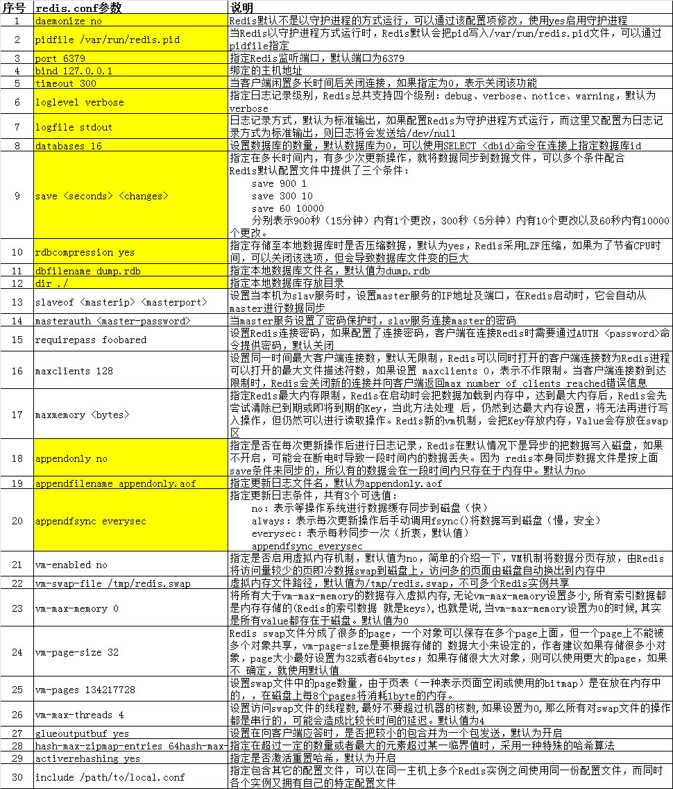

### 什么是 Redis
「[Redis](https://redis.io/)」是一个开源的使用C语言编写、支持网络、可基于内存亦可持久化的日志型、Key-Value数据库，并提供多种语言的 API。

### Redis 的特点
- 支持数据持久化
> Redis 可以将内存中的数据保存在磁盘中，重启的时候可以再次加载进行使用。
>   
> 方式一（RDB）：根据指定的规则，定时周期性的把内存中更新的数据写入到磁盘里。  
> RDB的方式是通过快照（snapshot）完成，当符合规则时 Redis 会把内存的数据生成一个副本并存储在硬盘中，这个过程称之为“快照”。  
> 
> 方式二（AOF）：把修改的操作记录追加到文件里，默认情况 Redis 没有开启 AOF 方式，可以通过 appendonly 命令来启用，如：appendonly yes。  
> 
> 两种方式的区别：RDB 方式性能较高，但是可能会引起一定程度的数据丢失，AOF 方式正好相反。  

- 丰富的数据类型
> Redis 不仅仅支持简单的key-value类型的数据，同时还提供 list，set，zset，hash 等数据结构的存储。  

- 单进程单线程高性能服务器
> 启动一个实例只能用一个 CPU，所以用 Redis 可以用多个实例，一个实例用一个 CPU 以便于提高效率。  

- crash safe 和 recovery slow
> Redis 崩溃后，数据相对安全，但是恢复起来比较缓慢，所以生产环境不建议一个 Redis 实例数据太多{（20-30）G 数据内存对应（96-128）G 实际内存）}，这种 20%-23% 的比例比较合适，因为磁盘读到内存的恢复时间也很慢，可以使用 ssd 磁盘来提高磁盘读取速度。  

- 性能极高
> Redis 单机 qps（每秒的并发）可以达到的速度是 110000 次/s，写的速度是 81000 次/s，适合小数据量高速读写访问。  

- Redis 的原子性
> Redis 的所有操作都是原子性的，意思是要么成功执行要么失败完全不执行。  
> 单个操作是原子性的。  
> 多个操作也支持事务，即原子性，通过 MULTI 和 EXEC 指令包起来。  
> 
> Redis 支持数据的备份即 master-slave 模式的数据备份。  
> Redis 还支持 publish/subscribe, key 过期。

### Redis 的缺陷与陷阱
内存管理开销大（不要超过物理内存的 3/5）。  
buffer io 可能会造成系统内存溢出（OOM-Out of Memory）。  

### Redis 的安装
```bash
wget http://download.redis.io/releases/redis-4.0.9.tar.gz
tar -zxvf redis-4.0.9.tar.gz -C /usr/local/
cd redis-4.0.9
# 若编译失败，重新执行 make MALLOC=libc
make 

# 启动 redis 服务
./redis-server
# 启动 redis 客户端，一般 ./redis-cli 即可
./redis-cli -h 127.0.0.1 -p 6379 -a "password" 
```

### Redis 的配置
Redis 的配置文件位于 Redis 的安装目录下，名为 redis.conf（Ubuntu 下，一般在 /etc/redis/6379.conf）。  
```bash
# 在 Redis 客户端下，使用命令获取所有配置项
config get *
# 获取某一项配置 
config get loglevel

# 修改配置
config set loglevel debug
```

> 配置参数大致如下  


### Redis 的五种数据类型及使用

### Redis 与 PHP
