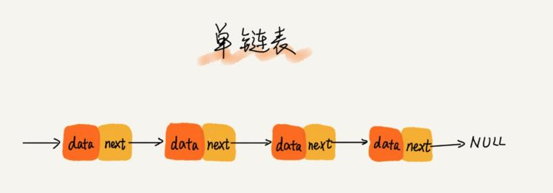

### 数据结构
数据结构，其实就是一个个解决问题的“模型”。有了这些模型，就能把一个个具体的问题抽象化，然后再来解决。  
不同的数据结构，都是在编程中运用数学思维的产物。每种数据结构都有自身的特点，有利于我们更方便地实现某种特定的数学模型。  

### 数据结构 —— 线性表结构
**数组**  
数组（Array）是一种线性表数据结构，它用一组连续的内存空间，来存储一组具有相同类型的数据。
> 在 PHP 中，因为数组底层是通过散列表实现的，所以功能异常强大，这段常规的数组定义在 PHP 中并不成立。  
> PHP 的数组可以存储任何类型数据，如果与 Java 对比的话，PHP 数组集成了 Java 的数组、List、Set、Map 于一身。  

对于传统的数组，比如 C 语言和 Java 中的数组，在使用之前都需要声明数组存储数据的类型和数组的大小，数组的优点是可以通过下标值随机访问数组内的任何元素，算法复杂度是 O (1)，非常高效，但是缺点是删除 / 插入元素比较费劲，以删除为例，需要在删除某个元素后，将后续元素都往前移一位，如果是插入，则需要将插入位置之后的元素都往后移，所以对数组的插入 / 删除而言，算法复杂度是 O (n)。  
```java
int[] arrayA = new int[5];//定义一个长度为5的整型数组
//数组赋值
for(int i=0;i<5;i++) {
    arrayA[i] = i+1;
}
//获取第三个元素的值
int a = arrayA[2];
//获取最后一个元素的值
int b = arrayA[4];
```

**链表**  
和数组不同，链表并不需要一块连续的内存空间，它通过“指针”将一组零散的内存块串联起来使用。  
链表有多种类型，最简单的是单链表，单链表是最原生的链表。  
单链表中有两个节点比较特殊，分别是第一个结点和最后一个结点。我们通常把第一个结点叫作头结点，把最后一个结点叫作尾结点。其中，头结点用来记录链表的基地址，有了它，我们就可以遍历得到整条链表。而尾结点特殊的地方在于：指针不是指向下一个结点，而是指向一个空地址 NULL，表示这是链表上最后一个结点。对单链表而言，理论上来说，插入（头插入、未插入、指定位置插入）和删除（指定值删除）节点的时间复杂度是 O (1)，查询节点的时间复杂度是 O (n)。  
> 插入：只需要改变插入元素之前的节点的指针域指向新的节点，再把新的节点的指针域指向后面一个节点就可以了，其他节点不受影响，无需额外操作。  
> 删除：改变要删除的节点的前一个节点的指针指向就可以了，其他节点不受影响，无需额外操作。

  

```c
typedef struct Node {
    ElemType data;//数据域
    struct Node* next;//指针域
} Node;
typedef struct Node* LinkList; //单向链表
```

在单链表的基础上扩展还有循环链表，循环链表和单链表的区别是尾节点指向了头结点，从而首尾相连，有点像贪吃蛇，可用于解决「约瑟夫环」问题。
  

此外，还有比较常见的双向链表，顾名思义，与单链表的区别是双向链表除了有一个指向下一个节点的指针外，还有一个用于指向上一个节点的指针，从而实现通过 O (1) 复杂度找到上一个节点。正是因为这个节点，使得双向链表在插入、删除节点时比单链表更高效，虽然我们前面已经提到单链表插入、删除时间复杂度已经是 O (1) 了，但是这没有考虑还只是针对插入、删除操作本身而言，以删除为例，删除某个节点后，需要将其前驱节点的指针指向被删除节点的下一个节点，这样，我们还需要获取其前驱节点，在单链表中获取前驱节点的时间复杂度是 O (n)，所以综合来看单链表的删除、插入操作时间复杂度也是 O (n)，而双向链表则不然，它有一个指针指向上一个节点，所以其插入和删除时间复杂度才是真正的 O (1)。而且，对于有序链表而言，双向链表的查询效率显然也要高于单链表，不过更优的时间复杂度是靠更差的空间复杂度换取的，双向链表始终需要单链表的两倍空间，但是在 Web 应用中，时间效率优先级更高，所以我们通常都是空间换时间来提高性能，Java 的 LinkedHashMap 底层就用到了双向链表。  
  

结合循环链表和双向链表为一体的双向循环链表，其实就是将双向链表的首尾通过指针连接起来。
  

**栈**  


