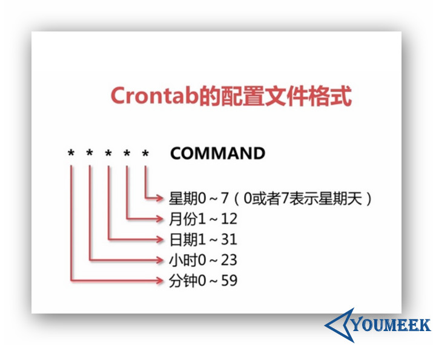

### Crontab 安装
查看是否已安装：  
```bash
# CentOS：
rpm -qa | grep cron
# Ubuntu：
dpkg -l | grep cron

```
如果未安装（一般系统是集成的）：
```bash
# CentOS 6 / 7：
sudo yum install -y vixie-cron crontabs
# Ubuntu：
sudo apt-get install -y cron
```

### Crontab 常用命令
```bash
# CentOS 6
service crond start # 启动服务
service crond stop # 关闭服务
service crond restart # 重启服务
# CentOS 7
systemctl start crond # 启动服务
systemctl restart crond # 重新启动服务
systemctl status crond # 加入自启动
systemctl stop crond # 关闭服务

# 编辑 crontab
crontab -e
# 查看 crontab 任务
crontab -l
```

### Crontab 服务器配置
配置文件位置：/etc/crontab   
```bash
# 修改前先备份
cp /etc/crontab /etc/crontab.backup
sudo vim /etc/crontab
```

  


常见配置例子  
```
30 21 * * * service httpd restart # 每晚的 21:30 重启 apache
30 21 * * 6,0 service httpd restart # 每周六、周日的 21:30 重启 apache
45 4 1,10,22 * * service httpd restart # 每月的 1、10、22 日的 4:45 重启 apache
45 4 1-10 * * service httpd restart # 每月的 1 到 10 日的 4:45 重启 apache
*/2 * * * * service httpd restart # 每隔两分钟重启 apache
0 4 * * sun root /opt/shell/crontab-redis-restart.sh # 每周日 4:00 执行一个脚本
```

### Crontab 权限问题
- crontab 权限说明
> 一般默认只有 root 用户可以使用  
> 如果要指定某个用户可以使用，可以在 /etc/cron.allow 添加（不存在文件就创建一个）  
> 如果要指定某个用户不可以使用，可以在 /etc/cron.deny 添加（不存在文件就创建一个）  
> 如果一个用户同时在两个文件都存在，那则以 allow 为准  

### Crontab 不执行原因分析
首先，确认服务器是否开启定时任务计划服务，注意只有 root 用户才能对 crond 服务进行开启和关闭
```bash
service crond status
```
然后，确认 crontab 任务是否使用的是完整绝对路径和脚本是否有执行权限  
```bash
crontab -l
chmod +x script_shell
```
考虑时差问题
```bash
cp /usr/share/zoneinfo/Asia/Shanghai /etc/localtime
service crond restart
```
再不然，手动执行一下脚本看看是否有报错。  
当然，查看 crontab 日志也是有必要的  
```bash
tail -f /var/log/cron
```

[更多原因参考](https://www.tony-yin.site/2018/10/29/Why-Crontab-Not-Work/#)  
