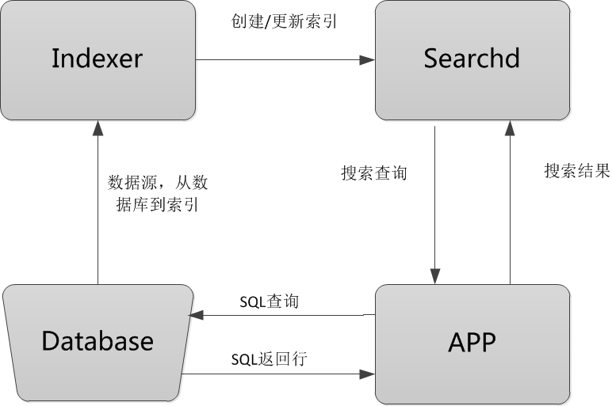

### 什么是 Sphinx
Sphinx 是一个全文检索引擎，是一款基于 SQL 的高性能全文检索引擎。   
Sphinx 特性如下：  

- 索引和性能优异
- 易于集成 SQL 和 XML 数据源，并可使用 SphinxAPI、SphinxQL 或者 SphinxSE 搜索接口
- 易于通过分布式搜索进行扩展
- 高速的索引建立 (在当代 CPU 上，峰值性能可达到 10 ~ 15MB / 秒)
- 高性能的搜索 (在 1.2G 文本，100 万条文档上进行搜索，支持高达每秒 150~250 次查询)

### 为什么是 Sphinx
使用 Sphinx 搜索引擎对数据做索引，数据一次性加载进来，然后做了索引之后保存在内存。这样用户进行搜索的时候就只需要在 Sphinx 服务器上检索数据即可。而且，Sphinx 没有 MySQL 的伴随机磁盘 I/O 的缺陷，性能更佳。

### Sphinx 工作原理

  

- Database：数据源，是 Sphinx 做索引的数据来源。因为 Sphinx 是无关存储引擎、数据库的，所以数据源可以是 MySQL、PostgreSQL、XML 等数据。
- Indexer：索引程序，从数据源中获取数据，并将数据生成全文索引。可以根据需求，定期运行 Indexer 达到定时更新索引的需求。
- Searchd：Searchd 直接与客户端程序进行对话，并使用 Indexer 程序构建好的索引来快速地处理搜索查询。
- APP：客户端程序。接收来自用户输入的搜索字符串，发送查询给 Searchd 程序并显示返回结果。

Sphinx 有两种工作方式，第一种是直接作为数据源（如 MySQL）的扩展，第二种是独立出来被 API 调用。  
Sphinx 的整个工作流程就是 Indexer 程序到数据库里面提取数据，对数据进行分词，然后根据生成的分词生成单个或多个索引，并将它们传递给 searchd 程序。简而言之，不存储原始数据，原始数据来源于 SQL，而生成索引放在内存或者磁盘中。  

首先数据源要有合法的结构，以及合理的配置。  
每次调用 Indexer 程序时，在相应配置的引导下，从数据源中查找对应数据，并在硬盘生成索引文件。Searchd 程序作为守护进程使用，我们的应用程序通过访问 Searchd 来使用 Sphinx，每次通过 API（比如 PHP 的 SphinxClient 类中相应函数）查询时，会从索引中（实际使用的索引数据可能会被 Sphinx 保存到内存）先匹配内容，然后 Sphinx 可能会返回一个标识（一般是主键）给我们的应用程序，我们应用程序再用这个标识去数据源查找（这个查找操作不是 Sphinx 完成的，是我们自己通过标识另行操作的）。  
客户端可以通过 API 调用进行搜索。

**倒排索引**  
Sphinx 索引使用的是倒排索引。  
倒排索引是一种数据结构，用来存储在全文搜索下某个单词在一个文档或者一组文档中的存储位置的映射，它是文档检索系统中最常用的数据结构。倒排索引是实现 “单词 - 文档矩阵” 的一种具体存储形式，通过倒排索引，可以根据单词快速获取包含这个单词的文档列表。  
