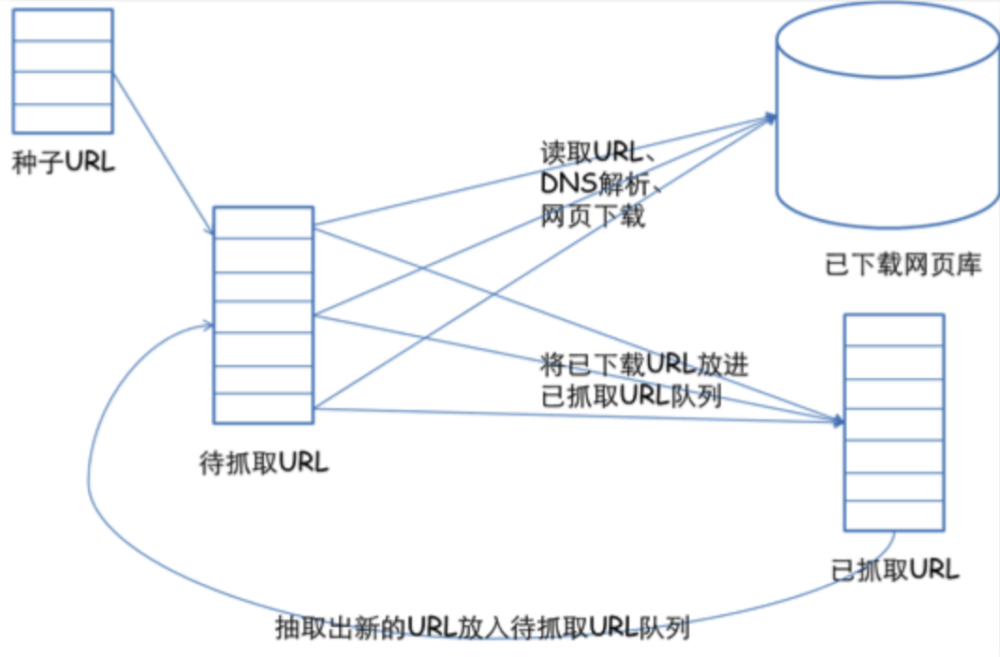

### 爬虫
使用任何技术手段，批量获取网站信息的一种方式。  

一般的爬虫过程：  
1、抓取和分析网页请求  
2、创建合适的 http 请求  
3、批量发送 http 请求，获取数据  

#### 爬虫基础
爬虫协议  
也被叫做 robots 协议，是为了告诉网络蜘蛛哪些页面可以抓取，哪些页面不能抓取。  
查看网站的爬虫协议，通常在网站域名后加 robots.txt 即可，比如百度的 https://www.baidu.com/robots.txt 。
```
# 拦截所有的机器人 
User-agent: * 
Disallow: /

# 允许所有的机器人
User-agent: * 
Disallow:
```

一些爬虫建议  
> 爬取互联网公开数据  
> 尽量放慢你的速度  
> 尽量遵循 robots 协议  
> 不要用于商业用途  
> 不要公布爬虫程序与数据  

网址的构成  
一个网站的网址一般由域名+自己编写的页面所构成。我们在访问同一网站的网页时，域名一般是不会改变的，因此我们爬虫所需要解析的就是网站自己所编写的不同页面的入口 url，只有解析出来各个页面的入口，我们才能开始我们的爬虫。  

网页的两种加载方法  
同步加载：改变网址上的某些参数会导致网页发生改变，例如：www.itjuzi.com/company?page=1（改变page=后面的数字，网页会发生改变）  
异步加载：改变网址上的参数不会使网页发生改变，例如：www.lagou.com/gongsi/（翻页后网址不会发生变化）  

网页源码的构成  
在网页中右键点击查看网页源码，可以查看到网页的源代码信息。   
源代码一般由三个部分组成，分别是 html、css 和 JavaScript。

查看网页请求  
以 chrome 浏览器为例，在网页上点击鼠标右键，检查（或者直接 F12），选择 network，刷新页面，选择 ALL 下面的第一个链接，这样就可以看到网页的各种请求信息。  
```
请求头（Request Headers）信息详解：

Accept: text/html,image/*(浏览器可以接收的类型)
Accept-Charset: ISO-8859-1(浏览器可以接收的编码类型)
Accept-Encoding: gzip,compress(浏览器可以接收压缩编码类型)
Accept-Language: en-us,zh-cn(浏览器可以接收的语言和国家类型)
Host: www.it315.org:80(浏览器请求的主机和端口)
If-Modified-Since: Tue, 11 Jul 2000 18:23:51 GMT(某个页面缓存时间)
Referer: http://www.it315.org/index.jsp(请求来自于哪个页面)
User-Agent: Mozilla/4.0 (compatible; MSIE 5.5; Windows NT 5.0)(浏览器相关信息)
Cookie：(浏览器暂存服务器发送的信息)
Connection: close(1.0)/Keep-Alive(1.1)(HTTP请求的版本的特点)
Date: Tue, 11 Jul 2000 18:23:51 GMT(请求网站的时间)

响应头（Response Headers）信息详解：

Location: http://www.it315.org/index.jsp(控制浏览器显示哪个页面)
Server:apache tomcat(服务器的类型)
Content-Encoding: gzip(服务器发送的压缩编码方式)
Content-Length: 80(服务器发送显示的字节码长度)
Content-Language: zh-cn(服务器发送内容的语言和国家名)
Content-Type: image/jpeg; charset=UTF-8(服务器发送内容的类型和编码类型)
Last-Modified: Tue, 11 Jul 2000 18:23:51 GMT(服务器最后一次修改的时间)
Refresh: 1;url=http://www.it315.org(控制浏览器1秒钟后转发URL所指向的页面)
Content-Disposition: attachment; filename=aaa.jpg(服务器控制浏览器发下载方式打开文件)
Transfer-Encoding: chunked(服务器分块传递数据到客户端） 
Set-Cookie:SS=Q0=5Lb_nQ; path=/search(服务器发送Cookie相关的信息)
Expires: -1(服务器控制浏览器不要缓存网页，默认是缓存)
Cache-Control: no-cache(服务器控制浏览器不要缓存网页)
Pragma: no-cache(服务器控制浏览器不要缓存网页)  
Connection: close/Keep-Alive(HTTP请求的版本的特点)  
Date: Tue, 11 Jul 2000 18:23:51 GMT(响应网站的时间)
```

网页请求过程  
从浏览器输入网址、回车后，到用户看到网页内容，经过的步骤如下：  
1）dns 解析，获取 ip 地址；  
2）建立 TCP 连接，3 次握手；    
3）发送 HTTP 请求报文；  
4）服务器接收请求并作处理；  
5）服务器发送 HTTP 响应报文；  
6）断开 TCP 连接，4 次握手  

通用的网络爬虫框架  
1）挑选种子 URL；  
2）将这些 URL 放入待抓取的 URL 队列；  
3）取出待抓取的 URL，下载并存储进已下载网页库中，将已下载的 URL 放入已抓取队列中；    
4）分析已抓取队列中的 URL，并且抽取出新的 URL 放入待抓取 URL 队列，从而进入下一循环。  
  

#### Python 简单爬虫
为什么选择 Python 做爬虫？  
因为 Python 非常简单并且容易上手，而且有非常丰富的第三方库。  

爬取豆瓣《小王子》短评
```python
import requests     
from bs4 import BeautifulSoup
import pandas

# 使用 requests 获得数据
headers = {
   'authorization':'', #填上你的 authorization
   'User-Agent':'', #填上你的 User-Agent
}
r = requests.get('https://book.douban.com/subject/1084336/comments/', headers = headers).text

# 使用 BeautifulSoup4 解析数据
soup = BeautifulSoup(r,'lxml')
pattern = soup.find_all('p','comment-content')
for item in pattern:
    print(item.string)


# 使用 pandas 保存数据
comments = []
for item in pattern:
    comments.append(item.string)    
df = pandas.DataFrame(comments)
df.to_csv('comments.csv')
```

### 多线程爬虫
线程指的是应用程序工作的最小单元。  
多线程即并发地执行线程，把所有事情在一个进程里跑起来。  

```python
import thread

def test1():
    startTime = time.ctime()
    print("启动 test1 任务：{}".format(startTime))
    # 爬虫逻辑

def test2():
    startTime = time.ctime()
    print("启动 test2 任务：{}".format(startTime))
    # 爬虫逻辑


def main():
    print("启动主任务")
    # 没有参数，args默认为空
    t1 = threading.Thread(target=test1,args=())
    # 守护线程需要在start之前设置，否则无效
    t1.setDaemon(True)
    # t1.daemon = True
    t1.setName("TH-1")
    t1.start()

    t2 = threading.Thread(target=test2,args=("TWO",))
    t2.setName("TH-2")
    t2.start()

    # enumerate 得到正在运行的进程
    for i in threading.enumerate():
        # getName 获取线程名
        name = i.getName()
        print("正在运行的进程：{}".format(name))

    print("结束主任务")


if __name__ == '__main__':
    main()
```

### Pyton 多进程爬虫
进程，指计算机中正在运行的程序实体。  
多进程，顾名思义，多个进程并发执行，可以有效提高程序的执行效率，优点是非常稳定，即使有子进程崩溃了，主进程和其他进程依然可以继续执行。  

```python
from multiprocessing import Pool
import os

def test(name):
    print('Run child process %s (%s)...' % (name, os.getpid()))
    # 爬虫逻辑

def main():
	p = Pool(2)
    for i in range(2):
        p.apply_async(test, args=(i,))
    p.close()
    p.join()

if __name__=='__main__':
    main()
```

### 反爬虫
反爬虫是使用任何技术手段，阻止别人批量获取自己网站信息的一种方式。系统会根据一个用户或者一个 IP 的一个或者多个 HTTP 请求来判断此种行为是否是正常人的行为，如果不是正常的网络行为，服务器会响应的返回一些错误信息。  

传统反爬虫手段：  
1、后台对访问进行统计，如果单个 IP 访问超过阈值，予以封锁（容易误伤普通用户，切换 IP 的成本不高）  
2、后台对访问进行统计，如果单个 session 访问超过阈值，予以封锁（session 完全不值钱，可以重新申请）  
3、后台对访问进行统计，如果单个 userAgent 访问超过阈值，予以封锁（杀伤力过大，误伤非常严重）  

还有一些常见的反爬虫机制：  
1、通过 UA 识别普通爬虫  
2、设置 IP 访问频率，如果超过一定频率，弹出验证码  
3、蜜罐资源或称隐式资源，适当在页面添加一些正常浏览器浏览访问不到的资源，一旦有 ip 访问即可封锁  

破解反爬虫的一些方法：  
1、设置下载延迟  
2、禁用 Cookie  
3、使用 user agent 池  
4、使用 IP 池（使用代理 ip 切换身份）  
5、分布式爬取   
6、模拟登陆  