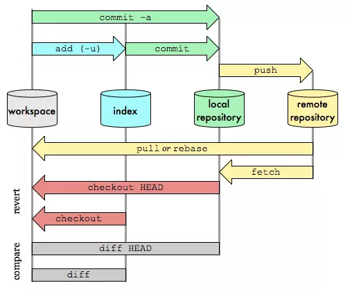

### 4 个基本概念
Workspace 工作区  
当前开发改动的地方，是你当前看到的，也是最新的；平常我们开发就是拷贝远程仓库中的一个分支，基于该分支进行开发。在开发过程中就是对工作区的操作。  

Index / Stage 暂存区  
.git 目录下的 index 文件，暂存区会记录 git add 添加文件的相关信息 (文件名、大小、timestamp...)，不保存文件实体，通过 id 指向每个文件实体。可以使用 git status 查看暂存区的状态。暂存区标记了你当前工作区中，哪些内容是被 git 管理的。  
当你完成某个需求或功能后需要提交到远程仓库，那么第一步就是通过 git add 先提交到暂存区，被 git 管理。  

Repository 本地仓库  
保存了对象被提交过的各个版本，比起工作区和暂存区的内容，它要更旧一些。  
git commit 后同步 index 的目录树到本地仓库，方便从下一步通过 git push 同步本地仓库与远程仓库的同步。  

Remote 远程仓库  
远程仓库的内容可能被分布在多个地点的处于协作关系的本地仓库修改，因此它可能与本地仓库同步，也可能不同步，但是它的内容是最旧的。  

> 1、任何对象都是在工作区中诞生和被修改；  
> 2、任何修改都是从进入 index 区才开始被版本控制；  
> 3、只有把修改提交到本地仓库，该修改才能在仓库中留下痕迹；  
> 4、与协作者分享本地的修改，可以把它们 push 到远程仓库来共享。  
  

### 常用命令
```bash
# 生成公钥 ~/.ssh/id_rsa.pub （用于仓库 ssh key 白名单）
ssh-keygen -t rsa -C "xxx@xxx.com"

# 创建线上项目后，拉取到本地
git clone git@xxx
cd xxx
# 变更文件后，查看当前 git 状态
git status [-sb]
# -sb 参数表示开启小白显示

# 添加到指定变更文件，增加跟踪、预备 commit 【到暂存区】
git add file_path
# 添加所有变更且未被忽略(gitignore)的文件 
git add .
# 1.x 版本中：
# git add all 可以提交未跟踪、修改和删除文件；
# git add . 可以提交未跟踪和修改文件，但是不处理删除文件。
# 2.x 版本
# 两者功能在提交类型方面是相同的。
# 所在目录不同导致的差异：
# git add all 无论在哪个目录执行都会提交相应文件；
# git add . 只能够提交当前目录或者它后代目录下相应文件。

# 对于同一个文件的多处变化，可以多次提交
git add -p [file_path]
# 此时，可以撤销 add 操作
git reset HEAD [file_path]

# 删除工作区文件，并且将这次删除放入暂存区
git rm [file1] [file2] ...

# 停止追踪指定文件，但该文件会保留在工作区
git rm --cached [file]

# 改名文件，并且将这个改名放入暂存区
git mv [file_original] [file_renamed]

# 提交到「到本地仓库」
git commit -m"commit detailed message."
# add + commit 所有文件已跟踪过的文件
git commit -am"commit detailed message."
# 使用一次新的commit，替代上一次提交
# 如果代码没有任何新变化，则用来改写上一次commit的提交信息
# "amend" 是「修正」的意思，对最新一条 `commit` 进行修正
# 在提交时，如果加上 `--amend` 参数，Git 不会在当前 `commit` 上增加 `commit`，而是会把当前 `commit` 里的内容和暂存区（stageing area）里的内容合并起来后创建一个新的 `commit`，用这个新的 `commit` 把当前 `commit` 替换掉
# 注意：--amend 并不是直接修改原 commit 的内容，而是生成一条新的 commit
git add [file]
git commit --amend -m [message]

# 建立追踪关系，在现有分支与指定的远程分支之间
git branch --set-upstream [local_branch_name] [remote_branch_name]

# 推送到远程分支
git push remote_branch_name local_branch_name
# 如 git push origin master

# 删除本地分支
git branch -D local_branch_name
# 删除远程分支
git push origin :remote_branch_name

# 列出所有本地分支
git branch

# 列出所有远程分支
git branch -r

# 列出所有本地分支和远程分支
git branch -a

# 新建一个分支，但依然停留在当前分支
git branch [local_branch_name]

# 新建一个分支，并切换到该分支(+绑定远程分支)
git checkout -b [local_branch_name] [origin/remote_branch_name]

# 新建一个分支，指向指定commit
git branch [local_branch_name] [commit]

# 新建一个分支，与指定的远程分支建立追踪关系
git branch --track [local_branch_name] [remote_branch_name]

# 删除本地分支
git branch -d [local_branch_name]
# 删除远程分支
git push origin :[remote_branch_name]

# 切换到指定分支，并更新工作区
git checkout [local_branch_name]

# 切换上一个分支
git checkout -

# 合并指定分支到当前分支
git merge [local_branch_name]

# 列出所有tag
git tag

# 新建一个tag在当前commit
git tag [tag]

# 新建一个tag在指定commit
git tag [tag] [commit]

# 删除本地tag
git tag -d [tag]

# 删除远程tag
git push origin :refs/tags/[tagName]

# 查看tag信息
git show [tag]

# 提交指定tag
git push [remote] [tag]

# 提交所有tag
git push [remote] --tags

# 新建一个分支，指向某个tag
git checkout -b [branch] [tag]

# 显示当前分支的版本历史
git log

# 显示commit历史，以及每次commit发生变更的文件
git log --stat

# 搜索提交历史，根据关键词
git log -S [keyword]

# 显示某个commit之后的所有变动，每个commit占据一行
git log [tag] HEAD --pretty=format:%s

# 显示某个commit之后的所有变动，其"提交说明"必须符合搜索条件
git log [tag] HEAD --grep feature

# 显示某个文件的版本历史，包括文件改名
git log --follow [file]
git whatchanged [file]

# 显示指定文件相关的每一次diff
git log -p [file]

# 显示过去5次提交
git log -5 --pretty --oneline

# 显示所有提交过的用户，按提交次数排序
git shortlog -sn

# 显示指定文件是什么人在什么时间修改过
git blame [file]

# 显示暂存区和工作区的差异
git diff

# 显示暂存区和上一个commit的差异
git diff --cached [file]

# 显示工作区与当前分支最新commit之间的差异
git diff HEAD

# 显示两次提交之间的差异
git diff [first-branch]...[second-branch]

# 显示今天你写了多少行代码
git diff --shortstat "@{0 day ago}"

# 显示某次提交的元数据和内容变化
git show [commit]

# 显示某次提交发生变化的文件
git show --name-only [commit]

# 显示某次提交时，某个文件的内容
git show [commit]:[filename]

# 显示当前分支的最近几次提交
git reflog

# 下载远程仓库的所有变动
git fetch [remote_branch_name]

# 显示所有远程仓库
git remote -v

# 显示某个远程仓库的信息
git remote show [remote_branch_name]

# 增加一个新的远程仓库，并命名
git remote add [shortname] [url]

# 取回远程仓库的变化，并与本地分支合并
git pull [remote_branch_name] [local_branch_name]

# 上传本地指定分支到远程仓库
git push [remote_branch_name] [local_branch_name]

# 强行推送当前分支到远程仓库，即使有冲突
git push [remote_branch_name] --force

# 推送所有分支到远程仓库
git push [remote_branch_name] --all

# 恢复暂存区的指定文件到工作区
git checkout [file]

# 恢复某个commit的指定文件到暂存区和工作区
git checkout [commit] [file]

# 恢复暂存区的所有文件到工作区
git checkout .

# 重置暂存区的指定文件，与上一次commit保持一致，但工作区不变
git reset [file]

# 重置暂存区与工作区，与上一次commit保持一致
# 丢弃最新的提交
git reset --hard

# 重置当前分支的指针为指定commit，同时重置暂存区，但工作区不变
git reset [commit]

# 重置当前分支的HEAD为指定commit，同时重置暂存区和工作区，与指定commit一致
git reset --hard [commit]

# 重置当前HEAD为指定commit，但保持暂存区和工作区不变
git reset --keep [commit]

# 新建一个commit，用来撤销指定commit
# 后者的所有变化都将被前者抵消，并且应用到当前分支
git revert [commit]

# 暂时将未提交的变化移除，稍后再移入
git stash
git stash pop

```

### 命令理解
```bash
# 合并
# merge 命令把不同的分支合并起来
git fetch [remote]	# merge 之前先拉一下远程仓库最新代码
git merge [branch]	# 合并指定分支到当前分支
# merge 之后出现 conflict，需要针对冲突情况手动解除

# rebase 又称为衍合【变基】，是合并的另外一种选择
git rebase [branch] # 当前分支上新的 commit 都在 [branch] 分支上重演一遍

# merge 和 rebase 的区别
# 比如有两个分支：test 和 master
#       D---E test
#      /
# A---B---C---F master
# 在 master 执行 git merge test, 会得到如下结果：
#       D--------E
#      /          \
# A---B---C---F----G   test, master
# 在 master 执行 git rebase test，会得到如下结果：
# A---B---D---E---C'---F'   test, master
# 
# 如果你想要一个干净的，没有 merge commit 的线性历史树，那么你应该选择 git rebase；
# 如果你想保留完整的历史记录，并且想要避免重写 commit history 的风险，你应该选择使用 git merge

# 撤销 add、commit  
# reset 命令把当前分支指向另一个位置，并且相应的变动工作区和暂存区
git reset —soft [commit] # 只改变提交点，暂存区和工作目录的内容都不改变
git reset —mixed [commit] # 改变提交点，同时改变暂存区的内容 【默认】
git reset —hard [commit] # 暂存区、工作区的内容都会被修改到与提交点完全一致的状态
git reset --hard HEAD # 让工作区回到上次提交时的状态

# revert 用一个新提交来消除一个历史提交所做的任何修改
git revert HEAD # 撤销上一次 commit
git revert HEAD^ # 撤销上上一次 commit
git revert [commit] # 撤销指定的版本，撤销也会作为一次提交进行保存

# reset 和 revert  
# git revert 是用一次新的 commit 来回滚之前的 commit，git reset 是直接删除指定的 commit。  
# git reset 是把 HEAD 向后移动了一下，而 git revert 是 HEAD 继续前进，只是新的 commit 的内容和要 revert 的内容正好相反，能够抵消要被 revert 的内容。  
# 在回滚这一操作上看，效果差不多，但是，在后面继续 merge 以前的老版本时有区别。因为 git revert 是用一次逆向的 commit 回滚之前的提交，因此后面合并老的 branch 时，导致这部分改变不会再次出现，减少冲突。但是 git reset 是直接把某些 commit 在某个 branch 上删除，因而和老的 branch 再次 merge 的时候，这些被回滚的 commit 还会被引入，从而产生更多的冲突。
#  
# 应用场景：  
# 如果回退分支的代码以后还需要的话用 git revert 就再好不过了；  
# 如果分支就是提错了没用了还不想让别人发现错的代码，那就 git reset。  
# 再比如，  
# develop 分支已经合并了 a、b、c 三个分支，忽然发现 b 分支没用，代码也没必要。  
# 这个时候就不能用 reset 了，因为使用 reset 之后 a 和 c 分支也同样消失了；  
# 只能用 git revert b_commit，这样 a 和 c 的代码依然还在。
```
