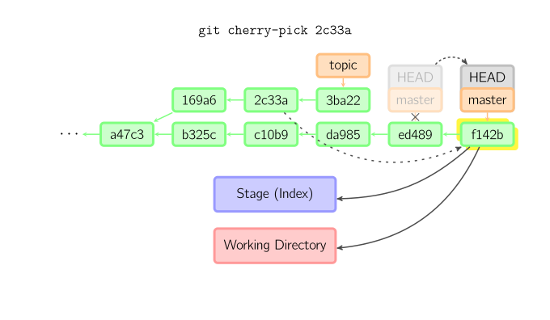

### 设置
设置 Git 以便准备开始工作
```bash
# 设置用户名和邮箱（local>global>system）
# 对当前仓库有效 --local（缺省）
# 对登陆用户所有仓库有效 --global
# 对系统所有用户有效 --system
# 取消 --unset
git config --global user.name "Your Name"
git config --global user.email "your_email@whatever.com"

# 设置行尾首选项
git config --global core.autocrlf input
git config --global core.safecrlf true
```

.git 目录说明。  
.git/config 项目配置文件；  
.git/HEAD HEAD 文件指向（命令查看：git symbolic-ref HEAD）；  
.git/refs/tags 标签。  

### 创建项目与基本操作
```bash
mkdir demo
cd demo
echo "this is a demo" > first.txt

# 初始化 git
git init
# 添加文件到暂存区
git add first.txt
# 提交文件到本地仓库，如果是空提交增加参数 --allow-empty
git commit -m "First Commit"
# 查看当前 git 状态
git status
# 再进行修改
echo "update." >> first.txt
# 撤销工作区的修改【撤销】
git checkout first.txt

# 修改一下并添加到暂存区
echo "update one more." >> first.txt
git add first.txt
# 撤销暂存区的内容【撤销】
git reset HEAD first.txt

# 修改并提交到本地仓库
echo "append some content and excute commit." >> first.txt
git add first.txt
git commit -m "Try to revert our commit"
# 撤销已经提交的更改【撤销】
git revert HEAD --no-edit

# 修改并提交到本地仓库
echo "append some content and excute commit." >> first.txt
git add first.txt
git commit -m "Try to append"
# 再次修改
echo "append more." >> first.txt
# 修正之前的提交
git add first.txt
git commit --amend -m "Try to append more."

# 加个文件
echo "the second file" > second.txt
git add second.txt
# 对同一个文件二次修改
echo "append the comment" >> second.txt
# 此时的状态是一次更改已被暂存，且准备提交；二次更改还未暂存（如果现在提交，那么第二次的修改将不会保存到本地仓库中）
git status
git commit -m "Second commit"
# 此时 second.txt 还有修改未提交到暂存区，可以再次提交
git add second.txt
git commit -m "Append comment"
# 查看提交的历史
git log --pretty=format:'%h %ad | %s%d [%an]' --graph --date=short

# 移动文件
mkdir src
git mv *.txt src
git commit -m "Moved .txt to src"
```

### 别名
设置别名，更方便的操作（$HOME/.gitconfig）
```
[alias]
  co = checkout
  ci = commit
  st = status
```
 Shell 支持别名或简写 ($HOME/.profile)
 ```
alias gs='git status '
alias gc='git commit'
 ```

### 给版本打标签
```bash
# 添加 v1 版本的测试版标签
git tag v1-beta
# 查看已有的标签
git tag
# 从已有的标签中检出代码
git checkout v1-beta

# 删除无效标签
git tag -d v1-beta
```

### 分支操作 
```bash
# 创建分支
git checkout -b new_branch

echo "The third file" > third.txt
git add third.txt
git commit -m "Add file"

# 切换分支
git checkout master

echo "This is a example file" > README.md
git add -a
git commit -m "Added README"

# 查看分叉的分支历史
git log --all

# 合并分支
git checkout new_branch
git merge master

# 冲突解决
git checkout master
echo "make conflict" >> README.md
git commit -am "make conflict"
git checkout new_branch
git merge master
# 修复冲突，编辑保留需要的代码
git add README.md
git commit -m "fixed conflict"

# 使用变基合并代码，回到合并前的代码
git log
git reset reset --hard <hash>
git checkout master
git log
git reset reset --hard <hash>
# 变基
git checkout new_branch
git rebase master
# 变基的最终结果与合并很相似，但是提交树却十分不同
# 变基后 new_branch 分支的提交树已被重写，以致 master 分支成为了其提交历史的一部分。这样使得提交链更加线性，且更易阅读
# 针对短期生命的本地分支使用变基，而对公开仓库的分支使用合并

# 合并回 master
git checkout master
git merge new_branch

# 添加本地分支跟踪远程
git branch --track new_branch origin/new_branch
# 推送更改
git push origin new_branch
# 拉下更改、合并
git checkout master
git fetch 
git merge origin/new_branch

# 仓库共享
git daemon
```

### git 一些命令的理解
**回滚错误的修改**

```bash
# git commit --amend 合并缓存的修改和上一次的提交，用新的快照替换上一个提交
# git commit --amend 允许你将缓存的修改和之前的提交合并到一起，而不是提交一个全新的快照
git add [file_path]
git commit -m "alter the file"
git add [file_path]
git commit --amend --no-edit # --no-edit 标记会修复提交但不修改提交信息，当然也可以更改提交信息

# git checkout 不仅可以切换分支，还可以检出之前的提交
# git checkout <commit> <file>
# 常用：检出最近的版本
git checkout HEAD [file_path]

# git revert 撤销一个已经提交的快照（用于移除历史中的某个提交）
# git revert 是通过搞清楚如何撤销这个提交引入的更改，然后在最后加上一个撤销了更改的新提交，而不是从项目历史中移除这个提交
# git revert <commit>
# 常用：撤销刚刚的 commit
git revert HEAD

# git reset 重设更改
# git reset 通常被用来撤销缓存区和工作目录的修改，也可以被用来移除提交快照
# git reset 应该只用于本地修改，而不应该重设和其他开发者共享的快照
# 常用：从 add 后的缓存区移除特定文件，但不改变工作目录
git reset [commit?]
# git reset --hard [commit?] 会强行改变工作目录

# git clean 将未跟踪的文件从你的工作目录中移除
git clean -n # 演习，告诉你哪些文件在命令执行后会被移除，而不是真的删除它
git clean -f # 强制删除，但不会删除 .gitignore 中指定的未跟踪的文件
```
git checkout 和 git reset 对比  
  
  
  

**挑选提交**
```bash
# git cherry-pick 复制一个或多个提交节点并在当前分支做完全一样的新提交
# git cherry-pick 常用于发布某个分支的部分功能
git cherry-pick [commit]
```


**变基是不一样的合并**
```bash
# git rebase 在当前分支上重演另一个分支的历史，提交历史是线性的
# git rebase --onto [branch_name] [commit] 限制范围
# git rebase --interactive 使用交互方式合并提交
git rebase -i

# git merge 和 git rebase 
# 
# git merge 合并 master 到 develop，是个安全的操作，产生一条合并的 commit
git checkout develop
git merge master # git merge master develop 
# 
# git rebase 合并 master 到 develop，会把 develop 整分支移动到 master 后面，有效地把所有 master 分支上新的提交并入过来
# git rebase 为原分支上每一个提交创建一个新的提交，重写了项目历史，并且不会带来合并提交
# git rebase 存在安全性和可跟踪性的缺陷，也不建议用在公共合作的更改中
git checkout develop
git rebase master 
# git rebase 指定分支，也可以指定 commit 作为基
# git rebase 合并最近 3 次提交
git rebase HEAD~3
```
  

[搞懂 git rebase](http://jartto.wang/2018/12/11/git-rebase/)  

**其他用的较少的命令**  
[git submodule](https://segmentfault.com/a/1190000003076028)  
[git subtree](https://segmentfault.com/a/1190000012002151)  
